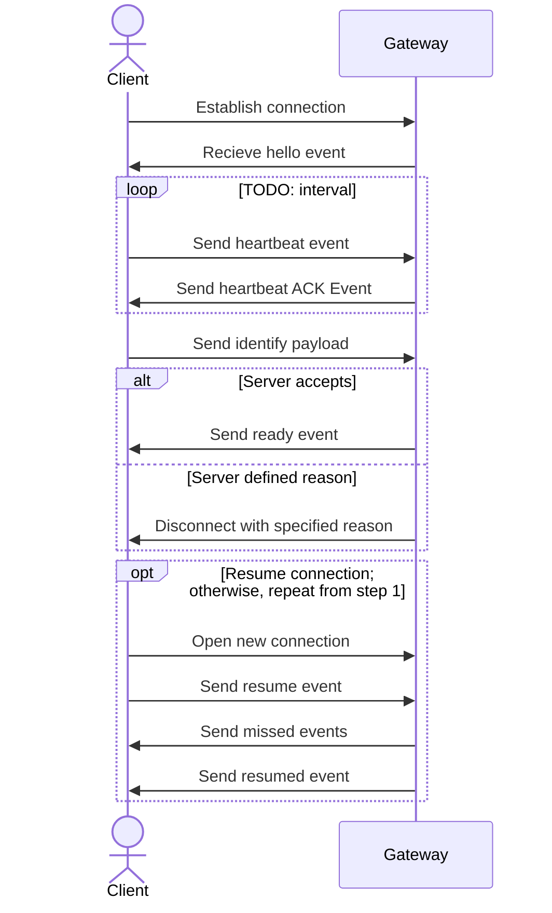
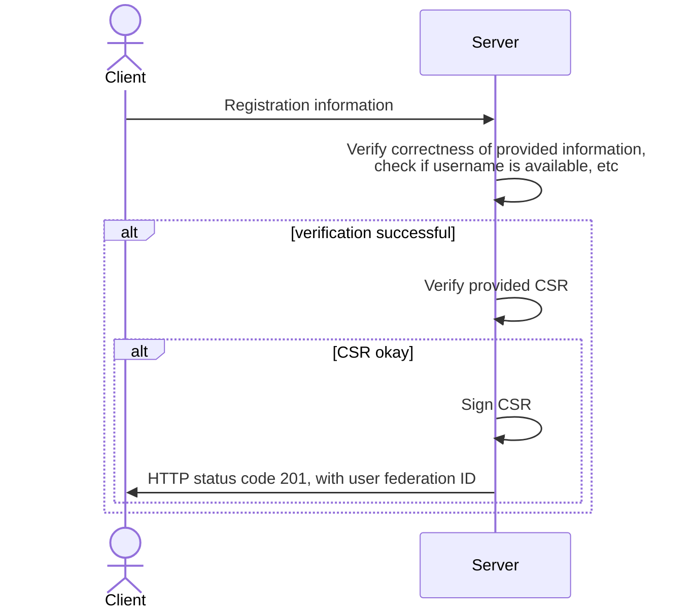
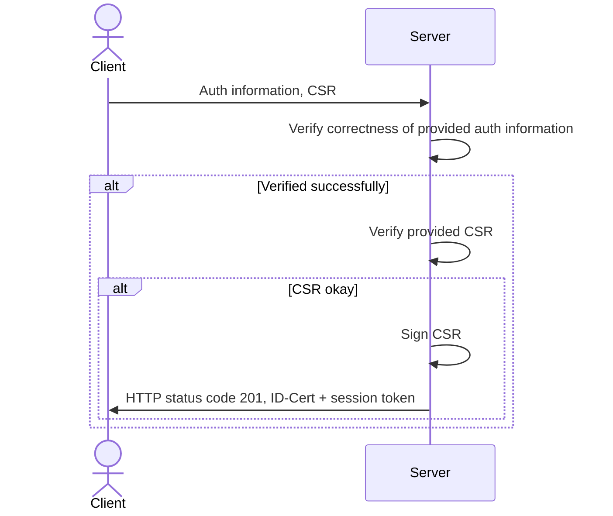
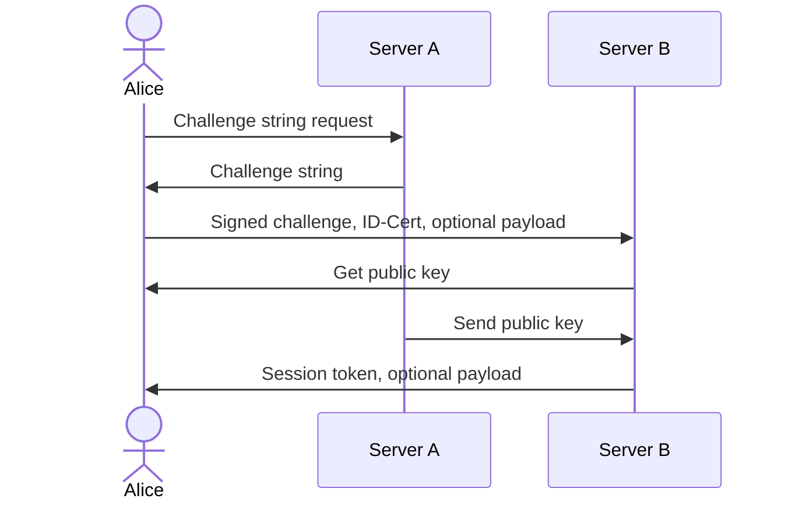
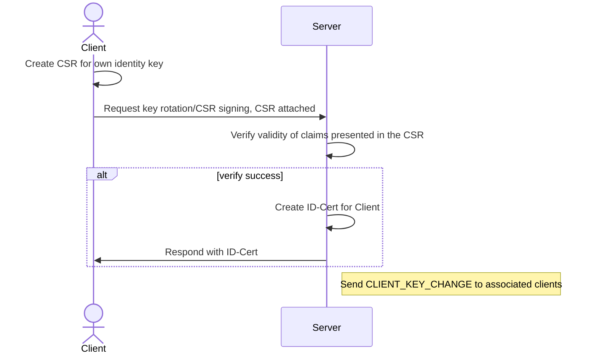
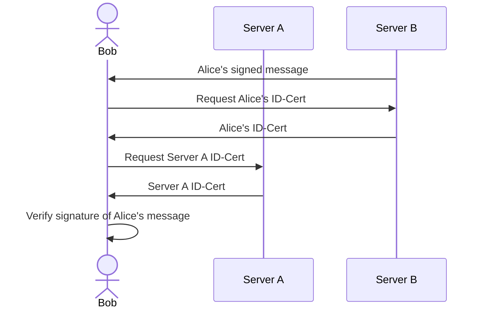
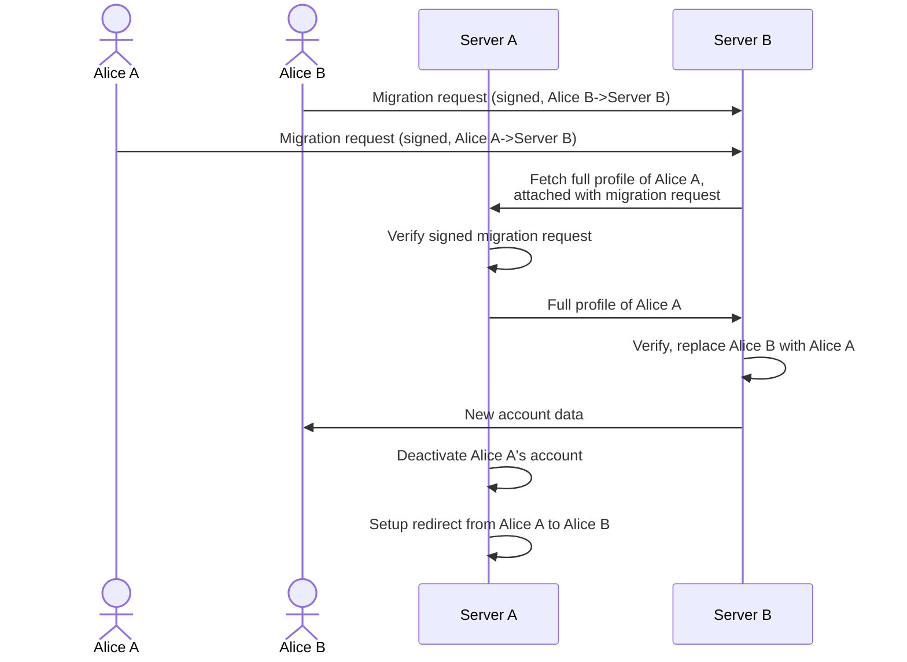
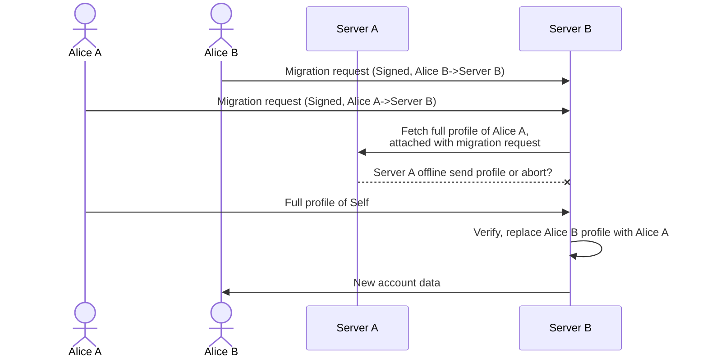
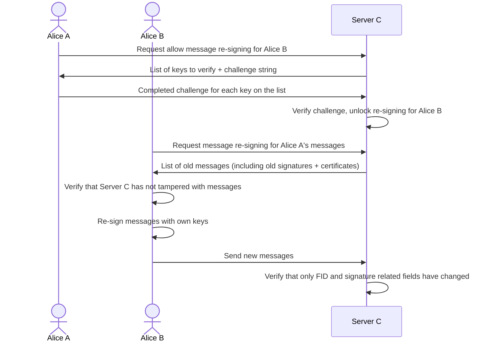

# polyproto Specification

**v0.0.0** - Treat this as an unfinished draft.
[Semantic versioning v2.0.0](https://semver.org/spec/v2.0.0.html) is used to version this specification.

- [polyproto Specification](#polyproto-specification)
  - [1. Terminology used in this document](#1-terminology-used-in-this-document)
  - [2. Trust model](#2-trust-model)
  - [3. APIs and communication protocols](#3-apis-and-communication-protocols)
    - [3.1 Client-Home server API](#31-client-home-server-api)
    - [3.2 Client-foreign server API](#32-client-foreign-server-api)
    - [3.3 WebSockets](#33-websockets)
  - [4. Federated Identity](#4-federated-identity)
    - [4.1 Authentication](#41-authentication)
      - [4.1.1 Registering a new user on a polyproto home server](#411-registering-a-new-user-on-a-polyproto-home-server)
      - [4.1.2 Authenticating a new client on a polyproto home server](#412-authenticating-a-new-client-on-a-polyproto-home-server)
      - [4.1.3 Authenticating on a foreign server](#413-authenticating-on-a-foreign-server)
    - [4.2 Challenge Strings](#42-challenge-strings)
    - [4.3 Abuse prevention](#43-abuse-prevention)
  - [5. Users](#5-users)
  - [6. Encryption](#6-encryption)
    - [6.1. KeyPackages](#61-keypackages)
      - [6.1.1 Last resort KeyPackages](#611-last-resort-keypackages)
    - [6.2 Initial authentication](#62-initial-authentication)
    - [6.3 Multi-device support](#63-multi-device-support)
  - [7. Keys and signatures](#7-keys-and-signatures)
    - [7.1 Home server signed certificates for public client identity keys (ID-Cert)](#71-home-server-signed-certificates-for-public-client-identity-keys-id-cert)
      - [7.1.1 Necessity of ID-Certs](#711-necessity-of-id-certs)
    - [7.2 User identity keys and message signing](#72-user-identity-keys-and-message-signing)
      - [7.2.1 Key rotation](#721-key-rotation)
      - [7.2.2 Message verification](#722-message-verification)
    - [7.4 Best practices](#74-best-practices)
      - [7.4.1 Signing keys/ID-Certs](#741-signing-keysid-certs)
      - [7.4.2 Home server operation and design](#742-home-server-operation-and-design)
  - [8. Account migration](#8-account-migration)
    - [8.1 Migrating a user account](#81-migrating-a-user-account)
    - [8.2 Re-signing messages](#82-re-signing-messages)


The polyproto protocol is a home-server-based federation protocol specification intended for use in applications where a user identity is needed. polyproto focuses on federated identity, and apart from the usage of MLS for encryption, does not specify any application-specific features. It is intended to be used as a base for application implementations and other protocols, such as polyproto-chat, which is a chat protocol built on top of polyproto. Any specific polyproto user identity can be used for multiple applications, as long as the applications support polyproto. 

No part of polyproto is considered less important than any other part, and all parts of polyproto are required for a polyproto implementation to be considered compliant with the polyproto specification. The only exception to this is the encryption part of polyproto, which is optional, as the necessity of encryption depends on the specific implementation.

This document is intended to be used as a starting point for developers wanting to develop software which can interoperate with other polyproto implementations.

## 1. Terminology used in this document

In addition to the terminology found in the glossary located at the end of this document, the following terminology is used throughout this document:

- **Message, Messages**: In the context of this protocol specification, a **message** is any piece of data sent by a client that is intended to be identifiable as being sent by a specific user. To qualify as a "message", this piece of data must also, at any point in time, and also if only briefly, be visible to other users and/or the unauthenticated public. Examples of things that would qualify as messages include:
    - A message sent to another user in a chat application
    - A post on a social media platform
    - A "like" interaction on a social media platform
    - Reaction emojis in Discord-like chat applications
    - Group join/leave messages
    - Reporting a post/user, if the report is not anonymous

Terminology not specified in this section or in the glossary has been defined somewhere else in this document.

## 2. Trust model

polyproto operates under the following trust assumptions:

1. Users entrust their home server and its admins with data security and discretion on actions appearing as user-performed.
2. Users only distrust their home servers in case of irregularities or conflicting information.
3. In a federated context, users trust foreign servers with all unencrypted data.
4. Users trust MLS channel members with their data and attached metadata.
5. Foreign servers can't impersonate users without explicit consent.
6. Users rely on their home servers for identity key certification, without the home servers possessing the identity.

## 3. APIs and communication protocols

The polyproto specification defines a set of APIs, namely the Client-Home server and Client-Foreign server APIs. 
In addition to these REST APIs, polyproto employs WebSockets for real-time communication between clients and servers.

### 3.1 Client-Home server API

The [*Client-Home server*](./docs/APIs/Core/Client-Home%20Server%20API/index.md) API of polyproto is concerned with authentication- and federation-related issues between a client and its home server.
A client in this context is expected to be a user/bot session.

### 3.2 Client-foreign server API

The [*Client-foreign server*](./docs/APIs/Core/Client-Foreign%20Server%20API/index.md) API of polyproto is used for tasks such as requesting the servers' or a users' public key(s) or migrating a user account.
The definition of "client" in this context is broader, since it includes both users/bots and other polyproto servers.

### 3.3 WebSockets

In polyproto, WebSockets facilitate real-time communication between user/bot clients and servers, and they are employed in both Client-Home Server and Client-Foreign Server communication.

WebSocket connections to polyproto servers consist of the following cycle:



Fig. 1: Sequence diagram of a WebSocket connection to a polyproto server.

!!! info

    To learn more about polyproto WebSockets and WebSocket Events, consult the [WebSockets documentation](/docs/APIs/Core/WebSockets/index.md).

## 4. Federated Identity

The federation of user identities allows users to engage with foreign servers as if they were their home servers.
For instance, in polyproto-chat, a user can send direct messages to users from a different server or join the Guilds of other servers.

Identity certificates defined in sections [#7. Keys and signatures](#7-keys-and-signatures) and [#7.1 Home server signed certificates for public client identity keys (ID-Cert)](#71-home-server-signed-certificates-for-public-client-identity-keys-id-cert) are employed to sign messages that the user sends to other servers.

!!! note "Using one identity for multiple polyproto implementations"

    A user can choose to use the same identity for multiple polyproto implementations. If section [4.1.3](#413-authenticating-on-a-foreign-server) is implemented correctly, this should not be a problem.


!!! info

    You can read more about the Identity Pubkey and Certificate in [7. Keys and signatures](#7-keys-and-signatures).

### 4.1 Authentication

#### 4.1.1 Registering a new user on a polyproto home server

Registering a new user in the context of polyproto is done through an API route defined in the polyproto Client-Home server API documentation.

To register, the client sends the necessary information to their home server. The server verifies the data, checks username availability, and responds with HTTP 201 and the new identity's federation ID, if successful. However, a session token isn't provided until the user authenticates a client, as detailed in section [4.1.2](#412-authenticating-a-new-client-on-a-polyproto-home-server).


Fig. 2: Sequence diagram of a successful identity creation process.

#### 4.1.2 Authenticating a new client on a polyproto home server

To access their account from a new device, a user authenticates the session with their home server by sending authentication information and a [certificate signing request (CSR)](#71-home-server-signed-certificates-for-public-client-identity-keys-id-cert) for the new client. If verified successfully, the server signs the CSR and responds with the newly generated ID-Cert and a session token.


Fig. 3: Sequence diagram of a successful client authentication process.

The client is now authenticated and can use the session token and ID-Cert to perform actions on behalf of the user identified by the ID-Cert.

#### 4.1.3 Authenticating on a foreign server

Authenticating on a foreign server requires the user to sign a challenge string with their private identity key and send it, along with their ID-Cert, to the server. The server then validates the ID-Cert's origin, the challenge string's signature, and the ID-Cert's validity.

If the verification is successful, the foreign server can issue a session token to the user.

**Example:**
Say that Alice is on server A, and would like to authenticate on Server B using her existing identity.

Alice's client sends a request to Server B for a challenge string. Upon receiving a response, Alice signs this challenge string with their ID-Cert and sends the signature and her ID-Cert to Server B. Server B can now verify, that it was actually Alice who signed the string, and not a malicious outsider. If all goes well, server B will send a newly generated session token back to Alice's client. Alice's client can then authenticate with server B using this token.



Fig. 4: Sequence diagram of a successful identity verification.

In the diagram, Alice's "optional payload" is extra data that may be requested by servers. This is useful when using a single identity across various polyproto implementations, due to differing information needs. The payload is signed with the user's private identity key.

Likewise, the "optional payload" sent by the server in the above diagram can be used by implementations to send additional information to the client. An example might be initial account information.

!!! example

    Alice currently has a polyproto identity, which she created when signing up for "https://example.com/chat". When signing up for this service, she didn't need to provide any additional information on registration. However, when she wants to user her existing identity to sign up for "https://example.com/social", she is asked to provide her email address, which she can provide as the "optional payload". The server can then store the email address in its' database, associate it with Alice's identity, and let Alice log in with her existing identity. 

If Alice's session token expires, she can repeat this process of requesting a challenge string and, together with her ID-Cert, exchange it for a session token.
However, if Alice wants to access this third party account from a completely new device, they will have to perform the steps described in section [4.1.2](#412-authenticating-a-new-client-on-a-polyproto-home-server) to obtain a valid ID-Cert for that session.

### 4.2 Challenge Strings

Servers generate alphanumeric challenge strings to verify a user's private identity key possession. These strings, ranging from 32 to 256 characters, have a UNIX timestamp lifetime. If the current timestamp surpasses this lifetime, the challenge fails. The user signs the string, sending the signature and their ID-Cert to the server, enabling identity confirmation.

Challenge strings counteract replay attacks. Their uniqueness ensures that even identical requests have different signatures, preventing malicious servers from successfully replaying requests.

### 4.3 Abuse prevention

To protect users from malicious home servers secretly acting on the behalf of non-consenting users,
a mechanism is needed to prevent home servers from generating federation tokens for users without
their consent.

!!! example "Potential abuse scenario"

    A malicious home server can potentially request a federation token on behalf of one of its
    users, and use it to generate a session token on the user's behalf. This is a problem, as the
    malicious server can then impersonate the user on another server, as well as read unencrypted
    data (such as messages, in the context of a chat application) sent on the other server.

!!! abstract

    The above scenario is not unique to polyproto, and rather a problem other federated services/
    protocols, like ActivityPub, have as well. There is no real solution to this problem, but it can be
    mitigated a bit by making it more difficult for malicious home servers to do something like this
    without the user noticing.

Polyproto servers need to inform users of new session tokens. This visibility hampers malicious home servers, but doesn't solve the issue of them being able to create federation tokens for servers the user hasn't previously connected to, as, naturally, users can't receive notifications without a connection. Clients re-establishing server connections must be updated on any new session tokens generated during their absence. The `NEW_SESSION` gateway event must be dispatched to all sessions, excluding the new session. The `NEW_SESSION` event's stored data can be accessed in the [Gateway Events documentation](/docs/APIs/Core/WebSockets/gateway_events.md#new_session).

!!! note

    With proper safety precautions and strong encryption, it is extremely unlikely for a malicious
    server to be able to listen in on encrypted conversations, without all users in that 
    conversation noticing. MLS's forward secrecy guarantees ensure that, in theory, a malicious
    session cannot decrypt any messages sent before its' join epoch. If secrecy or confidentiality
    are of concern, users should host their own home server and use end-to-end encryption.

## 5. Users

Every client requires an associated user identity. Users are distinguished by a unique federation ID (FID), comprised of their username, which is unique per instance, and the instance's root domain. This combination ensures global uniqueness.

FIDs used in public contexts are formatted as `user@optionalsubdomain.domain.tld`, and are case-insensitive.

The following regex can be used to validate user IDs: `\b([A-Z0-9._%+-]+)@([A-Z0-9.-]+\.[A-Z]{2,})\b`.

!!! note

    Validating a federation ID with the above regex does not guarantee that the ID is valid. It only
    indicates that the federation ID is formatted correctly.

For all intents and purposes, a federation ID is a display of identity. However, verifying identity
claims is crucial. See [Section #7.1](#71-home-server-signed-certificates-for-public-client-identity-keys-id-cert)
and [Section #7.2.2](#722-message-verification) for more information.

## 6. Encryption

!!! abstract "About MLS"

    Polyproto offers end-to-end encryption for messages via [Message Layer Security (MLS)](https://messaginglayersecurity.rocks/). polyproto compliant servers take on the role of both an Authentication Service and a Delivery Service in the context of MLS.

    MLS is a cryptographic protocol that provides confidentiality, integrity, and authenticity guarantees for group messaging applications. It builds on top of the [Double Ratchet Algorithm](https://signal.org/docs/specifications/doubleratchet/) and [X3DH](https://signal.org/docs/specifications/x3dh/) to provide these security guarantees.

Implementations of polyproto may opt to support encryption to secure communication channels. The selected security protocol for all polyproto implementations is the Messaging Layer Security protocol, given its feasibility within the implementation context. MLS inherently supports negotiation of protocol versions, cipher suites, extensions, credential types, and extra proposal types. For two implementations of polyproto to be compatible with each other in the context of encryption, they must have overlapping capabilities in these areas.

The following sections explain the additional behavior that polyproto implementations utilizing MLS must implement.

### 6.1. KeyPackages

!!! warning

    The sections 6.1 and 6.1.1 are not exhaustive and do not cover all aspects of MLS and KeyPackages. They exist solely to give a general overview of how KeyPackages are used in polyproto.
    Please read and understand the MLS specification (RFC9420) to implement polyproto correctly.

A polyproto compliant server must store KeyPackages for all clients registered on it. The KeyPackage is a JSON object that contains the following information:

```json
{
  "protocol_version": "<Version>",
  "cipher_suite": "<CipherSuite>",
  "init_key": "<HPKEPublicKey>",
  "leaf_node": "<LeafNode>",
  "extensions": "<Extensions>",
}
```

- `protocol_version` denotes the MLS protocol version.
- `cipher_suite` indicates the used cipher suite for this KeyPackage. Note that a client may store multiple KeyPackages for a single user, to support multiple cipher suites.
- `init_key` is a public key for encrypting initial group secrets.
- `leaf_node` is a signed `LeafNodeTBS` struct as defined in section `7.2. Leaf Node Contents` in RFC9420. A `LeafNode` contains information representing a users' identity, in the form of the users' **ID-Cert** for a given session/client. The `LeafNodeTBS` is signed using the user's private identity key.
- `extensions` can be used to add additional information to the protocol, as defined in section `13. Extensibility` in RFC9420.

A KeyPackage is supposed to be used only once. Servers must ensure the following things:
-  That any KeyPackage is not given out to clients more than once.
-  That the `init_key` values of all KeyPackages are unique, as the `init_key` is what makes the KeyPackage one-time use.
-  That the contents of the `LeafNode` as well as the `init_key` were signed by the user who submitted the KeyPackage.

Because KeyPackages are supposed to be used only once, servers should retain multiple valid KeyPackages for each user, alerting clients when their stock is running low. Consult the Client-Server-API for more information on how servers should request new KeyPackages from clients. Servers should delete KeyPackages when their validity lapses.

Servers only store KeyPackages for home server users, i.e. not for foreign users.

!!! note "About keys"

    It is recommended that keys are to be generated using the `EdDSA` signature scheme, however, other signature schemes may be used as well.

#### 6.1.1 Last resort KeyPackages

A "last resort" KeyPackage, which, contrasting regular KeyPackages, is reusable, is issued when a server runs out of regular KeyPackages for a user. This is to prevent DoS attacks, where malicious clients deplete all KeyPackages for a given user, blocking that user's inclusion into encrypted groups or guild channels.

Servers are to replace a "last resort" KeyPackage after it has been used at least once by requesting one from the client.

### 6.2 Initial authentication

During the initial authentication process, a client must provide at least one [KeyPackage](#61-keypackages), as well as one ["last resort" KeyPackage](#611-last-resort-keypackages) to the server, in addition to the required registration information.

The public identity key inside the `LeafNode` of this KeyPackage corresponds to the public identity key found inside a clients' ID-Cert.

### 6.3 Multi-device support

polyproto servers and clients employing encryption must support multi-device use. The MLS protocol assigns each device a unique `LeafNode` and prohibits key sharing across devices. Each device offers distinct KeyPackages and an own ID-Cert.

## 7. Keys and signatures

### 7.1 Home server signed certificates for public client identity keys (ID-Cert)
 
The ID-Cert, a public key certificate, validates a public user identity key. It's a user-generated CSR ([Certificate Signing Request](https://en.wikipedia.org/wiki/Certificate_signing_request)), signed by a home server, encompassing user identity information, as well as the client's public identity key. Clients can acquire an ID-Cert in return for a CSR.

ID-Certs form the basis of message signing, verification and encryption in polyproto They are used to verify the identity of a client, and to verify the integrity of messages sent by a client.

A CSR includes the following information:

- The public identity key of the client.
- The federation ID of the user associated with the client.
- The session ID of the client. The session ID is a unique identifier for a session, which does not change when a client rotates their identity keys.
- Optionally, an expiry date for the certificate. This expiry date must be less than or equal to the expiry date of the home servers' public identity key certificate.

The resulting ID-Cert contains the following information, in addition to the information supplied through the CSR:

- Issuer information: The home servers' domain.
- Serial number: A unique identifier for the certificate.
- Signature algorithm: The algorithm used to sign the certificate.
- Signature: The signature of the certificate, generated using the home servers' private identity key.
- Expiry date: The expiry date of the certificate.

!!! info 

    See [7.2.1](#721-key-rotation) for more information on what an "associated client" is.

#### 7.1.1 Necessity of ID-Certs

The addition of a certificate may seem ubiquitous, but it is necessary to prevent a malicious foreign server from abusing public identity key caching to impersonate a user. Consider the following example which employs foreign server public identity key caching, but no home server issued identity key certificates:

!!! example "Potential abuse scenario"

    A malicious foreign server B can fake a message from Alice (Home server: Server A) to Bob (Home Server: Server B), by generating a new identity key pair and using it to sign the malicious message. The foreign server then sends that message to Bob, who will then request Alice's public identity key from Server B, who will then send Bob the malicious public identity key. Bob will succeed in verifying the signature of the message, and not notice that the message is malicious.

The above scenario is not possible with home server issued identity key certificates, as the malicious server cannot generate an identity key pair for Alice which is signed by Server A.

### 7.2 User identity keys and message signing

As briefly mentioned section [#4](#4-federated-identity), users must hold on to an identity key pair at all times. This key pair is used to represent a user's identity and to verify message integrity, by having a user sign all messages they send with their private identity key. The key pair is generated by the user, and a user-generated identity key certificate signing request (CSR) is sent to the user's home server when first connecting to the server with a new client, or when rotating keys. The key is stored in the client's local storage. Upon receiving a new identity key CSR, a home server will sign this CSR and send the resulting public key certificate to the client. This certificate is proof that the home server attests to the clients key. Read section [7.3](#73-home-server-generated-certificates-for-public-client-identity-keys-id-cert) for more information on the certificate.

#### 7.2.1 Key rotation

A client may choose to rotate their identity key at any time. This is done by generating a new identity key pair, and sending the new public identity key to their home server, as part of a new Certificate Signing Request, at least one new KeyPackage and one corresponding 'last resort' KeyPackage. The home server will then generate the new ID-Cert, send it to the client, and let all associated clients know, that this clients' public identity key has changed. The server does this by sending a [`CLIENT_KEY_CHANGE`](/docs/APIs/Core/WebSockets/gateway_events.md#client_key_change) gateway event to those clients. For example, in the context of a chat application built with polyproto-chat, an associating relationship between two clients exists, if the two clients share a guild, a group or a direct message channel, if they are friends, or if they have a pending friend request between each other.


Before sending any messages to a server, a client that performed a key rotation should inform the server of that change, to ensure that the server has the correct ID-Cert cached for the client.

Home servers must keep track of the ID-Certs of all users (and their clients) registered on them, and must be able to provide a clients' ID-Cert for a given timestamp on request. This is to ensure messages sent by users, even ones sent a long time ago, can be verified by other servers and their users. This is because the public key of a user may change over time and users must sign all messages they send to servers. Likewise, a client should also keep all of its own ID-Certs stored perpetually, to potentially verify its identity in case of a migration.


Fig. 5: Sequence diagram depicting the process of a client using a CSR to request a new ID-Cert from their home server.

If a server's identity key lifetime unexpectedly ends, perhaps due to a leak necessitating rotation, the server should generate a new identity key pair and broadcast [`SERVER_KEY_CHANGE`](/docs/APIs/Core/WebSockets/gateway_events.md#server_key_change) and [`LOW_KEY_PACKAGES`](/docs/APIs/Core/WebSockets/gateway_events.md#low_key_packages) gateway events to all clients. Clients should regenerate their identity keys, request a new ID-Cert (via a CSR), and respond appropriately to the [`LOW_KEY_PACKAGES`](/docs/APIs/Core/WebSockets/gateway_events.md#low_key_packages) event. Should a client be offline at the time of the key change, it must be informed of the change upon reconnection.

!!! note

    A `LOW_KEY_PACKAGES` event is only sent by servers which use MLS encryption. Server/Clients not implementing MLS encryption can safely ignore this event.

#### 7.2.2 Message verification

To ensure message integrity via signing, clients and servers must verify message signatures. This involves cross-checking the message signature against the sender's ID-Cert and the senders' home server's public key, while also confirming the validity of the ID-Cert attached to the message and ensuring its public key matches the sender's.

**Example:** Given a signed message from Alice, like Bob would receive it from Server B in [Fig. 3](#fig-3), Bob's client would verify the signature of the message like so:


Fig. 6: Sequence diagram of a successful message signature verification.

Bob's client should now cache Server A's public identity key and Alice's ID-Cert, to avoid having to request them again for as long as the ID-Cert/Server public key do not change, and are not expired.

If the verification fails, Bob's client should try to re-request the key from Server B first. Should the verification fail again, Bob's client may try to request Alice's public identity key and certificate from Server A (Alice's home server), and try to verify the signature again. Should the verification still not succeed, the message should be treated with extreme caution.

!!! question "Why does Bob's client not request Alice's public identity key from Server A?"

    Bob's client could request Alice's public identity key from Server A, instead of Server B. However, this is discouraged, as it

    - Generates unnecessary load on Server A; Doing it this way distributes the load of public identity key requests more fairly, as the server that the message was sent on is the one that has to process the bulk of public identity key requests.
    - Would expose unnecessary metadata to Server A; Server A does not need to know who exactly Alice is talking to, and when. Only Server B, Alice and Bob need to know this information. Always requesting the public identity key from Server A might expose this information to Server A.

    Clients should only use Server A as a fallback for public identity key verification, if Server B does not respond to the request for Alice's public identity key, or if the verification fails with the public identity key from Server B.

!!! info

    A failed signature verification does not always mean that the message is invalid. It may be that the user's identity key has changed, and that Server B has not yet received the new public identity key for some reason.

### 7.4 Best practices

#### 7.4.1 Signing keys/ID-Certs

- User/client signing keys should be rotated regularly (every 20-60 days). This is to ensure that a compromised key can only be used for a limited amount of time. Server identity keys should be rotated way less frequently (every 1-5 years), and perhaps only when a leak is suspected.
- When a server is asked to generate a new ID-Cert for a user, it must make sure that the CSR is valid and, if set, has an expiry date which is less than or equal to the expiry date of the server's own ID-Cert.
- Due to the fact that a `SERVER_KEY_CHANGE` gateway event is bound to generate a lot of traffic, servers should only manually generate a new identity key pair when absolutely necessary and instead choose a fitting expiry date interval for their identity key certificates. It might also be a good idea to stagger the sending of `SERVER_KEY_CHANGE` gateway events, to prevent a server from initiating a DDoS attack on itself.
- When a client or server receives the information that a user clients' identity key has been changed, the client/server in question should update their cached ID-Cert for the user in question, taking into account the session ID of the new identity key pair.

#### 7.4.2 Home server operation and design

- Employ a caching layer for your home server to handle the potentially large amount of requests for public key certificates without putting unnecessary strain on the database.

## 8. Account migration

Account migration allows users to move their account and associated data to another identity.
This allows users to switch home servers while not losing ownership of messages sent by them.

Migrating an account is done with the following steps:

1. The user creates a new account on a new home server.
2. The user requests the migration from the new home server, specifying the old account's
   federation ID.
3. The old user account confirms the migration request by sending a signed API request to the new home
   server. The confirmation contains the federation ID of the new account.
4. The new server sends this information to the old server, which then sends the new server all
   information associated with the old account. 
   The old server now forward requests regarding the old account to the new server.
   Alternatively, if the old server is shut down, the new server can request the information
   from the old user directly.
5. The old account can now request the resigning of its messages, transferring ownership of the
   messages to the new account. To have all messages from a server re-signed, a user must
   prove that they are the owner of the private keys used to sign the messages.

### 8.1 Migrating a user account


Fig. 7: Sequence diagram depicting a successful migration of Alice A's account to Alice B's account, where Server A is reachable and cooperative.

Alternatively, if Server A is offline or deemed uncooperative, the following sequence diagram depicts how the migration can be done without Server A's cooperation:


Fig. 8: Sequence diagram depicting a successful migration of Alice A's account to Alice B's account, where Server A is unreachable or uncooperative.

!!! question "If the old home server is not needed for the migration, why try to contact it in the first place?"

    It is generally preferrable to have the old home server cooperate with the migration, as it
    allows for a more seamless migration. A cooperative homeserver will be able to provide the new
    home server with all information associated with the old account. It can also forward requests
    regarding the old account to the new server, which makes the process more seamless for other
    users. The "non-cooperative homeserver migration method" is only a last resort.

### 8.2 Re-signing messages

Transferring message ownership from an old to a new account, known as re-signing messages, necessitates coordination between the two accounts, initiated by the old account. To start, the old account sends an API request containing the new account's federation ID to the server where messages should be re-signed. The server responds with all public keys used for signing the old account's messages, along with one challenge string. The old account will then need to prove that it is in possession of the private keys that were used to sign the messages. This is done by signing a challenge string with the private keys. If the server verifies the challenge, it authorizes the new account to re-sign the old account's messages signed with the verified key. Instead of overwriting the message, a new message variant with the new signature is created.


Fig. 9: Sequence diagram depicting the re-signing procedure.