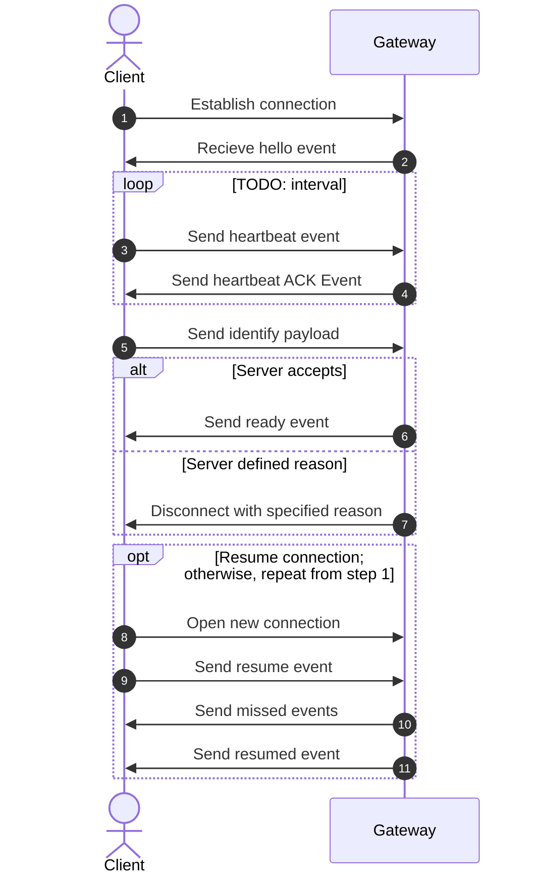
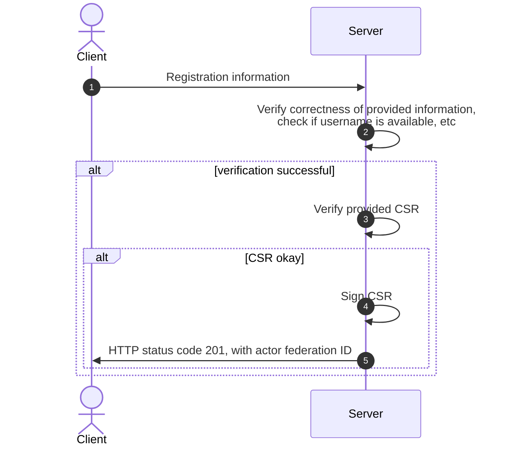
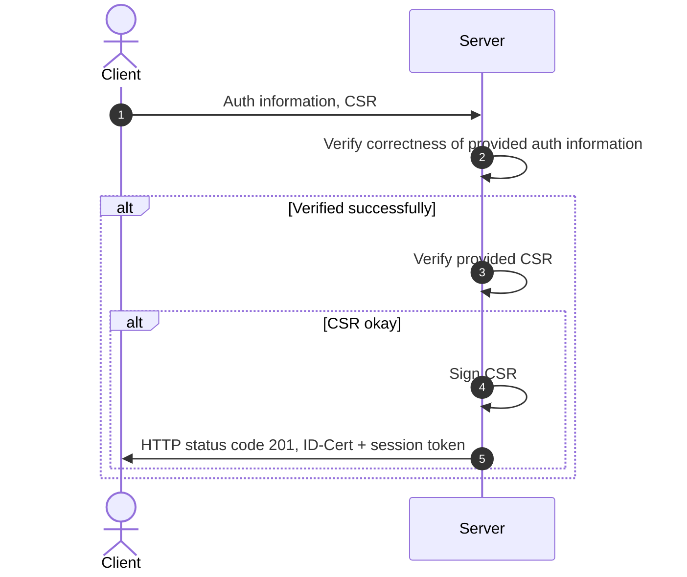
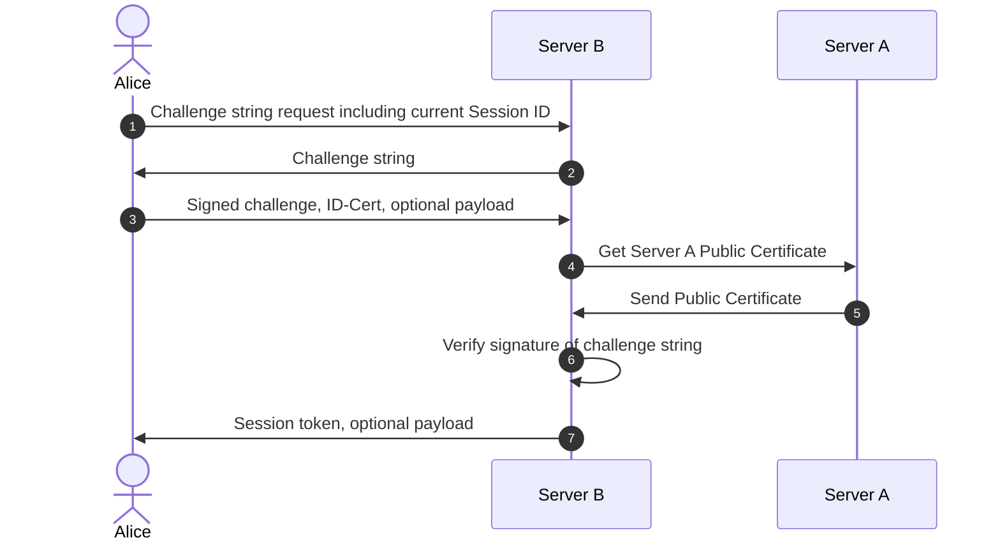
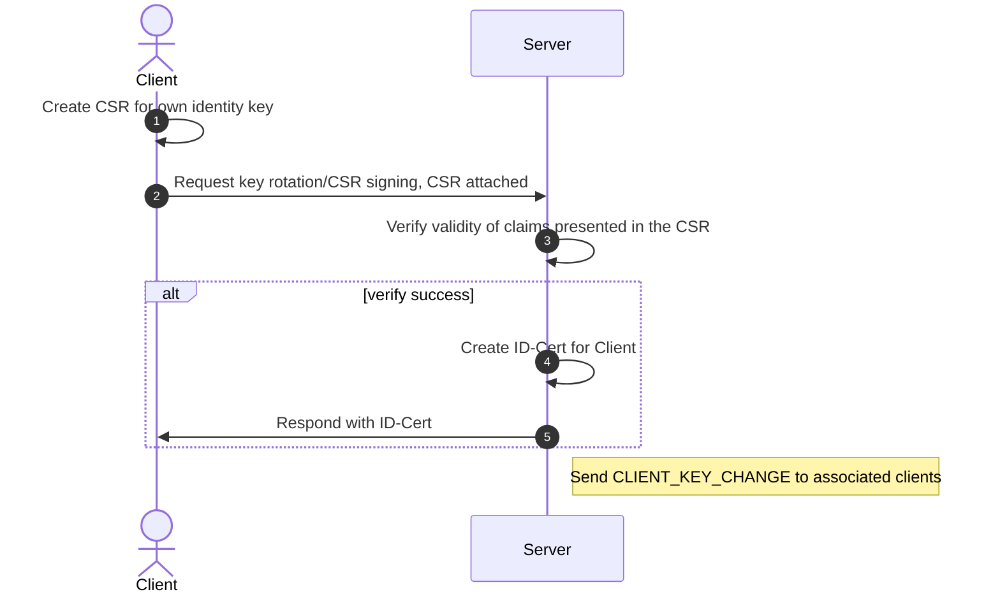
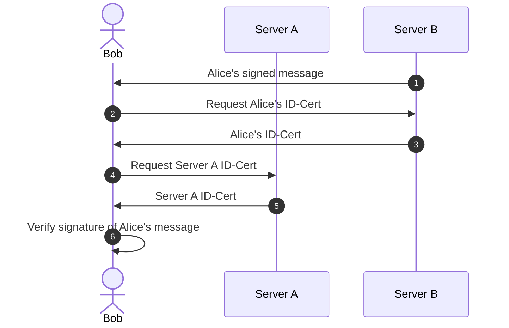
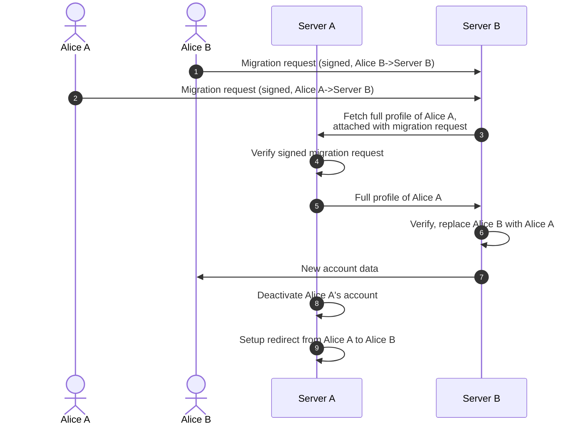
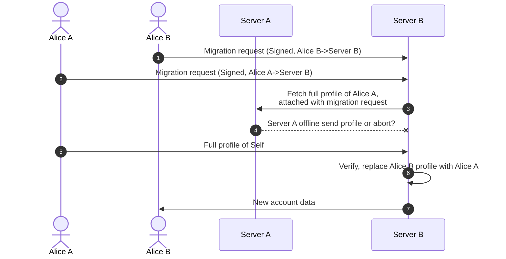
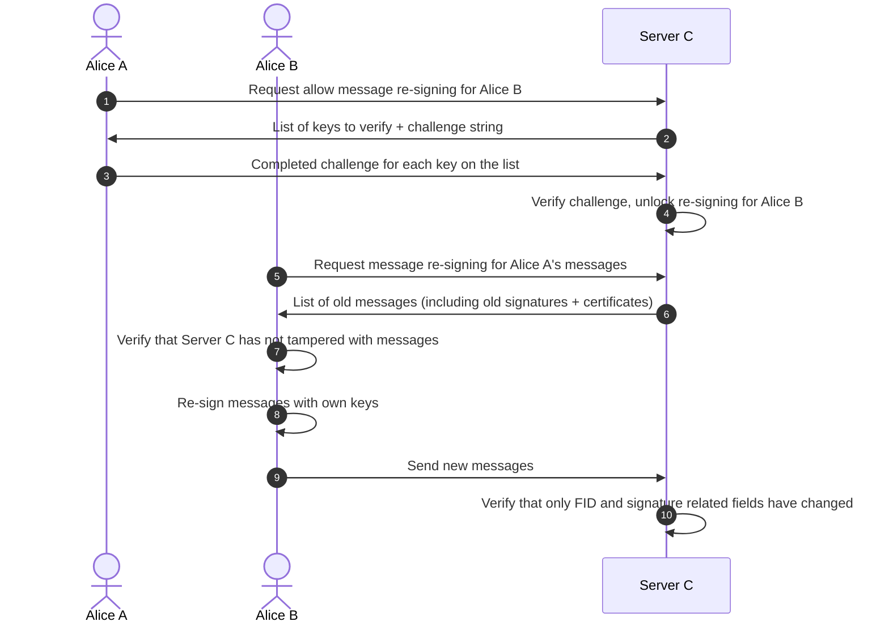
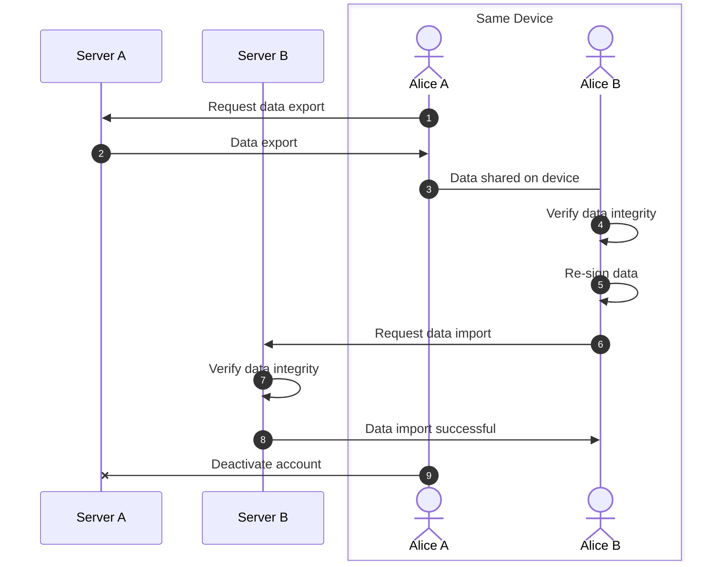

# polyproto Specification

**v0.0.0** - Treat this as an unfinished draft.
[Semantic versioning v2.0.0](https://semver.org/spec/v2.0.0.html) is used to version this specification.
The version number specified here also applies to the API documentation.

- [polyproto Specification](#polyproto-specification)
  - [1. Terminology used in this document](#1-terminology-used-in-this-document)
  - [2. Trust model](#2-trust-model)
  - [3. APIs and communication protocols](#3-apis-and-communication-protocols)
    - [3.3 WebSockets](#33-websockets)
      - [3.3.1 Events over REST](#331-events-over-rest)
  - [4. Federated identity](#4-federated-identity)
    - [4.1 Authentication](#41-authentication)
      - [4.1.1 Registering a new actor on a polyproto home server](#411-registering-a-new-actor-on-a-polyproto-home-server)
      - [4.1.2 Authenticating a new client on a polyproto home server](#412-authenticating-a-new-client-on-a-polyproto-home-server)
      - [4.1.3 Authenticating on a foreign server](#413-authenticating-on-a-foreign-server)
    - [4.2 Challenge Strings](#42-challenge-strings)
    - [4.3 Abuse prevention](#43-abuse-prevention)
  - [5. Users](#5-users)
  - [6. Encryption](#6-encryption)
    - [6.1. KeyPackages](#61-keypackages)
      - [6.1.1 Last resort KeyPackages](#611-last-resort-keypackages)
    - [6.2 Initial authentication](#62-initial-authentication)
    - [6.3 Multi-device support](#63-multi-device-support)
  - [7. Keys and signatures](#7-keys-and-signatures)
    - [7.1 Home server signed certificates for public client identity keys (ID-Cert)](#71-home-server-signed-certificates-for-public-client-identity-keys-id-cert)
      - [7.1.1 Structure of an ID-Cert](#711-structure-of-an-id-cert)
        - [7.1.1.1 Distinguished Names (`DNs`)](#7111-distinguished-names-dns)
        - [7.1.1.2 Extensions and constraints](#7112-extensions-and-constraints)
      - [7.1.2 Necessity of ID-Certs](#712-necessity-of-id-certs)
      - [7.1.3 Key rotation](#713-key-rotation)
        - [7.1.3.1 A note about CRLs (Certificate revocation lists)](#7131-a-note-about-crls-certificate-revocation-lists)
    - [7.2 Actor identity keys and message signing](#72-actor-identity-keys-and-message-signing)
      - [7.2.2 Message verification](#722-message-verification)
    - [7.3 Best practices](#73-best-practices)
      - [7.3.1 Signing keys and ID-Certs](#731-signing-keys-and-id-certs)
      - [7.3.2 Home server operation and design](#732-home-server-operation-and-design)
  - [8. Account migration](#8-account-migration)
    - [8.1 Reassigning ownership](#81-reassigning-ownership)
      - [8.1.1 Migrating an actor](#811-migrating-an-actor)
      - [8.1.2 Re-signing data](#812-re-signing-data)
    - [8.2 Moving data](#82-moving-data)


The polyproto protocol is a home-server-based identity federation protocol specification intended for use in applications where actor identity is needed. polyproto focuses on federated identity, and apart from the usage of Messaging Layer Security (MLS) for encryption, does not specify any application-specific features. Instead, it is intended to be used as a base for application implementations and other protocols, such as `polyproto-chat` - a chat protocol built on top of polyproto. Through a shared "base layer", polyproto implementations are intercompatible in a way where one identity can be used across various polyproto implementations.

No part of polyproto is considered less important than any other part, and all parts of polyproto are required for a polyproto implementation to be considered compliant with the polyproto specification. The only exception to this is the encryption part of polyproto, which is optional, as the necessity of encryption depends on the specific implementation.

This document is intended to be used as a starting point for developers wanting to develop software, which can operate with other polyproto implementations.

## 1. Terminology used in this document

In addition to the terminology found in the glossary located at the end of this document, the following terminology is used throughout this document:

- **Message, Messages**: In the context of this protocol specification, a **message** is any piece of data sent by a client that is intended to be identifiable as being sent by a specific actor. To qualify as a "message", this piece of data must also, at any point in time, and also if only briefly, be visible to other users or to the unauthenticated public. Examples of things that would qualify as messages include:
    - A message sent to another actor in a chat application
    - A post on a social media platform
    - A "like" interaction on a social media platform
    - Reaction emojis in Discord-like chat applications
    - Group join or leave messages
    - Reporting a post or actor, if the report is not anonymous

Terminology not specified in this section or in the glossary has been defined somewhere else in this document.

## 2. Trust model

polyproto operates under the following trust assumptions:

1. Users entrust their home server and its admins with data security and discretion on actions appearing as actor-performed.
2. Users only distrust their home servers in case of irregularities or conflicting information.
3. In a federated context, users trust foreign servers with all unencrypted data.
4. Users trust MLS channel members with their data and attached metadata.
5. Foreign servers cannot impersonate users without explicit consent.
6. Users rely on their home servers for identity key certification, without the home servers possessing the identity.

## 3. APIs and communication protocols

The polyproto specification defines a set of [APIs](/APIs).
In addition to these REST APIs, polyproto employs WebSockets for real-time communication between clients and servers.

### 3.3 WebSockets

WebSockets enable real-time communication between actor clients and servers.

WebSocket connections to polyproto servers consist of the following cycle:



Fig. 1: Sequence diagram of a WebSocket connection to a polyproto server.

!!! info

    To learn more about polyproto WebSockets and WebSocket Events, consult the [WebSockets documentation](/docs/APIs/Core/WebSockets/index.md).

#### 3.3.1 Events over REST

For some implementation contexts, a constant WebSocket connection might not be wanted. A client can
instead opt to query an API endpoint to receive events, which would normally be sent through the WebSocket
connection. Concrete polyproto-implementations and extensions can decide whether this alternative
behaviour is supported. 

!!! example

    An example of an implementation context where having a constant WebSocket might not be wanted would
    be Urban IoT devices, or devices with a limited or only periodically available internet connection. 

Querying [this endpoint](/APIs/Core/Routes%3A No registration needed/#get-events) yields a JSON-Array
containing either all events the session has missed since disconnecting from the WebSocket, or all events
the session has missed since last querying the endpoint.

Depending on how many events the session has
missed, the earliest events might be excluded from the response to limit the response bodies size. This
behaviour should be explicitly documented in implementations or extensions of polyproto.

Due to the
intended use cases for retrieving events through REST rather than WebSockets, this endpoint is not
a long-polling endpoint.

There are three intended, main modes for retrieving events in polyproto

1. Keep a constant WebSocket connection whenever possible
2. Keep a semi-constant WebSocket connection, perhaps connecting every x minutes for a set period of
   time
3. Do not use WebSockets and only query the REST API

Polling a REST endpoint is inherently inefficient and therefore should only be done with a high interval,
ranging from a few minutes to a few days. If a client requires information more often than that,
then a WebSocket connection should be considered.

## 4. Federated identity

The federation of actor identities allows users to engage with foreign servers as if they were their home servers.
For instance, in polyproto-chat, an actor can send direct messages to users from a different server or join the Guilds of other servers.

Identity certificates defined in sections [#7. Keys and signatures](#7-keys-and-signatures) and [#7.1 Home server signed certificates for public client identity keys (ID-Cert)](#71-home-server-signed-certificates-for-public-client-identity-keys-id-cert) are employed to sign messages that the actor sends to other servers.

!!! note "Using one identity for several polyproto implementations"

    An actor can choose to use the same identity for multiple polyproto implementations. If section [4.1.3](#413-authenticating-on-a-foreign-server) is implemented correctly, this should not be a problem.


!!! info

    You can read more about the Identity Pubkey and Certificate in [7. Keys and signatures](#7-keys-and-signatures).

### 4.1 Authentication

#### 4.1.1 Registering a new actor on a polyproto home server

Registering a new actor in the context of polyproto is done through an API route defined in the polyproto ["No registration needed" API](/APIs/Core/Routes%3A No registration needed/#post-create-identity) documentation.

To register, the client sends the necessary information to their home server. The server verifies the data, checks username availability, and responds with HTTP 201 and the new identity's federation ID, if successful. However, a session token is not provided until the actor authenticates a client, as detailed in section [4.1.2](#412-authenticating-a-new-client-on-a-polyproto-home-server).


Fig. 2: Sequence diagram of a successful identity creation process.

#### 4.1.2 Authenticating a new client on a polyproto home server

To access their account from a new device, an actor authenticates the session with their home server by sending authentication information and a [certificate signing request (CSR)](#71-home-server-signed-certificates-for-public-client-identity-keys-id-cert) for the new client. If verified successfully, the server signs the CSR and responds with the newly generated ID-Cert and a session token corresponding to this ID-Cert.


Fig. 3: Sequence diagram of a successful client authentication process.

The client is now authenticated and can use the session token and ID-Cert to perform actions on behalf of the actor identified by the ID-Cert.

#### 4.1.3 Authenticating on a foreign server

Authenticating on a foreign server requires the actor to sign a challenge string with their private identity key and send it, along with their ID-Cert, to the server. The server then validates the ID-Cert's origin, the challenge string's signature, and the ID-Cert's validity.

If the verification is successful, the foreign server can issue a session token to the actor.

**Example:**
Say that Alice is on server A, and wants to authenticate on Server B, using her existing identity.

Alice's client sends a request to Server B for a challenge string, telling Server B the session ID
they are communicating from in the process. Upon receiving a response, Alice signs this challenge
string with the correct private key. They then send the signature to Server B. Server B can now
verify that it was actually Alice who signed the string, and not a malicious outsider. Server B does
this by requesting Alice's ID-Cert, specifically the ID-Cert matching the session ID Alice
identified with to Server B. If all goes well, server B will send a newly generated session token
back to Alice's client. Alice's client can then authenticate with server B by using this token.



Fig. 4: Sequence diagram of a successful identity verification.

In the diagram, Alice's "optional payload" is extra data that might be requested by servers. This is useful when using a single identity across various polyproto implementations, due to differing information needs. The payload is signed with the actor's private identity key.

Likewise, the "optional payload" sent by the server in the above diagram can be used by implementations to send additional information to the client. An example might be initial account information.

!!! example

    Alice currently has a polyproto identity, which she created when signing up for "https://example.com/chat". When signing up for this service, she didn't need to provide any additional information on registration. However, when she wants to actor her existing identity to sign up for "https://example.com/social", she is asked to provide her email address, which she can provide as the "optional payload". The server can then store the email address in its' database, associate it with Alice's identity, and let Alice log in with her existing identity. 

If Alice's session token expires, they can repeat this process of requesting a challenge string and, together with her ID-Cert, exchange it for a session token.
However, if Alice wants to access this third party account from a completely new device, they will have to perform the steps described in section [4.1.2](#412-authenticating-a-new-client-on-a-polyproto-home-server) to obtain a valid ID-Cert for that session.

### 4.2 Challenge Strings

Servers generate alphanumeric challenge strings to verify an actor's private identity key possession. These strings, ranging from 32 to 256 characters, have a UNIX timestamp lifetime. If the current timestamp surpasses this lifetime, the challenge fails. The actor signs the string, sending the signature and their ID-Cert to the server, enabling identity confirmation.

Challenge strings counteract replay attacks. Their uniqueness ensures that even identical requests have different signatures, preventing malicious servers from successfully replaying requests.

### 4.3 Abuse prevention

To protect users from malicious home servers secretly acting on the behalf of non-consenting users,
a mechanism is needed to prevent home servers from generating federation tokens for users without
their consent.

!!! example "Potential abuse scenario"

    A malicious home server can potentially request a federation token on behalf of one of its
    users, and use it to generate a session token on the actor's behalf. This is a problem, as the
    malicious server can then impersonate the actor on another server, as well as read unencrypted
    data (such as messages, in the context of a chat application) sent on the other server.

!!! abstract

    The above scenario is not unique to polyproto, and rather a problem other federated services/
    protocols, like ActivityPub, have as well. There is no real solution to this problem, but it can be
    mitigated a bit by making it more difficult for malicious home servers to do something like this
    without the actor noticing.

Polyproto servers need to inform users of new session tokens. This visibility hampers malicious home servers, but does not solve the issue of them being able to create federation tokens for servers the actor does not connect to. This is because, naturally, users cannot receive notifications without a connection. Clients re-establishing server connections must be updated on any new session tokens generated during their absence. The `NEW_SESSION` gateway event must be dispatched to all sessions, excluding the new session. The `NEW_SESSION` event's stored data can be accessed in the [Gateway Events documentation](/docs/APIs/Core/WebSockets/gateway_events.md#new_session).

!!! note

    With proper safety precautions and strong encryption, it is extremely unlikely for a malicious
    server to be able to listen in on encrypted conversations, without all users in that 
    conversation noticing. MLS's forward secrecy guarantees ensure that, in theory, a malicious
    session cannot decrypt any messages sent before its' join epoch. If secrecy or confidentiality
    are of concern, users should host their own home server and use end-to-end encryption.

## 5. Users

Every client requires an associated actor identity. Users are distinguished by a unique federation ID (FID), consist of their username, which is unique per instance, and the instance's root domain. This combination ensures global uniqueness.

FIDs used in public contexts are formatted as `actor@optionalsubdomain.domain.tld`, and are case-insensitive.

The following regular expression can be used to validate actor IDs: `\b([A-Z0-9._%+-]+)@([A-Z0-9.-]+\.[A-Z]{2,})\b`.

!!! note

    Validating a federation ID with the above regex does not guarantee that the ID is valid. It only
    indicates that the federation ID is formatted correctly.

For all intents and purposes, a federation ID is a display of identity. However, verifying identity
claims is crucial. See [Section #7.1](#71-home-server-signed-certificates-for-public-client-identity-keys-id-cert)
and [Section #7.2.2](#722-message-verification) for more information.

## 6. Encryption

!!! abstract "About MLS"

    Polyproto offers end-to-end encryption for messages via [Message Layer Security (MLS)](https://messaginglayersecurity.rocks/). polyproto compliant servers take on the role of both an Authentication Service and a Delivery Service in the context of MLS.

    MLS is a cryptographic protocol that provides confidentiality, integrity, and authenticity guarantees for group messaging applications. It builds on top of the [Double Ratchet Algorithm](https://signal.org/docs/specifications/doubleratchet/) and [X3DH](https://signal.org/docs/specifications/x3dh/) to provide these security guarantees.

Implementations of polyproto can opt to support encryption to secure communication channels. The selected security protocol for all polyproto implementations is the Messaging Layer Security protocol, given its feasibility within the implementation context. MLS inherently supports negotiation of protocol versions, cipher suites, extensions, credential types, and extra proposal types. For two implementations of polyproto to be compatible with each other in the context of encryption, they must have overlapping capabilities in these areas.

The following sections explain the additional behavior that polyproto implementations utilizing MLS must implement.

### 6.1. KeyPackages

!!! warning

    The sections 6.1 and 6.1.1 are not exhaustive and do not cover all aspects of MLS and KeyPackages. They exist solely to give a general overview of how KeyPackages are used in polyproto.
    Please read and understand the MLS specification (RFC9420) to implement polyproto correctly.

A polyproto compliant server must store KeyPackages for all clients registered on it. The KeyPackage is a JSON object that contains the following information:

```json
{
  "protocol_version": "<Version>",
  "cipher_suite": "<CipherSuite>",
  "init_key": "<HPKEPublicKey>",
  "leaf_node": "<LeafNode>",
  "extensions": "<Extensions>",
}
```

- `protocol_version` denotes the MLS protocol version.
- `cipher_suite` indicates the used cipher suite for this KeyPackage. Note that a server can store many KeyPackages for a single actor, to support various cipher suites.
- `init_key` is a public key for encrypting initial group secrets.
- `leaf_node` is a signed `LeafNodeTBS` struct as defined in section `7.2. Leaf Node Contents` in RFC9420. A `LeafNode` has information representing a users' identity, in the form of the users' **ID-Cert** for a given session or client. The `LeafNodeTBS` is signed by using the actor's private identity key.
- `extensions` can be used to add additional information to the protocol, as defined in section `13. Extensibility` in RFC9420.

A KeyPackage is supposed to be used only once. Servers must ensure the following things:
-  That any KeyPackage is not given out to clients more than once.
-  That the `init_key` values of all KeyPackages are unique, as the `init_key` is what makes the KeyPackage one-time use.
-  That the contents of the `LeafNode` and the `init_key` were signed by the actor who submitted the KeyPackage.

Because KeyPackages are supposed to be used only once, servers should retain multiple valid KeyPackages for each actor, alerting clients when their stock is running low. Consult the ["Registration needed"-API](/APIs/Core/Routes%3A Registration needed) for more information about how servers should request new KeyPackages from clients. Servers should delete KeyPackages when their validity lapses.

Servers only store KeyPackages for home server users, not for foreign users.

!!! note "About keys"

    It is recommended that keys are generated using the `EdDSA` signature scheme, however, other signature schemes may be used as well.
    Consider, that intercompatibility can only be guaranteed if all communicating parties have an overlapping set of supported signature schemes.

#### 6.1.1 Last resort KeyPackages

A "last resort" KeyPackage, which, contrasting regular KeyPackages, is reusable, is issued when a server runs out of regular KeyPackages for an actor. This is to prevent `DoS` attacks, where malicious clients deplete all KeyPackages for a given actor, blocking that actor's inclusion into encrypted groups or guild channels.

Servers are to replace a "last resort" KeyPackage after it has been used at least once by requesting one from the client.

### 6.2 Initial authentication

During the initial authentication process, a client must provide at least one [KeyPackage](#61-keypackages) and one ["last resort" KeyPackage](#611-last-resort-keypackages) to the server, in addition to the required registration information.

The public identity key inside the `LeafNode` of this KeyPackage corresponds to the public identity key found inside a clients' ID-Cert.

### 6.3 Multi-device support

polyproto servers and clients employing encryption must support multi-device use. The MLS protocol assigns each device a unique `LeafNode` and prohibits key sharing across devices. Each device offers distinct KeyPackages and an own ID-Cert.

## 7. Keys and signatures

### 7.1 Home server signed certificates for public client identity keys (ID-Cert)
 
The ID-Cert, a [X.509](https://en.wikipedia.org/wiki/X.509) certificate, validates a public actor identity key. It is an actor-generated CSR ([Certificate Signing Request](https://en.wikipedia.org/wiki/Certificate_signing_request)), signed by a home server, encompassing actor identity information and the client's public identity key. Clients can get an ID-Cert in return for a valid and well-formed CSR.

All ID-Certs are valid X.509 certificates. However, not all X.509 certificates are valid ID-Certs.

ID-Certs form the basis of message signing and verification in polyproto.
They are used to verify the identity of a client, and to verify the integrity of messages sent by a
client.

A CSR includes the following information, according to the X.509 standard:

- The public identity key of the client.
- The federation ID of the actor associated with the client.
- The session ID of the client. The session ID is a unique identifier for a session, which does not change when a client rotates their identity keys.
- Optionally, an expiry date for the certificate. This expiry date must be less than or equal to the expiry date of the home servers' public identity key certificate.

When signing a CSR, the home server must verify the correctness of all claims presented in the CSR.

!!! warning "Important"

    All entities receiving an ID-Cert must inspect the certificate for correctness and validity. 
    This includes checking the signature, the certificate's validity period, the certificate's issuer
    and **all** other claims presented in the certificate.

The resulting ID-Cert then holds the following information:

| Field Description                                                                            | Special requirements, if any                                                                              | X.509 equivalent                                         |
| -------------------------------------------------------------------------------------------- | --------------------------------------------------------------------------------------------------------- | -------------------------------------------------------- |
| The home servers' fully qualified domain name.                                               | [Distinguished Name](#7111-distinguished-names-dns)                                                       | Issuer Name                                              |
| The federation ID of the actor.                                                              | [Distinguished Name](#7111-distinguished-names-dns), Must be unique across all actors on the home server. | Subject Name                                             |
| A unique identifier for the certificate.                                                     | Must be unique across all certificates issued by a home server.                                           | Serial Number                                            |
| The algorithm used to sign the certificate.                                                  |                                                                                                           | Certificate Signature Algorithm & Signature Algorithm ID |
| The signature of the certificate, generated by using the home servers' private identity key. |                                                                                                           | Certificate Signature                                    |
| The expiry date of the certificate.                                                          | Time must not be after expiry date of the home server's root certificate                                  | Validity period: Not After                               |
| Certificate validity period starting date                                                    | Time must not be before the home server's root certificate was generated                                  | Validity period: Not Before                              |
| X.509 Version Number (v3)                                                                    | v3                                                                                                        | Version Number                                           |
| The public identity key of the client.                                                       |                                                                                                           | Subject Public Key Info: Subject Public Key              |
| The public key algorithm used to generate the client's public identity key.                  |                                                                                                           | Subject Public Key Info: Public Key Algorithm            |
| The session ID of the client.                                                                | No two valid certificates for one session ID can exist. Session IDs have to be unique per user.           | Subject Unique Identifier                                |
| Extensions                                                                                   |                                                                                                           | Extensions                                               |

#### 7.1.1 Structure of an ID-Cert

The ID-Cert is a valid X.509 certificate, and as such, it has a specific structure. The structure of
an X.509 certificate is defined in [RFC5280](https://tools.ietf.org/html/rfc5280).
ID-Certs encompass a subset of the structure of an X.509 certificate.

##### 7.1.1.1 Distinguished Names (`DNs`)

The Distinguished Names (`DNs`), according to the [LDAP Data Interchange Format (LDIF)](https://en.wikipedia.org/wiki/LDAP_Data_Interchange_Format). The `DN` is a sequence of relative distinguished names (`RDNs`).

The distinguished name must be unique for each certificate issued by a home server. The `DN` of an ID-Cert
must include the following fields:

```
dn: cn=<actor or home server name>, dc=<home server subdomain, if any>, dc=<home server domain>, dc=<hosme server tld, if any>
```

If the home server does not have a subdomain or tld, the `dc` fields for these components should
be omitted. 

Optionally, the `DN` can include an `ou` field, representing the organizational unit of the actor.

##### 7.1.1.2 Extensions and constraints

The following constraints must be met by ID-Certs:

- If the ID-Cert is a root certificate
  -  It must have the `CA` flag set to `true`. The path length constraint must be set to `0`.
  -  It must have the `keyCertSign` and `cRLSign` key usage flags set to `true`.
- If the ID-Cert is an actor certificate
  - It must have the `CA` flag set to `false`.
  - It must have the `keyCertSign` and `cRLSign` key usage flags set to `false`.
  - It must have the `digitalSignature` key usage flag set to `true`.

#### 7.1.2 Necessity of ID-Certs

The addition of a certificate might seem ubiquitous, but it is necessary to prevent a malicious foreign server from abusing public identity key caching to impersonate an actor. Consider the following example which employs foreign server public identity key caching, but no home server issued identity key certificates:

!!! example "Potential abuse scenario"

    A malicious foreign server B can fake a message from Alice (Home server: Server A) to Bob (Home Server: Server B), by generating a new identity key pair and using it to sign the malicious message. The foreign server then sends that message to Bob, who will then request Alice's public identity key from Server B, who will then send Bob the malicious public identity key. Bob will succeed in verifying the signature of the message, and not notice that the message is malicious.

The above scenario is not possible with home server issued identity key certificates, as the malicious server cannot generate an identity key pair for Alice, which is signed by Server A.

#### 7.1.3 Key rotation

A session may choose to rotate their ID-Cert at any time. This is done by generating a new identity key pair, using the new private key to generate a new CSR, and sending the new Certificate Signing Request to the home server, along with at least one new KeyPackage and a corresponding 'last resort' KeyPackage. The home server will then generate the new ID-Cert, send it to the client, and let all associated clients know that this clients' public identity key has changed. The server does this by sending a [`CLIENT_KEY_CHANGE`](/docs/APIs/Core/WebSockets/gateway_events.md#client_key_change) gateway event to those clients.

For example, in the context of a chat application built with polyproto-chat, an associating relationship between two clients exists, if:

- the two clients share a guild, a group or a direct message channel
- they are friends
- they have a pending friend request between each other.

Rotating keys is done by using an API route which requires authorization. 

!!! note

    Sessions can request a new ID-Cert for any session of the same actor. Most other, currently existing
    services also allow for this, as it is a common use case for user to want to, perhaps, log out of
    devices they no longer use. Depending on your use case, this might be a security concern, as it
    potentially simplifies account takeovers. Whether and how this risk is mitigated is up to 
    concrete implementations.

Before sending any messages to a server, a client that performed a key rotation should inform the server of that change. This is to ensure that the server has cached the correct ID-Cert for this session.

Home servers must keep track of the ID-Certs of all users (and their clients) registered on them, and must provide a clients' ID-Cert for a given timestamp on request. This is to ensure messages sent by users, even ones sent a long time ago, can be verified by other servers and their users. This is because the public key of an actor likely changes over time and users must sign all messages they send to servers. Likewise, a client should also keep all of its own ID-Certs stored perpetually, to potentially verify its identity in case of a migration.


Fig. 5: Sequence diagram depicting the process of a client using a CSR to request a new ID-Cert from their home server.

A server identity key's lifetime might come to an early or unexpected end, perhaps due to some sort of leak of the corresponding private key. When this happens, the server should generate a new identity key pair and broadcast the [`SERVER_KEY_CHANGE`](/docs/APIs/Core/WebSockets/gateway_events.md#server_key_change) and [`LOW_KEY_PACKAGES`](/docs/APIs/Core/WebSockets/gateway_events.md#low_key_packages) gateway events to all clients. Clients should regenerate their identity keys, request a new ID-Cert (through a CSR), and respond appropriately to the [`LOW_KEY_PACKAGES`](/docs/APIs/Core/WebSockets/gateway_events.md#low_key_packages) event. Should a client be offline at the time of the key change, it must be informed of the change upon reconnection.

!!! note

    A `LOW_KEY_PACKAGES` event is only sent by servers which use MLS encryption. Server/Clients not implementing MLS encryption can safely ignore this event.

##### 7.1.3.1 A note about CRLs (Certificate revocation lists)

It is common for systems relying on X.509 certificates for user authentication to use Certificate
Revocation Lists (CRLs) to keep track of which certificates are no longer valid. This is done to
prevent a user from using a certificate that has been revoked.

CRLs are difficult to implement well, often requiring many resources to keep up to date, and
are also not always reliable. OCSP (Online Certificate Status Protocol) is a more modern, reliable
and easier to implement alternative. Still, it potentially requires many resources to
keep up with demand, while introducing a more immediate single point of failure.

polyproto inherently mitigates some of the possible misuse of a revoked certificate, as the validity
of a certificate is usually checked by many parties. Especially, if the revocation process is
initiated by the actor themselves, the actor already lets all servers they are connected to know that
the certificate in question is no longer valid.

polyproto does not require the use of CRLs or OCSP.

### 7.2 Actor identity keys and message signing

As briefly mentioned section [#4](#4-federated-identity), users must hold on to an identity key pair at all times. This key pair is used to represent an actor's identity and to verify message integrity, by having an actor sign all messages they send with their private identity key. The key pair is generated by the actor. An actor-generated identity key certificate signing request (CSR) is sent to the actor's home server when first connecting to the server with a new session, or when rotating keys. The key is stored in the client's local storage. Upon receiving a new identity key CSR, a home server will sign this CSR and send the resulting ID-Cert to the client. This certificate is proof that the home server attests to the clients key. Read [section 7.1](#71-home-server-signed-certificates-for-public-client-identity-keys-id-cert) for more information on the certificate.

#### 7.2.2 Message verification

!!! bug "TODO"

    TODO: Add notice about checking for signature malleability when verifying messages.

!!! bug "TODO"

    TODO: Add the information that PKCS#10 is used for CSRs, and that CSRs are DER encoded.

To ensure message integrity via signing, clients and servers must verify message signatures. This involves cross-checking the message signature against the sender's ID-Cert and the senders' home server's root certificate, while also confirming the validity of the ID-Cert attached to the message and ensuring its public key matches the sender's.

**Example:** Given a signed message from Alice, such as Bob would receive from Server B in [Fig. 3](#fig-3), Bob's client would verify the signature of the message like this:


Fig. 6: Sequence diagram of a successful message signature verification.

Bob's client and Server B should now cache Server A's public identity key and Alice's ID-Cert,
to avoid having to request them again.

If the verification fails, Bob's client should try to re-request the key from Server B first. Should the verification fail again, Bob's client can try to request Alice's public identity key and ID-Cert from Server A (Alice's home server). The signature verification process should then be re-tried. Should the verification still not succeed, the message should be treated with extreme caution.

!!! question "Why does Bob's client not request Alice's public identity key from Server A?"

    Bob's client could request Alice's public identity key from Server A, instead of Server B. However, this is discouraged, as it

    - Generates unnecessary load on Server A; Doing it this way distributes the load of public identity key requests more fairly, as the server that the message was sent on is the one that has to process the bulk of public identity key requests.
    - Would expose unnecessary metadata to Server A; Server A does not need to know who exactly Alice is talking to, and when. Only Server B, Alice and Bob need to know this information. Always requesting the public identity key from Server A might expose this information to Server A.

    Clients should only use Server A as a fallback for public identity key verification, if Server B does not respond to the request for Alice's public identity key, or if the verification fails with the public identity key from Server B.

!!! info

    A failed signature verification does not always mean that the message is invalid. It may be that the actor's identity key has changed, and that Server B has not yet received the new public identity key for some reason.

### 7.3 Best practices

#### 7.3.1 Signing keys and ID-Certs

- Actor and client signing keys should be rotated regularly (every 20-60 days). This is to ensure that a compromised key can only be used for a limited amount of time. Server identity keys should be rotated way less often (every 1-5 years), and perhaps only when a leak is suspected.
- When a server is asked to generate a new ID-Cert for an actor, it must make sure that the CSR is valid and, if set, has an expiry date less than or equal to the expiry date of the server's own ID-Cert.
- Due to the fact that a `SERVER_KEY_CHANGE` gateway event is bound to generate a large amount of traffic, servers should only manually generate a new identity key pair when absolutely necessary and instead choose a fitting expiry date interval for their identity key certificates. It might also be a good idea to stagger the sending of `SERVER_KEY_CHANGE` gateway events, to prevent a server from initiating a DDoS attack on itself.
- When a client or server receives the information that an actor's client identity key has been changed, the client/server in question should update their cached ID-Cert for the actor in question, taking into account the session ID of the new identity key pair.

#### 7.3.2 Home server operation and design

- Use a caching layer for your home server to handle the potentially large amount of requests for
  ID-Certs without putting unnecessary strain on the database.

## 8. Account migration

Account migration allows users to move their account and associated data to another identity.
This allows users to switch home servers while not losing ownership of messages sent by them.

Migrating an actor always involves reassigning the ownership of all actor-associated data in the
distributed network to the new actor. Should the old actor want to additionally move all data from
the old home server to another home server, more steps are needed. 

### 8.1 Reassigning ownership

Migrating an account is done with the following steps:

1. The actor creates a new account on a new home server.
2. The actor requests the migration from the new home server, specifying the old account's
   federation ID.
3. The old actor account confirms the migration request by sending a signed API request to the new home
   server. The confirmation contains the federation ID of the new account.
4. The new server sends this information to the old server, which then sends the new server all
   information associated with the old account. 
   The old server now forward requests regarding the old account to the new server.
   Alternatively, if the old server is shut down, the new server can request the information
   from the old actor directly.
5. The old account can now request the resigning of its messages, transferring ownership of the
   messages to the new account. To have all messages from a server re-signed, an actor must
   prove that they are the owner of the private keys used to sign the messages.

#### 8.1.1 Migrating an actor


Fig. 7: Sequence diagram depicting a successful migration of Alice A's account to Alice B's account, where Server A is reachable and cooperative.

Alternatively, if Server A is offline or deemed uncooperative, the following sequence diagram depicts how the migration can be done without Server A's cooperation:


Fig. 8: Sequence diagram depicting a successful migration of Alice A's account to Alice B's account, where Server A is unreachable or uncooperative.

!!! question "If the old home server is not needed for the migration, why try to contact it in the first place?"

    It is generally preferrable to have the old home server cooperate with the migration, as it
    allows for a more seamless migration. A cooperative homeserver will be able to provide the new
    home server with all information associated with the old account. It can also forward requests
    regarding the old account to the new server, which makes the process more seamless for other
    users. The "non-cooperative homeserver migration method" is only a last resort.

#### 8.1.2 Re-signing data

Transferring message ownership from an old to a new account, known as re-signing messages, necessitates
coordination between the two accounts, initiated by the old account. To start, the old account sends
an API request containing the new account's federation ID to the server where messages should be
re-signed. The server responds with all ID-Certs used for signing the old account's messages, along with
a challenge string. The old account will then need to prove that it is in possession of the private
keys that were used to sign the messages. This is done by signing a challenge string with the private
keys. If the server verifies the challenge, it authorizes the new account to re-sign the old
account's messages signed with the verified key. Instead of overwriting the message, a new message variant
with the new signature is created, preserving the old message.

Implementations and protocol extensions should carefully consider the extent of messages that can be
re-signed.

!!! example

    In the case of a social media platform with quote-posting functionality, it is reasonable to
    assume that re-signing a quoted post is allowed. However, this would likely change the
    signature of the quoted post, which would be undesirable. Edge cases like these are up to
    implementations to handle, and should be well documented.


Fig. 9: Sequence diagram depicting the re-signing procedure.

### 8.2 Moving data

In cases of an imminent server shutdown or distrust in the old server, moving data from the old server
is necessary to prevent data loss. This process extends upon the reassigning ownership process, and
involves the following steps:

1. Using the old account, the client requests a data export from your old home server.
2. The old home server sends a data export to the client. The client will check the signatures on
   the exported data, to ensure it was not tampered with.
3. The new account re-signs the data with its own keys and imports it into the new home server.
4. The new home server verifies the data and signals that the import was successful.
5. The old client requests the deactivation or deletion of the old account on the old home server.


