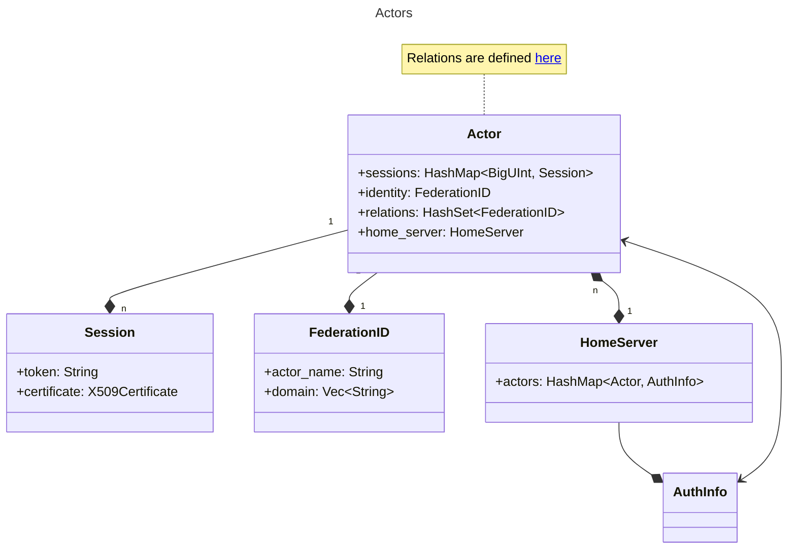

```mermaid
---
title: Actors
---

classDiagram
    class Actor {
        +sessions: HashMap~BigUInt, Session~
        +identity: FederationID
        +relations: HashSet~FederationID~
        +home_server: HomeServer
    }

    note for Actor "Relations are defined <a href="https://docs.polyphony.chat/Protocol%20Specifications/core/#713-key-rotation"/>here</a>"

    Actor "1" --* "n" Session
    Actor "1" --* "1" FederationID
    Actor "n" *--* "1" HomeServer 

    class Session {
        +token: String
        +certificate: X509Certificate
    }


    class FederationID {
        +actor_name: String
        +domain: Vec~String~
    }

    class HomeServer {
        +actors: HashMap~Actor, AuthInfo~
    }

    HomeServer --* AuthInfo
    Actor <--> AuthInfo

    class AuthInfo


```