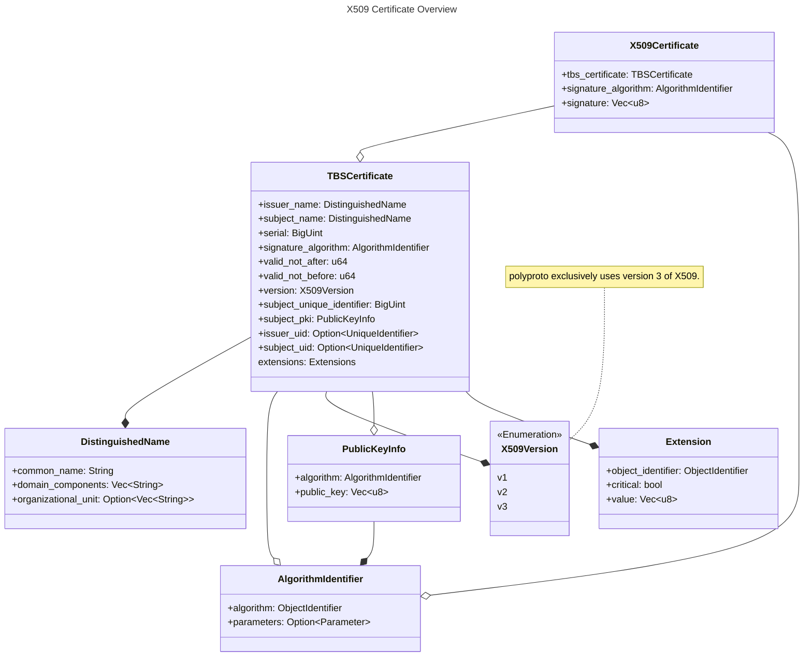

```mermaid
---
title: X509 Certificate Overview
---
classDiagram
    class X509Certificate {
        +tbs_certificate: TBSCertificate
        +signature_algorithm: AlgorithmIdentifier
        +signature: Vec~u8~
    }

    X509Certificate --o TBSCertificate
    X509Certificate --o AlgorithmIdentifier

    class TBSCertificate {
        +issuer_name: DistinguishedName
        +subject_name: DistinguishedName
        +serial: BigUint
        +signature_algorithm: AlgorithmIdentifier
        +valid_not_after: u64
        +valid_not_before: u64
        +version: X509Version
        +subject_unique_identifier: BigUint
        +subject_pki: PublicKeyInfo
        +issuer_uid: Option~UniqueIdentifier~
        +subject_uid: Option~UniqueIdentifier~
        extensions: Extensions
    }

    TBSCertificate --* DistinguishedName
    TBSCertificate --o AlgorithmIdentifier
    TBSCertificate --* X509Version
    TBSCertificate --o PublicKeyInfo
    TBSCertificate --* Extension


    class DistinguishedName {
        +common_name: String
        +domain_components: Vec~String~
        +organizational_unit: Option~Vec~String~~
    }
    
    class AlgorithmIdentifier {
        +algorithm: ObjectIdentifier
        +parameters: Option~Parameter~
    }

    class X509Version {
        <<Enumeration>>
        v1
        v2
        v3
    }

    note for X509Version "polyproto exclusively uses version 3 of X509."

    class PublicKeyInfo {
        +algorithm: AlgorithmIdentifier
        +public_key: Vec~u8~
    }

    PublicKeyInfo --* AlgorithmIdentifier

    class Extension {
        +object_identifier: ObjectIdentifier
        +critical: bool
        +value: Vec~u8~
    }
    

```