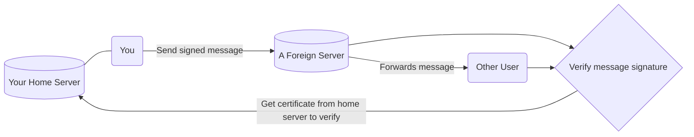

# An Overview of polyproto

!!! danger "Work in Progress"

    This overview page is not yet finished. However, that what is there is already representative of
    what the polyproto protocol is about.

polyproto is a federated identity and message exchange protocol, which can be used for almost anything.
If you'd like to build an application where federation, user control and data integrity are wanted,
then polyproto is most likely for you. Read this overview to get to know the core concepts and technologies
used in the protocol. 

## Identity

Your identity is always represented by a Federation ID, FID for short. Conceptually, FIDs are nothing new,
and they look like this: 

`xenia@some.example.com`

Everything after the `@` is your Home Servers' domain, and the part before the `@` is your username.
Together, this makes for an individual, yet globally unique identifier.

## Trust

Trusting the smallest possible amount of entities is great practice when it comes to security.
polyproto makes sure that almost everyone you do trust is under constant scrutiny, and thus provides
measures to verify a data authors' identity, and that the actual data has not been tampered with.

Aside from yourself, the entity with the most trust assigned to it is your home server. Creating your
identity on a specific home server is a pledge from that server and its admins to you, where they promise
not to create sessions on your behalf, or to otherwise perform actions which can be publicly identified
to be carried out by you, without your explicit consent.

Should you ever change your mind about your home server's trustworthiness, you can always migrate to another
server while keeping the ownership status of your data on all servers you have sent data to, even if
your home server is offline indefinitely.

## Message signing

When you, for example, chat with someone on a different server, that other server is fully in control
about what data it chooses to present to you. To make sure that you are actually talking to `xenia@example.com`,
and not to an evil server admin who directly claims to be `xenia`, the tried and true technique of
message signing is used. 

This is how it works:

- Every user client has an own identity key pair, consist of a public and a private key. The public
  key is cryptographically linked to the private key, meaning that this public key can not "fit onto"
  another private key.
- Your home server attests to your key pairs, by creating a certificate for your public key, which it
  signs with its own secret, public/private key pair, and then sends to you.

Now, there is a relationship between your identity and your home server, meaning that if a dispute were
to arise, there's always be a third party - your home server - "backing" your identity.

- When sending a message with polyproto, you generate a signature for that messages' contents and attach
  this signature to the message you send to other servers. 
- Any user, at any point, can now take this signature, your identity certificate and your home servers'
  public key and cryptographically verify that it was, in fact, you who sent the message, and that the
  message was not tampered with. To distribute the load of ID-Cert requests more evenly, it is always
  the duty of the server that the data exchange is happening on, to cache and hand out ID-Certs of users.

This paragraph simplifies many things and deliberately leaves out things like mandatory defense mechanisms
against potentially even more foreign servers, for the sake of clarity. If you are interested about the
details, feel free to jump to 
[section 7.1 in the protocol](/Protocol%20Specifications/core/#71-home-server-signed-certificates-for-public-client-identity-keys-id-cert)
in the specification document, which covers this exact thing and more.

## Technology

Probably the most refreshing aspect about this new protocol is, that it is really boring. There is really
nothing new about any given atomic aspect of polyproto. Polyproto uses well-known, tried and battle-tested
technologies, like asymmetric encryption, public key infrastructure, public key certificates, digital signatures,
JSON over REST and other, already well established technologies like WebSockets.

polyproto should be effortless - both for developers and for end users, who, ideally, should never have to
notice any of the technical stuff going on in the background.
