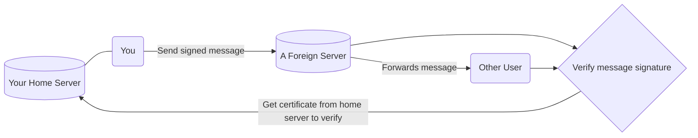

# An Overview of polyproto-core

!!! danger "Work in Progress"

    This overview page is not yet finished. However, that what is there is already representative of
    what the polyproto protocol is about.

polyproto is a federated protocol, engineered around what is most important in any application: User Experience.
Read this document for an overview of the concepts and ideas behind polyproto.

## Identity

Your identity is always represented by a Federation ID, FID for short. Conceptually, FIDs are nothing new,
and they look like this: 

`xenia@some.example.com`

Everything after the `@` is your Home Servers' domain, and the part before the `@` is your username.
Together, this makes for an individual, yet globally unique identifier.

## Trust

When you, for example, chat with someone on a different server, that other server is fully in control
about what data it chooses to present to you. To make sure that you are actually talking to `xenia@example.com`,
and not to an evil server admin who simply claims to be `xenia`, the tried and true technique of
message signing is used. 

This is how it works:

- Every user client has an own identity key pair, comprised of a public and a private key. The public
  key is cryptographically linked to the private key, meaning that this public key can not "fit onto"
  another private key.
- Your Home Server attests to your key pairs, by creating a certificate for your public key, which it
  signs with its own secret, public/private key pair, and then sends to you.

Now, there is a relationship between your identity and your home server, meaning that if a dispute were
to arise, there'd always be a third party - your home server - "backing" your identity.

- When sending a message with polyproto, you generate a signature for that messages' contents and attach
  this signature to the message you send to other servers. 
- Any user, at any point, can now take this signature and your identity certificate and cryptographically
  verify that it was, in fact, you who sent the message.

This paragraph simplifies a lot of things and deliberately leaves out things like mandatory defense mechanisms
against potentially even more foreign servers, for the sake of clarity. If you are interested about the
details, feel free to jump to 
[section 7.1 in the protocol](/Protocol%20Specifications/core/#71-home-server-signed-certificates-for-public-client-identity-keys-id-cert)
in the specification document, which covers this exact thing and more.