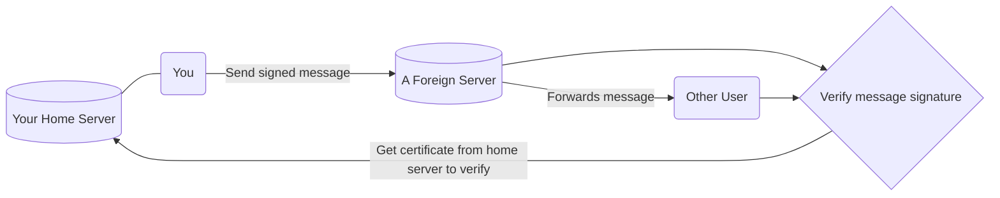

# An Overview of polyproto

!!! danger "Work in Progress"

    This overview page is not yet finished. However, that what is there is already representative of
    what the polyproto protocol is about.

polyproto is a federated identity and message exchange protocol, which can be used for almost anything.
If you'd like to build an application where federation, user control and data integrity are wanted,
then polyproto is most likely for you. Read this overview to get to know the core concepts and technologies
used in the protocol. 

## Identity

Your identity is always represented by a Federation ID, FID for short. Conceptually, FIDs are nothing new,
and they look like this: 

`xenia@some.example.com`

Everything after the `@` is your Home Servers' domain, and the part before the `@` is your username.
Together, this makes for an individual, yet globally unique identifier.

## Certificates and Keys

Identity Certificates - ID-Certs for short - represent your identity when logged in on different sessions.
Each Identity Certificate contains the following information:

- Your federation ID, so that an account can be uniquely identified
- A session ID, which is unique for each session and does not change, even if the keys change
- An expiry date, after which the certificate becomes invalid
- A signature, generated by your home server, which acts as part of the proof that this certificate was
  actually issued by your home server
- Some information from your home server (Home server domain, certificate serial number)
- Information about the signature algorithm used

and, last but not least

- The public identity key of the client

For the sake of explanation, the most important parts here are the **client public identity key**, your
**federation ID**, the **home servers' domain** and the **home servers' signature for this certificate**.

## Message signing

When you, for example, chat with someone on a different server, that other server is fully in control
about what data it chooses to present to you. To make sure that this server is always telling you the
truth, and not, for example, manufacturing chat messages or social media posts made by a person, messages
are signed using a clients' public identity key.

This is how it works:

- As touched on previously, every user client has an own identity key pair, comprised of a public and
  a private key. The public key is cryptographically linked to the private key, meaning that this public
  key can not belong to another private key. Signing data is done using the private key, which ONLY the
  client knows. Everyone can then use your public key to prove that this signature was generated by
  your client, and that the signature matches the data which was signed.
- Signatures are unique to a piece of data, meaning that two differing pieces of data signed by the same
  or different private keys will always[^1] produce different signatures. This is the case, even if the
  data only differs minutely (be it by a single space, or a single comma).
- Your home server attests to a clients' key pair, by creating a certificate for your public key, which
  it signs with its own secret, public/private key pair, and then sends to you. Your *private* key is never
  sent anywhere at all, and it does not need to be.

[^1]: Signature/hash collisions, which although theoretically possible, are extraordinarily infrequent and thus, negligible in practical scenarios.

Now, your public identity key and your home servers' identity key are 'linked' to each other. This is
represented in the ID-Cert you then receive from your home server.

- When communicating with another "foreign" server in polyproto, you first send that server your ID-Cert.
  The server can then prove the validity of your identity, simply by asking your home server for its public
  key and performing a quick signature verification. 
- When sending data to the server, such as chat messages, your client computes the signature for that
  message using your private key, and attaches this signature to the message you send to other servers. 
- Any user, at any point, can now take this signature, your identity certificate and your home servers'
  public key and cryptographically verify that it was, in fact, you who sent the message, and that the
  message was not tampered with in any way. To distribute the load of ID-Cert requests more evenly, it
  is always the duty of the server that the data exchange is happening on, to cache and hand out ID-Certs
  of users.

!!! info 

    If you are interested about the details, feel free to jump to 
    [section 7.1 in the protocol](/Protocol%20Specifications/core/#71-home-server-signed-certificates-for-public-client-identity-keys-id-cert)
    in the specification document, which covers this exact thing and more.

## Trust

Trusting the smallest possible amount of entities is great practice when it comes to security.
polyproto makes sure that almost everyone you do trust is under constant scrutiny, and thus provides
measures to verify a data authors' identity, and that the actual data has not been tampered with.

Aside from yourself, the entity with the most trust assigned to it is your home server. Creating your
identity on a specific home server is a pledge from that server and its admins to you, where they promise
not to create sessions on your behalf, or to otherwise perform actions which can be publicly identified
to be carried out by you, without your explicit consent.

Should you ever change your mind about your home server's trustworthiness, you can always migrate to another
server while keeping the ownership status of your data on all servers you have sent data to, even if
your home server is offline indefinitely.

## Multi-use

polyprotos' API definitions and specification document intentionally leave space for implementation-specific
data to be sent, where it makes sense. Nothing about the core protocol makes polyproto inherently unsuitable
for any purpose.

## Federation

Federation in polyproto means using one identity/client to interact with multiple servers at once.
Implementing federation is really simple, and entirely seamless to use for end users.

## Technology

Probably the most refreshing aspect about this new protocol is, that it is really boring. There is really
nothing new about any given atomic aspect of polyproto. Polyproto uses well-known, tried and battle-tested
technologies, like asymmetric encryption, public key infrastructure, public key certificates, digital signatures,
JSON over REST and other, already well established technologies like WebSockets.

polyproto should be effortless - both for developers and for end users, who, ideally, should never have to
notice any of the technical stuff going on in the background.

## **Conclusion**

This is just an outline about how polyproto works. The goal with this outline is to inform about the most
relevant parts, while intentionally leaving out some details for the sake of clarity. If you have read
and understood this overview, you should have no - or at least way less - trouble reading the
[full protocol specification](/Protocol%20Specifications/core), which covers a lot more details!