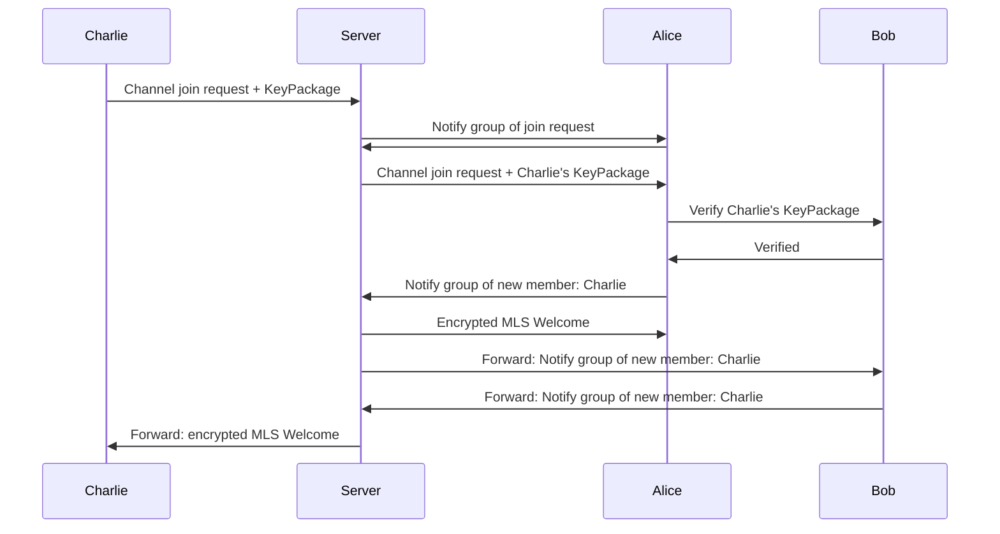
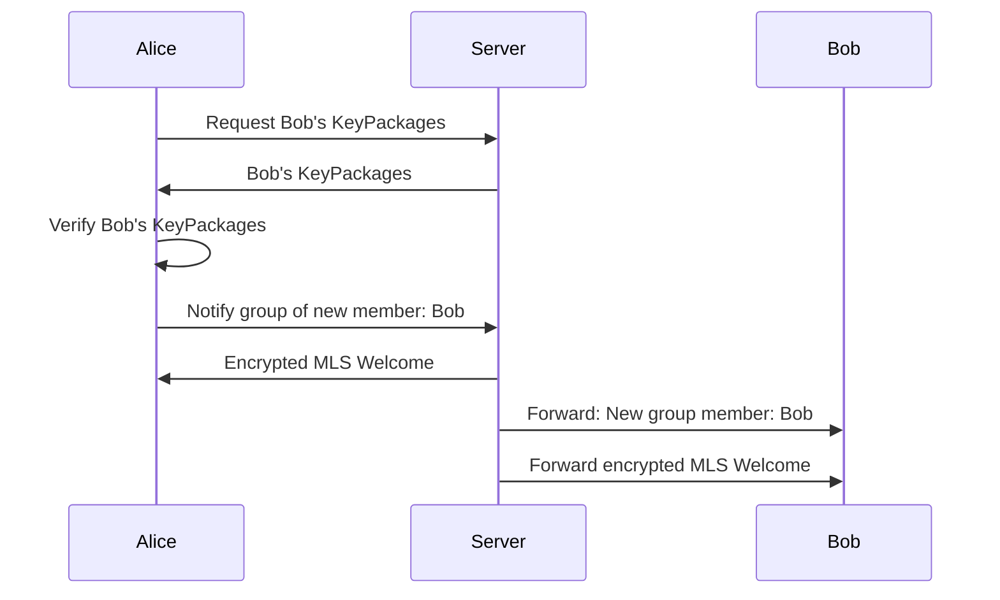
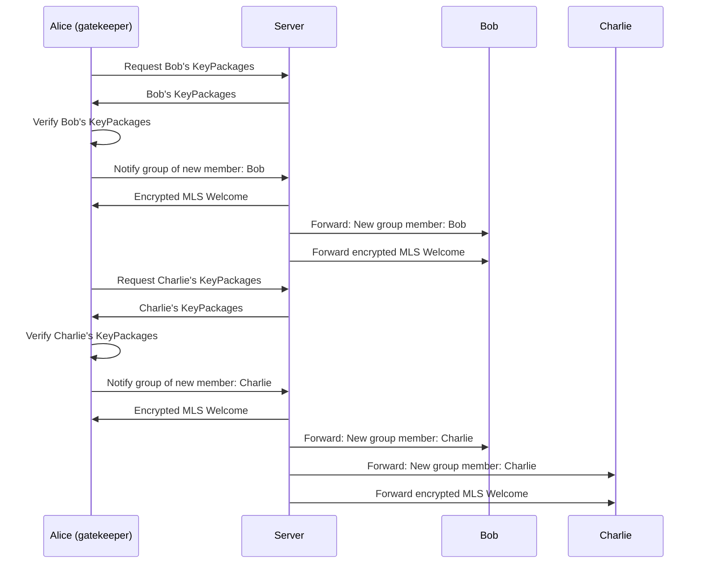

# p2-Extension: polyproto-chat

- Namespace: `chat`
- Version: `v0.1.0-alpha.1`
- API version: `v0.1.0-alpha.1`
- API documentation: [apidocs.polyproto.org](https://apidocs.polyproto.org)
- Dependencies:
  - [polyproto](https://docs.polyphony.chat/Protocol%20Specifications/core/)@1.0.0-beta.1
  - [mls](https://docs.polyphony.chat/Protocol%20Specifications/P2%20Extensions/mls/)@0.1.0-alpha.1

!!! warning

    The polyproto-chat specification document is in an **alpha** phase. Please report any inconsistencies,
    missing or duplicate information and other mistakes at [github.com/polyphony-chat/docs/issues](https://github.com/polyphony-chat/docs/issues).

[Semantic versioning v2.0.0](https://semver.org/spec/v2.0.0.html) is used to version this specification.

## 4. Federating direct/group messages

### 4.1 Direct messages

Federating direct messages is straightforward. When Alice sends a message to Bob, their client will send the message to Bob's home server via an API request. Bob's home server will then send the message to Bob's client via an established WebSocket connection, and vice versa.

### 4.2 Group messages

Group messages work just like guilds, in the sense that data is stored by the home server of the group's creator, meaning that all group members will have to communicate with the group creator's home server. If the group creator leaves the group, the ownership of the group is transferred to another member. The group chat stays on the group creator's home server.

<!--Potential work could be done to think of a system which allows group chat members to vote for a migration of the conversation to another server. Consent is needed from all involved parties, because otherwise, data cannot ethically be transfered from one server to another another.-->

## 6. Encrypted channels and groups

Note, that in the below sequence diagrams, the MLS Welcome message and the MLS Group notify message are all encrypted using the identity key of the recipient.

### 6.1 Encrypted guild channels

Encrypting a guild channel is done by a client with the `MANAGE_CHANNEL` permission. Upon successfully requesting enabling encryption of a channel, all future messages in it will be encrypted. Joining an encrypted channel is done by sending a join request to the server. The server will then notify the channels' members of the join request. The members will then decide whether to accept or reject the join request. If the join request is accepted by any member, that member will initiate the MLS welcoming process. If the member finds that the join request is invalid (perhaps due to an invalid `KeyPackage`), the join request must be denied. It is imperative that join requests are verified correctly by the server.

<a id="fig-3"/>

Fig. 3: Sequence diagram of a successful encrypted channel join in which Alice acts as a gatekeeper. The sequence diagram assumes that Alice can verify Charlies' public key to indeed belong to Charlie, and that Alice accepts the join request.

### 6.2 Encrypted direct messages

Adding another person to a direct message is not possible, and would not make much sense, as the new person cannot see any messages that were sent before they joined the group. If Alice wants to add Charlie to a direct message with Bob, she will have to create a new direct message with Bob and Charlie.

Fig. 4: Sequence diagram of a successful encrypted direct message creation.

### 6.3 Encrypted group messages

Encrypted group messages work by using the traditional MLS protocol, with the additional concept of group owners. Only group owners can add new members to the group and forcibly remove others from the group. The Group owner is determined by the Client-Server API.

Fig. 5: Sequence diagram of a successful encrypted group creation with 3 members.

### 6.4 Joining new devices from existing users

Regardless of channel or group permissions, a user join request from a new device should be accepted by default.

### 6.5 Best practices

- In case of encrypted guild channel join requests, it may be a good idea to treat multiple join requests from the same user with different clients as a single join request, when it comes to UI/UX.
- Joining an encrypted channel, even from an already established member with a new device, should be an event distinctly visible to all members of the channel. This is to prevent a malicious user from joining a channel without the other members noticing.

---

--8<-- "snippets/glossary.md"
