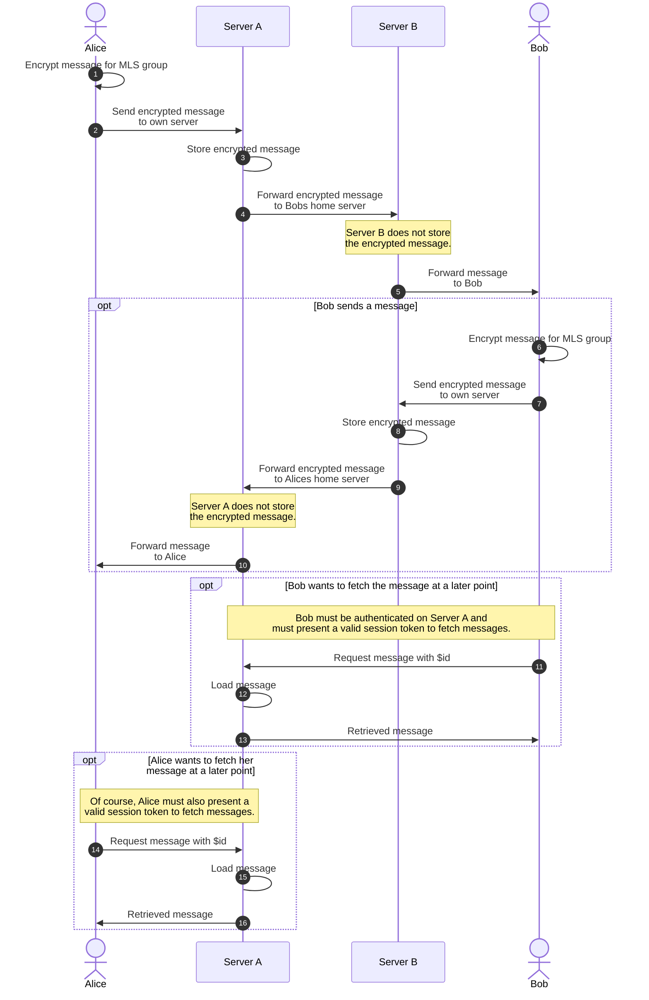
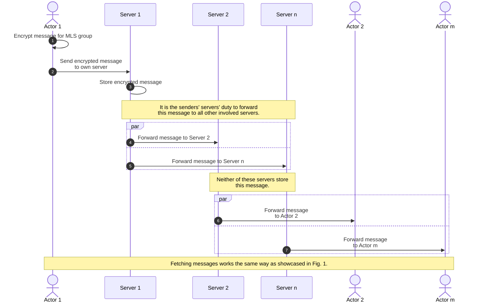
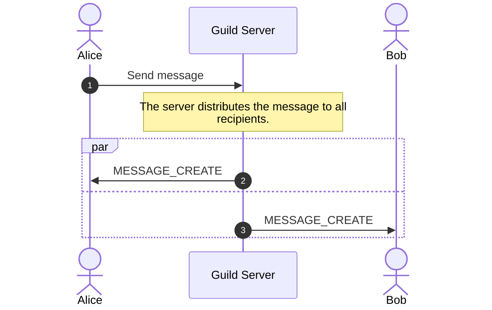
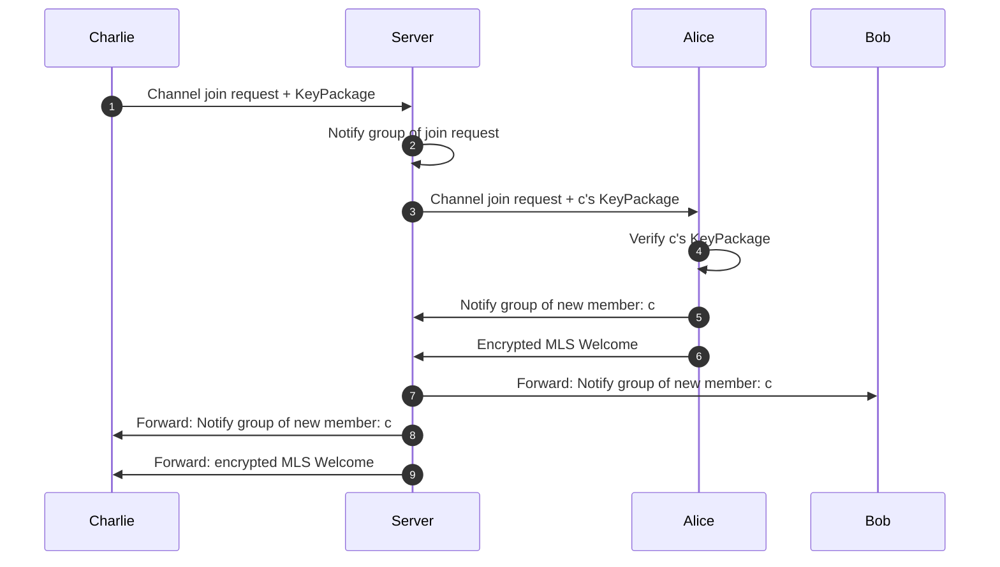
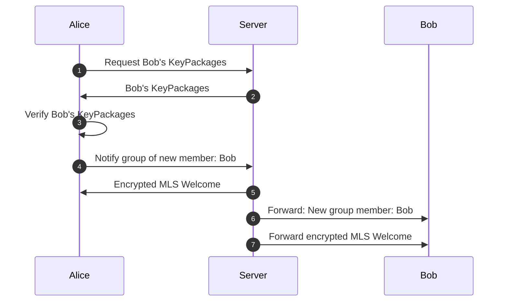
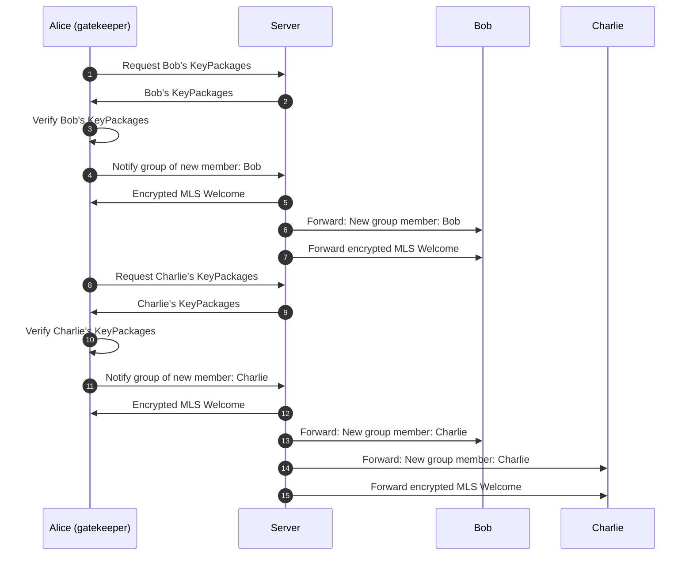

# p2-Extension: polyproto-chat

- Namespace: `chat`
- Version: `v0.1.0-alpha.1`
- API version: `v0.1.0-alpha.1`
- API documentation: [apidocs.polyproto.org](https://apidocs.polyproto.org)
- Dependencies:
    - [polyproto](https://docs.polyphony.chat/Protocol%20Specifications/core/)@1.0.0-beta.1
    - [mls](https://docs.polyphony.chat/Protocol%20Specifications/P2%20Extensions/mls/)@0.1.0-alpha.1

!!! warning

    The polyproto-chat specification document is in an **alpha** phase. Please report any inconsistencies,
    missing or duplicate information and other mistakes at [github.com/polyphony-chat/docs/issues](https://github.com/polyphony-chat/docs/issues).

[Semantic versioning v2.0.0](https://semver.org/spec/v2.0.0.html) is used to version this specification.

- [p2-Extension: polyproto-chat](#p2-extension-polyproto-chat)
  - [1. Trust model](#1-trust-model)
  - [2. Federation Principles](#2-federation-principles)
  - [2.1 Messaging Groups](#21-messaging-groups)
    - [2.1.1 Private messages](#211-private-messages)
    - [2.1.2 Group messages](#212-group-messages)
  - [2.2 Guilds and Guild channels](#22-guilds-and-guild-channels)
  - [3. Encrypted channels and groups](#3-encrypted-channels-and-groups)
    - [3.1 Encrypted guild channels](#31-encrypted-guild-channels)
    - [3.2 Encrypted direct messages](#32-encrypted-direct-messages)
    - [3.3 Encrypted group messages](#33-encrypted-group-messages)
    - [3.4 Joining new devices from existing users](#34-joining-new-devices-from-existing-users)
    - [3.5 Best practices](#35-best-practices)
  - [polyproto-chat specific glossary](#polyproto-chat-specific-glossary)
  - [General glossary](#general-glossary)

## 1. Trust model

polyproto-chat inherits its trust model from the core polyproto specification. In addition, the
following trust assumptions are added:

1. Unencrypted messages can only be read by users with the necessary permissions to access the channel
   the message was sent to, at the point the message was sent, or in the future. In addition,
   server moderators, -administrators and other entities who can access the infrastructure the
   server is hosted on are always able to read unencrypted messages, whether through directly
   accessing this information or because of a report that was filed by another user.
2. Unencrypted metadata can be accessed by the same set of people described in 1.
3. Server moderators, -administrators, other entities who may gain access to the infrastructure the
   server is hosted on and other polyproto-chat users can not read encrypted messages or -metadata in
   plain text, if they are not themselves part of the MLS group the message was sent in.
4. Extending 3., server moderators, -administrators and other entities have **no way** to gain insight
   into the contents of an encrypted message, if they are not themselves part of the MLS group the
   message was sent in.
5. Compromise of an encrypted communications channel will not expose past communications.
6. After an encrypted communications channel has been compromised, it is possible to re-establish
   the security/secrecy guarantees (post-compromise security).

!!! danger

    Human error, faulty software or malicious actions can always lead to unauthorized access to
    information, encrypted or not. This is true for every user-facing application employing encryption
    *ever*, not just polyproto-chat.

## 2. Federation Principles

This section explains how the federation in different parts of polyproto-chat works.

## 2.1 Messaging Groups

Every messaging group is also an MLS group. Messaging groups are always encrypted using the MLS
protocol and shared cipher suites. A direct messaging group between two actors is also treated as
a group message in this case.

Group messages are decentralized in nature. Each participant of a messaging group stores the messages
they send on the server which acts as their primary service provider for the polyproto-chat service.

!!! info

    Read chapter #9 of the polyproto core specification document for more information on services and
    service providers.

With multiple servers participating in a conversation, a server outage only affects the messages
stored on that server, not the entire messaging group.

### 2.1.1 Private messages

The below sequence diagram showcases how a private messaging channel between two actors with different
service providers works.

*Fig. 1: Message sending and message retrieval in a private messaging group.*

If the actors use the same primary service provider for the `chat` service, steps (4) and (9) do
not apply.

### 2.1.2 Group messages

Below, you can find a condensed sequence diagram showcasing how a messaging group with > 2 actors
works:

*Fig. 2: Message sending and message retrieval in a messaging group.*

If two actors have the same primary service provider for the `chat` service, steps facilitating
communication across servers do not apply.

## 2.2 Guilds and Guild channels

Unlike messaging groups, guild channels are not encrypted by default.

!!! question "Why are guild channels not encrypted by default?"

    In the real world, most guilds are used as spaces for open communities where people join and leave
    freely. Encrypted communications channels are useful when the communication between actors is potentially
    sensitive. Additionally, for encryption to be effective, you must at least somewhat trust the
    parties able to decrypt your messages.

    The potential for anyone to join a chat and receive the entire encrypted history undermines the
    purpose of encryption. Therefore, we don't offer cross-actor encrypted chat history distribution,
    even for guild channels.

    Encrypted guild channels are available, but without cross-actor encrypted chat history
    distribution, their user experience is not fit for a "default" status.

All messages sent to guild channels are stored on the server that hosts the guild.

*Fig. 3: Sequence diagram, showing Alice sending a message to a guild channel accessible to both
Alice and Bob.*

## 3. Encrypted channels and groups

Note, that in the below sequence diagrams, the MLS Welcome message and the MLS Group notify
message are all encrypted using the identity key of the recipient.

### 3.1 Encrypted guild channels

Encrypting a guild channel is done by a client with the `MANAGE_CHANNEL` permission. Upon
successfully requesting enabling encryption of a channel, all future messages in it will be
encrypted. Joining an encrypted channel is done by sending a join request to the server. The server
will then notify the channels' members of the join request. The members will then decide whether to
accept or reject the join request. If the join request is accepted by any member, that member will
initiate the MLS welcoming process. If the member finds that the join request is invalid (perhaps
due to an invalid `KeyPackage`), the join request must be denied. It is imperative that join
requests are verified correctly by the server.

<a id="fig-3"/>

Fig. 3: Sequence diagram of a successful encrypted channel join in which Alice acts as a gatekeeper.
The sequence diagram assumes that Alice can verify Charlies' public key to indeed belong to
Charlie, and that Alice accepts the join request.

### 3.2 Encrypted direct messages

Adding another person to a direct message is not possible, and would not make much sense, as the
new person cannot see any messages that were sent before they joined the group. If Alice wants
to add Charlie to a direct message with Bob, she will have to create a new direct message with
Bob and Charlie.

Fig. 4: Sequence diagram of a successful encrypted direct message creation.

### 3.3 Encrypted group messages

Encrypted group messages work by using the traditional MLS protocol, with the additional concept
of group owners. Only group owners can add new members to the group and forcibly remove others
from the group. The Group owner is determined by the Client-Server API.

Fig. 5: Sequence diagram of a successful encrypted group creation with 3 members.

### 3.4 Joining new devices from existing users

Regardless of channel or group permissions, a user join request from a new device should be
accepted by default.

### 3.5 Best practices

- In case of encrypted guild channel join requests, it may be a good idea to treat multiple join
  requests from the same user with different clients as a single join request, when it comes to UI/UX.
- Joining an encrypted channel, even from an already established member with a new device,
  should be an event distinctly visible to all members of the channel. This is to prevent a
  malicious user from joining a channel without the other members noticing.

---

## polyproto-chat specific glossary

- **Message group** - A "guildless" message channel with 2-15 individual actors.
- **Guild** - Guilds are fundamental organizational units, representing a community or group of users
  who share a common interest, purpose or affiliation. Guilds are organized into channel categories,
  which contain channels. See also: `Channel`, `Channel Category`, `Role`, `Permission`

## General glossary

--8<-- "snippets/glossary.md"
