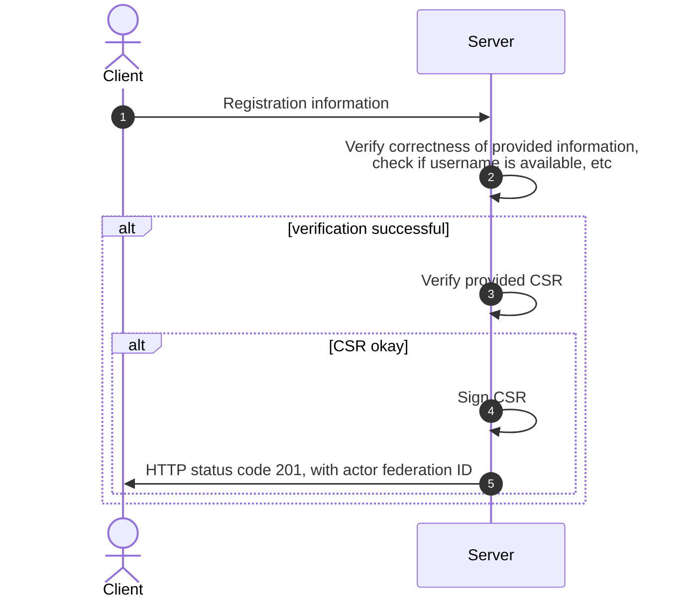
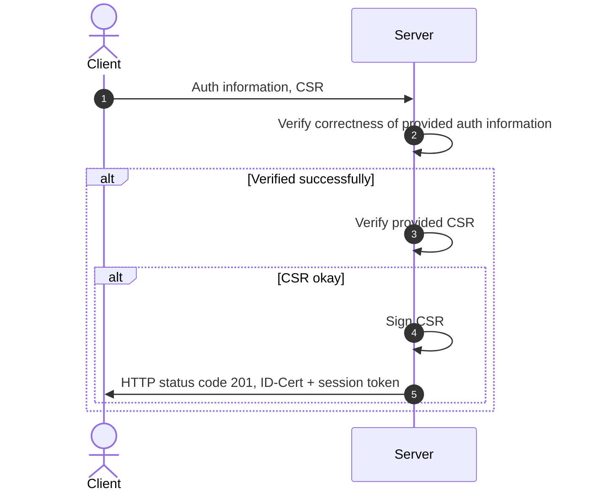
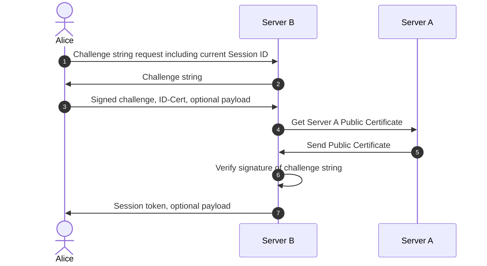

# P2 Protocol Extension: polyproto-auth

The `polyproto-auth` extension is a protocol extension for polyproto that provides a basic
authentication mechanism to register new users and authenticate existing users.

- [P2 Protocol Extension: polyproto-auth](#p2-protocol-extension-polyproto-auth)
  - [1. Registration of a new actor](#1-registration-of-a-new-actor)
  - [1.1 Registering a new actor on a polyproto home server](#11-registering-a-new-actor-on-a-polyproto-home-server)
  - [1.2 Authenticating a new client on a polyproto home server](#12-authenticating-a-new-client-on-a-polyproto-home-server)
  - [1.3 Authenticating on a foreign server](#13-authenticating-on-a-foreign-server)

## 1. Registration of a new actor

Registering a new actor in the context of polyproto is done through an API route defined in the
polyproto-auth
["No registration needed" API](/APIs/Core/Routes%3A No registration needed/#post-create-identity)
documentation.

## 1.1 Registering a new actor on a polyproto home server

To register, the client sends the necessary information to their home server. The server verifies
the data, checks username availability, and responds with HTTP 201 and the new identity's federation
ID, if successful. However, a session token is not provided until the actor authenticates a client,
as detailed in section [1.2](#12-authenticating-a-new-client-on-a-polyproto-home-server).

Fig. 1: Sequence diagram of a successful identity creation process.

## 1.2 Authenticating a new client on a polyproto home server

To access their account from a new device, an actor authenticates the session with their home server
by sending authentication information and a
[certificate signing request (CSR)](../core.md/#71-home-server-signed-certificates-for-public-client-identity-keys-id-cert)
for the new client. If verified successfully, the server signs the CSR and responds with the newly
generated ID-Cert and a session token corresponding to this ID-Cert.

Fig. 2: Sequence diagram of a successful client authentication process.

The client is now authenticated and can use the session token and ID-Cert to perform actions on
behalf of the actor identified by the ID-Cert.

## 1.3 Authenticating on a foreign server

Authenticating on a foreign server requires the actor to sign a challenge string with their private
identity key and send it, along with their ID-Cert, to the server. The server then validates the
ID-Cert's origin, the challenge string's signature, and the ID-Cert's validity.

If the verification is successful, the foreign server can issue a session token to the actor.

**Example:**
Say that Alice is on server A, and wants to authenticate on Server B, using her existing identity.

Alice's client sends a request to Server B for a challenge string, telling Server B the session ID
they are communicating from in the process. Upon receiving a response, Alice signs this challenge
string with the correct private key. They then send the signature to Server B. Server B can now
verify that it was actually Alice who signed the string, and not a malicious outsider. Server B does
this by requesting Alice's ID-Cert, specifically the ID-Cert matching the session ID Alice
identified with to Server B. If all goes well, server B will send a newly generated session token
back to Alice's client. Alice's client can then authenticate with server B by using this token.

Fig. 3: Sequence diagram of a successful identity verification.

In the diagram, Alice's "optional payload" is extra data that might be requested by servers.
This is useful when using a single identity across various polyproto implementations, due to
differing information needs. The payload is signed with the actor's private identity key.

Likewise, the "optional payload" sent by the server in the above diagram can be used by
implementations to send additional information to the client. An example might be initial account
information.

!!! example

    Alice currently has a polyproto identity, which she created when signing up for 
    "https://example.com/chat". When signing up for this service, she didn't need to provide any
    additional information on registration. However, when she wants to actor her existing identity
    to sign up for "https://example.com/social", she is asked to provide her email address, which
    she can provide as the "optional payload". The server can then store the email address in its'
    database, associate it with Alice's identity, and let Alice log in with her existing identity. 

If Alice's session token expires, they can repeat this process of requesting a challenge string and,
together with her ID-Cert, exchange it for a session token. However, if Alice wants to access this
third party account from a completely new device, they will have to perform the steps described in
section [1.2](#12-authenticating-a-new-client-on-a-polyproto-home-server) to obtain a valid
ID-Cert for that session.

---

--8<-- "snippets/glossary.md"
