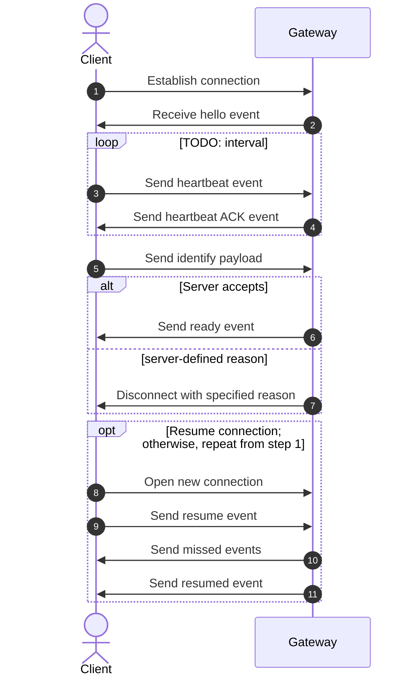
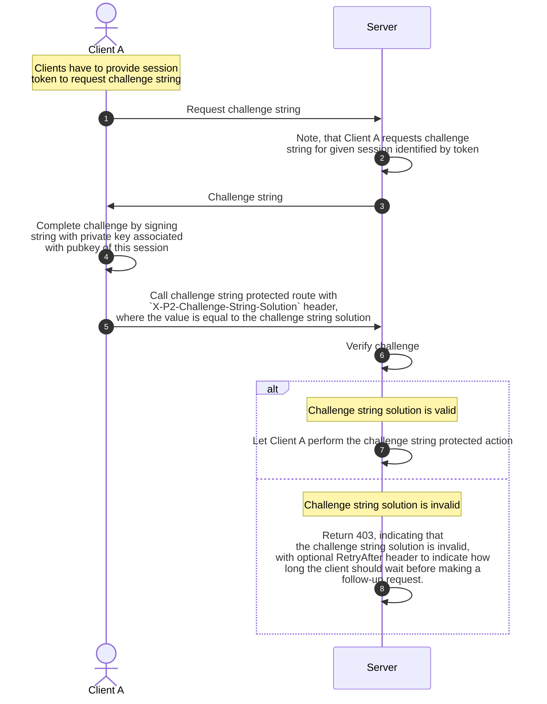
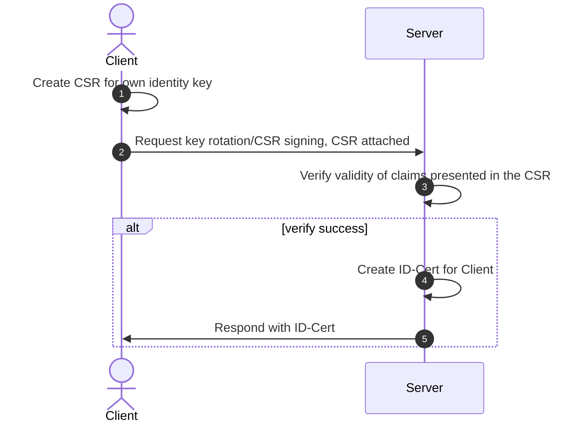
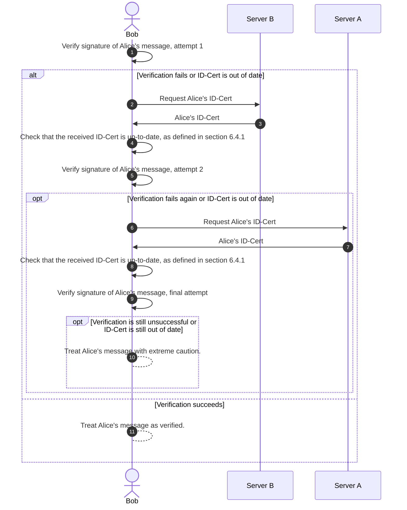
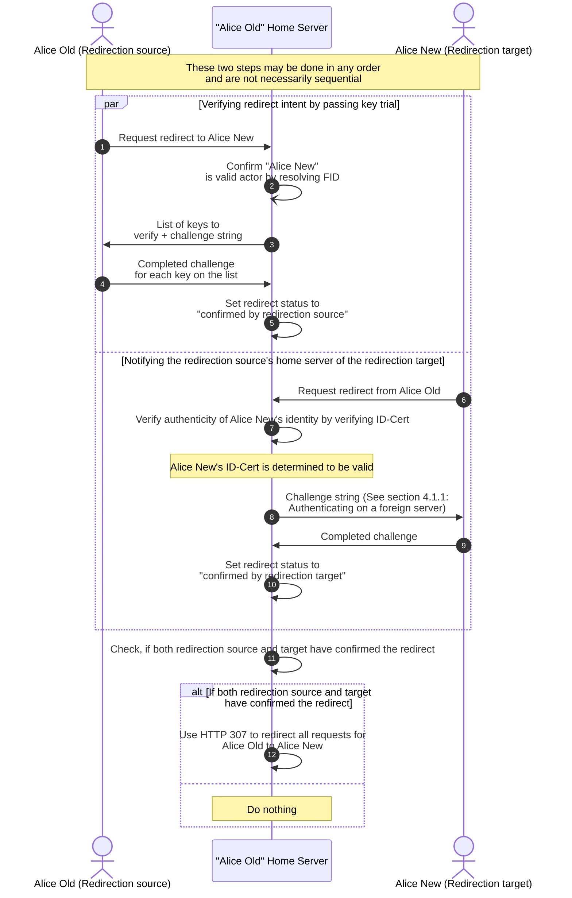
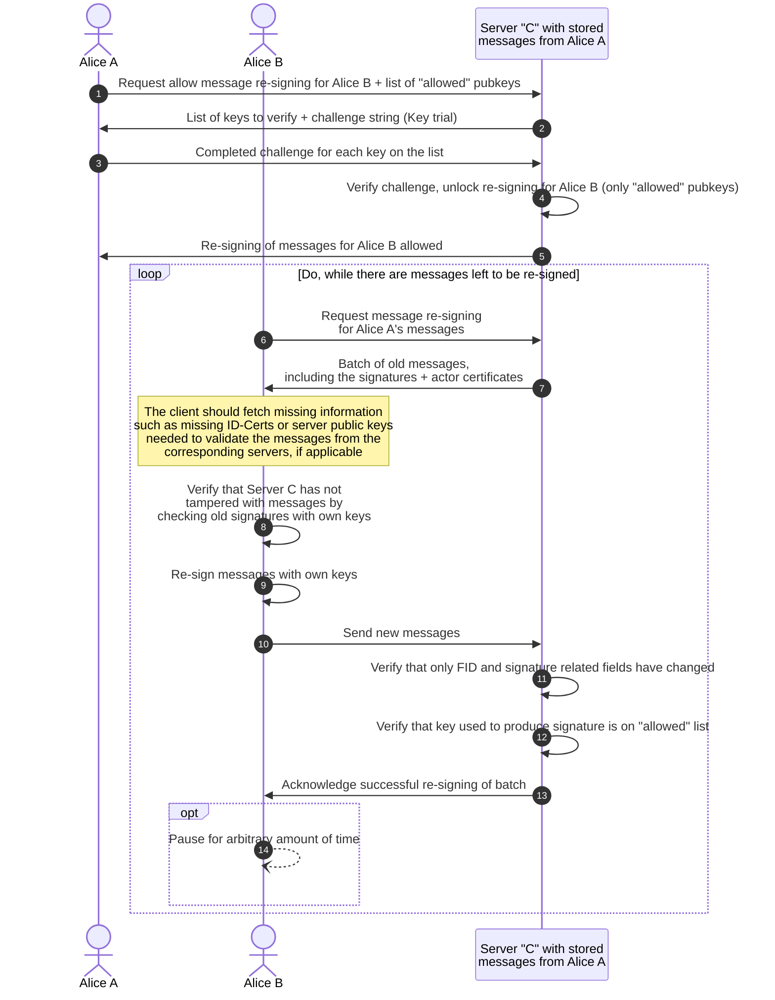
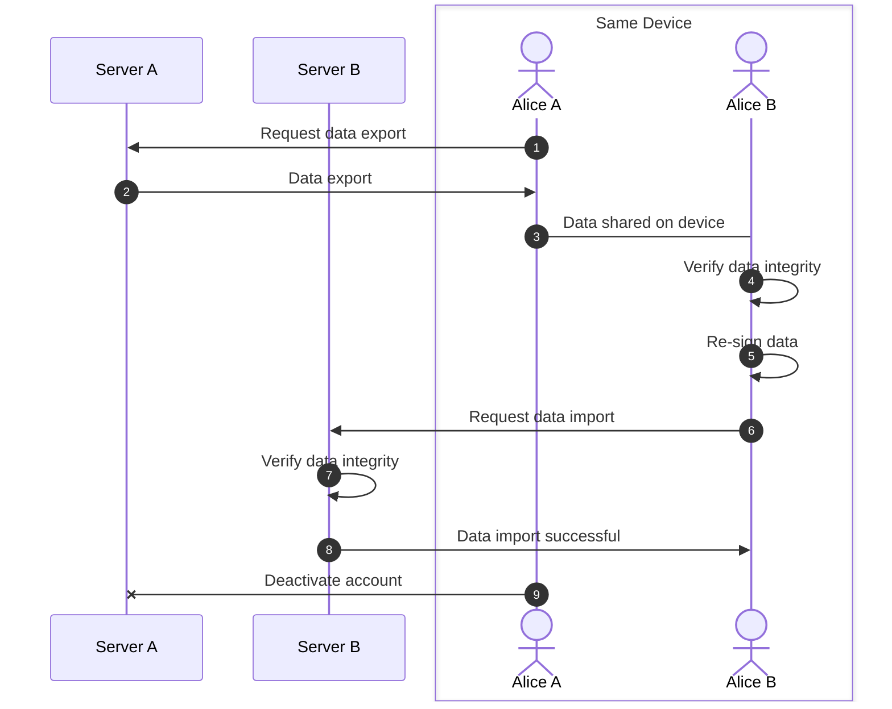

# polyproto Specification

- Namespace: `core`
- Version: `v0.1.0-alpha.1`
- API version: `v0.1.0-alpha.1`
- API documentation: [apidocs.polyproto.org](https://apidocs.polyproto.org)

!!! warning

    The polyproto specification document is in an **alpha** phase. Please report any inconsistencies,
    missing or duplicate information and other mistakes at [github.com/polyphony-chat/docs/issues](https://github.com/polyphony-chat/docs/issues).

[Semantic versioning v2.0.0](https://semver.org/spec/v2.0.0.html) is used to version this specification.

- [polyproto Specification](#polyproto-specification)
  - [1. Terminology used in this document](#1-terminology-used-in-this-document)
  - [2. Trust model](#2-trust-model)
  - [3. APIs and underlying communication protocols](#3-apis-and-underlying-communication-protocols)
    - [3.1 `.well-known`](#31-well-known)
    - [3.2 WebSocket Protocol](#32-websocket-protocol)
      - [3.2.1 Gateway Event Payloads](#321-gateway-event-payloads)
        - [3.2.1.1 Namespaces `n`](#3211-namespaces-n)
        - [3.2.1.2 Opcodes `op`](#3212-opcodes-op)
        - [3.2.1.3 Sequence numbers `s`](#3213-sequence-numbers-s)
      - [3.2.2 Heartbeats](#322-heartbeats)
      - [3.2.3 Gateway event payload definitions](#323-gateway-event-payload-definitions)
        - [3.2.3.1 "Hello" event](#3231-hello-event)
        - [3.2.3.2 Identify event](#3232-identify-event)
        - [3.2.3.3 Service channels](#3233-service-channels)
        - [3.2.3.4 New session event](#3234-new-session-event)
        - [3.2.3.5 Actor certificate invalidation event](#3235-actor-certificate-invalidation-event)
        - [3.2.3.6 "Resume" event and "resumed" event](#3236-resume-event-and-resumed-event)
        - [3.2.3.7 Server certificate change event](#3237-server-certificate-change-event)
        - [3.2.3.8 Heartbeat and heartbeat ACK events](#3238-heartbeat-and-heartbeat-ack-events)
        - [3.2.3.9 Heartbeat request](#3239-heartbeat-request)
      - [3.2.4 Establishing a connection](#324-establishing-a-connection)
      - [3.2.5 Closing a connection](#325-closing-a-connection)
      - [3.2.6 Guaranteed delivery of gateway messages through package acknowledgement](#326-guaranteed-delivery-of-gateway-messages-through-package-acknowledgement)
      - [3.3 Events over events](#33-events-over-events)
    - [3.4 HTTP](#34-http)
    - [3.5 Internet Protocol (IP)](#35-internet-protocol-ip)
    - [3.6 Compression](#36-compression)
  - [4. Federated identity](#4-federated-identity)
    - [4.1 Authentication](#41-authentication)
      - [4.1.1 Authenticating on a foreign server](#411-authenticating-on-a-foreign-server)
      - [4.1.2 Sensitive actions](#412-sensitive-actions)
    - [4.2 Key trials](#42-key-trials)
    - [4.3 Protection against misuse by malicious home servers](#43-protection-against-misuse-by-malicious-home-servers)
  - [5. Federation IDs (FIDs)](#5-federation-ids-fids)
  - [6. Cryptography and ID-Certs](#6-cryptography-and-id-certs)
    - [6.1 Home server signed certificates for public client identity keys (ID-Cert)](#61-home-server-signed-certificates-for-public-client-identity-keys-id-cert)
      - [6.1.1 Structure of an ID-Cert](#611-structure-of-an-id-cert)
        - [6.1.1.1 polyproto Distinguished Name (`pDN`)](#6111-polyproto-distinguished-name-pdn)
        - [6.1.1.2 Extensions and constraints](#6112-extensions-and-constraints)
        - [6.1.1.3 Session IDs](#6113-session-ids)
      - [6.1.2 Necessity of ID-Certs](#612-necessity-of-id-certs)
      - [6.1.3 Key rotation](#613-key-rotation)
      - [6.1.4 Early revocation of ID-Certs](#614-early-revocation-of-id-certs)
    - [6.2 Actor identity keys and message signing](#62-actor-identity-keys-and-message-signing)
      - [6.2.1 Message verification](#621-message-verification)
      - [6.2.2 Handling of external messages](#622-handling-of-external-messages)
    - [6.3 Private key loss prevention and private key recovery](#63-private-key-loss-prevention-and-private-key-recovery)
    - [6.4 Caching of ID-Certs](#64-caching-of-id-certs)
      - [6.4.1 Verifying that a newly retrieved ID-Cert is not out of date](#641-verifying-that-a-newly-retrieved-id-cert-is-not-out-of-date)
    - [6.5 Cryptographic specifications](#65-cryptographic-specifications)
    - [6.6 Best practices](#66-best-practices)
      - [6.6.1 Signing keys and ID-Certs](#661-signing-keys-and-id-certs)
      - [6.6.2 Home server operation and design](#662-home-server-operation-and-design)
      - [6.6.3 Private key loss prevention and private key recovery](#663-private-key-loss-prevention-and-private-key-recovery)
  - [7. Migrations](#7-migrations)
    - [7.1 Identity migration](#71-identity-migration)
      - [7.1.1 Redirects](#711-redirects)
    - [7.2 Re-signing messages](#72-re-signing-messages)
      - [7.2.1 Message batches](#721-message-batches)
      - [7.2.2 Server-imposed limits](#722-server-imposed-limits)
        - [7.2.2.1 Body size](#7221-body-size)
        - [7.2.2.2 Interval between re-signing batches](#7222-interval-between-re-signing-batches)
    - [7.3 Moving data](#73-moving-data)
      - [7.3.1 Resource Addressing with Relative Roots](#731-resource-addressing-with-relative-roots)
      - [7.3.2 polyproto export/import format](#732-polyproto-exportimport-format)
    - [7.4 Challenges and trust](#74-challenges-and-trust)
  - [8. Protocol extensions (P2 extensions)](#8-protocol-extensions-p2-extensions)
    - [8.1 Extension design](#81-extension-design)
    - [8.2 Namespaces](#82-namespaces)
    - [8.3 Officially endorsed extensions](#83-officially-endorsed-extensions)
    - [8.4 Versioning and yanking](#84-versioning-and-yanking)
      - [8.4.1 Yanking](#841-yanking)
    - [8.5 Dependencies](#85-dependencies)
    - [8.6 Routes](#86-routes)
  - [9. Services](#9-services)
  - [9.1 Discoverability](#91-discoverability)
    - [9.1.1 Changing a primary service provider](#911-changing-a-primary-service-provider)

The polyproto protocol is a home-server-based identity federation protocol specification intended
for use in applications where actor identity is needed. polyproto focuses on federated identity
and does not specify any further application-specific features. It can be used standalone, as a
method of authenticating across many applications and services, or as a base for federated protocol
extensions and application implementations. The use of cryptography—namely digital
signatures and X.509 certificates—make polyproto identities verifiable and portable. polyproto
empowers actors, as the home server can be changed at any time, without losing data or connections
to other actors.

This document is intended to be used as a starting point for developers wanting to develop software
that can operate with other polyproto implementations.

## 1. Terminology used in this document

The following terminology is used throughout this document:

--8<-- "snippets/glossary.md"

## 2. Trust model

polyproto operates under the following trust assumptions:

1. Users entrust their home server and its admins with data security and discretion on actions
   appearing as actor-performed, since as is the case with most home server-based systems, it is
   possible for a home server to impersonate an actor in unencrypted communications.
2. Impersonation *can* be detected by users, as home servers never have access to private keys of
   actors. To sign messages as an actor, a home server would have to use a different key pair.
3. Users only trust information that can be verified by cryptographic means. This includes
   verifying the identity of other actors and verifying the integrity of messages.
4. In a federated context, users trust foreign servers with all unencrypted data they send
   to them.
5. Foreign servers cannot impersonate users without immediate detection. Outsiders, meaning foreign
   servers and other actors, are unable to produce signatures that have a cryptographic connection
   to the actors' home server. This is assuming correct implementation of cryptographic
   standards, secure home server operation, and non-compromised client devices, all of which are
   mostly out of the scope of this specification.
6. Users rely on their home server for identity key certification, without the home server
   possessing the identity.

## 3. APIs and underlying communication protocols

The polyproto specification defines a set of [APIs](https://apidocs.polyproto.org).
In addition to these REST APIs, polyproto employs WebSockets for real-time communication between
clients and servers.

The APIs are divided into two categories:

- **Routes: No registration needed**: These routes are available to all clients, regardless of
  whether this server is the client's home server.
- **Routes: Registration needed**: These routes are only available to clients where the server is
  the client's home server.

All software aiming to federate with other polyproto implementations must implement the APIs defined
in the [API specification](https://apidocs.polyproto.org). Implementations can choose to extend the
APIs with additional routes but must not remove or change the behavior of the routes defined in
this specification.

### 3.1 `.well-known`

`/.well-known/` locations facilitate the discovery of resources and services available on a given
host.

!!! note

    Consult the excerpt of this specification explaining what a "domain name" is, to avoid
    misunderstandings. You can find this excerpt [here](#def-domain-name).

polyproto servers can be hosted under a domain name different from the domain name
appearing on ID-Certs managed by that server **if all the following conditions are met:**

1. Define the "*visible domain name*" as the domain name described by the [polyproto distinguished name](#6111-polyproto-distinguished-name-pdn)
   of the "issuer" field on an ID-Cert.
2. Define the "*actual domain name*" as the domain name where the polyproto server is actually hosted
   under.
3. The *visible domain name* **must** have a URI `[visible domain name]/.well-known/polyproto-core`,
   accessible via an HTTP GET request.
4. The resource accessible at this URI must be a JSON object formatted as such:

   ```json
   {
    "api": "[actual domain name]/.p2/core/"
   }
   ```

5. The ID-Cert received when querying `[actual domain name]/.p2/core/idcert/server` with an HTTP GET
   request must have a field "issuer" containing domain components (`dc`) that, when parsed, **equal**
   the domain name of the *visible domain name*. If the domain components in this field do not match
   the domain components of the *visible domain name*, the server hosted under the *actual domain name*
   must not be treated as a polyproto server for the *visible domain name*.

Every polyproto home server must have a `.well-known` URI, accessible via an HTTP GET request.

Should a client not be able to access the polyproto API endpoints located at `[visible domain name]/.p2/core/`,
the client must query `[visible domain name]/.well-known/polyproto-core` with an HTTP GET request and
try to verify the above-mentioned conditions. If all the above-mentioned conditions can be fulfilled,
the client can treat the server located at the *actual domain name* as a polyproto server serving the
*visible domain name*. Clients must not treat the server located at the *actual domain name* as a
polyproto server serving the *actual domain name*.

### 3.2 WebSocket Protocol

WebSockets enable real-time, bidirectional communication between actor clients and home servers.

!!! info

    A polyproto WebSocket server is also called "Gateway" or "Gateway Server" for short.

WebSocket connections to polyproto servers consist of the following, general cycle:



*Fig. 1: Sequence diagram of a WebSocket connection to a polyproto server.*

#### 3.2.1 Gateway Event Payloads

Gateway event payloads share a general structure, though the content of the `d` field varies depending
on the specific event.

| Field | Type       | Description                                                         |
| ----- | ---------- | ------------------------------------------------------------------- |
| `n`   | string     | [Namespace](#82-namespaces) context for this payload.               |
| `op`  | uint16     | Gateway Opcode indicating the type of payload.                      |
| `d`   | JSON value | The event data associated with this payload.                        |
| `s`¹  | uint64     | Sequence number of the event, used for guaranteed, ordered delivery |

¹: This field is only received by clients and never sent to the server.

##### 3.2.1.1 Namespaces `n`

The `n` field in a gateway event payload indicates the namespace context for the payload. You can
read more about namespaces in [section 8.2](#82-namespaces).
messages
Every namespace may define its own set of opcodes and event names.

The namespace context must be known to the entity receiving the payload, as it is crucial for
correctly interpreting the payload.

##### 3.2.1.2 Opcodes `op`

The following opcodes are defined by the `core` namespace:

| Opcode | Name                           | Action             | Description                                                                                                      |
| ------ | ------------------------------ | ------------------ | ---------------------------------------------------------------------------------------------------------------- |
| `0`    | Heartbeat                      | Actor Send         | Keep alive for the WebSocket session.                                                                            |
| `1`    | Hello                          | Actor Receive      | Received upon establishing a connection.                                                                         |
| `2`    | Identify                       | Actor Send         | Identify to the server.                                                                                          |
| `3`    | New Session                    | Actor Receive      | Received by all sessions except the new one.                                                                     |
| `4`    | Actor Certificate Invalidation | Actor Send/Receive | An actor certificate has been invalidated. Sent *to* server when an actor invalidates one of their certificates. |
| `5`    | Resume                         | Actor Send         | Request the replaying events after re-connecting.                                                                |
| `6`    | Server Certificate Change      | Actor Receive      | Received when the server's certificate changed.                                                                  |
| `7`    | Heartbeat ACK                  | Actor Receive      | Acknowledgement of a heartbeat                                                                                   |
| `8`    | Service Channel                | Actor Send/Receive | Open or close a service channel.                                                                                 |
| `9`    | Service Channel ACK            | Actor Receive      | Acknowledgement of a service channel event.                                                                      |
| `10`   | Resumed                        | Actor Receive      | Replayed events.                                                                                                 |
| `11`   | Heartbeat Request              | Actor Receive      | The server requests a heartbeat from the client ASAP.                                                            |

##### 3.2.1.3 Sequence numbers `s`

Sequence numbers are unsigned integers with a 64 bit length. In the rare event that this integer should
overflow, the server must close the connection to the client and prompt the client to initiate a new,
non-resumed gateway connection.

The sequence number increases by one for every gateway message sent by the server. The client must
keep track of received sequence numbers as part as the [guaranteed delivery mechanism](#326-guaranteed-delivery-of-gateway-messages-through-package-acknowledgement).
Every gateway connection has its own sequence number counter, starting at 0 for the first event sent
by the server.

#### 3.2.2 Heartbeats

Heartbeats are used to keep the WebSocket connection alive and, combined with [sequence numbers](#3213-sequence-numbers-s),
form an application-layer packet acknowledgement mechanism. The client continuously sends a heartbeat
event to the server with the interval specified in the ["Hello" event payload](#3231-hello-event).
The server must acknowledge the heartbeat event by sending a heartbeat ACK event back to the client.

Servers must account for the time it takes for the client to send the heartbeat event.

Before closing a connection due to a missed heartbeat, the server should request a heartbeat event
from the client by sending a heartbeat request event to the client. If the client is not responding within
a reasonable time frame, the server should close the gateway connection with an appropriate
[close code](#325-closing-a-connection).

The structure of the heartbeat and heartbeat ACK events are described in [section 3.2.3.8](#3238-heartbeat-and-heartbeat-ack-events).

Recommended values for heartbeat intervals are 30 to 60 seconds. The heartbeat interval is chosen by
the server.

#### 3.2.3 Gateway event payload definitions

##### 3.2.3.1 "Hello" event

The "Hello" event is sent by the server to the client upon establishing a connection. The `d` payload
for a "Hello" event is an object containing a `heartbeat_interval` field, which specifies the interval
in milliseconds at which the client should send heartbeat events to the server. The payload might also
contain an `active_migration` object, indicating that there is an unfinished migration which can be
resumed. This object should only be sent by a server if both the "old" and the "new" have confirmed
the setup of the migration.

!!! danger

    User-operated clients **must not** automatically continue
    re-signing messages when receiving this object. Manual confirmation and verification **is necessary**,
    since this "notice" does not contain any cryptographic properties. If this is not done, servers
    could theoretically send this property even though the user has not previously enabled re-signing
    in a malicious identity takeover attempt, or get the user to sign key trials in order to impersonate
    them.

!!! example "Example hello event payload"

    ```json
    {
      "n": "core",
      "op": 1,
      "d": {
        "heartbeat_interval": 45000,
        "active_migration": {
          "from": "xenia@old.example.com",
          "to": "xenia@new.example.com"
        },
      },
      "s": 0
    }
    ```

| Field                | Type    | Description                                                                                                        |
| -------------------- | ------- | ------------------------------------------------------------------------------------------------------------------ |
| `heartbeat_interval` | uint32  | Interval in milliseconds at which the client should send heartbeat events to the server.                           |
| `active_migration`   | object? | If present, indicates that there is an unfinished migration from actor `from` to actor `to`, which can be resumed. |
| \| `from`            | string  | Federation ID of the actor who is the source of the migration.                                                     |
| \| `to`              | string  | Federation ID of the actor who is the target of the migration.                                                     |

##### 3.2.3.2 Identify event

The "identify" event is sent by the client to the server to let the server know which actor the
client is.

!!! example "Example identify event payload"

    ```json
    {
      "n": "core",
      "op": 2,
      "d": {
        "token": "a9144379a161e1fcf6b07801b70db6d6c481..."
      }
    }
    ```

| Field   | Type   | Description                                                                                                           |
| ------- | ------ | --------------------------------------------------------------------------------------------------------------------- |
| `token` | string | A [session token](#41-authentication) issued by the server, identifying the session the client wants to connect with. |

!!! info

    This event may be extended in a backwards-compatible manner in future versions of polyproto.

##### 3.2.3.3 Service channels

Service channels act like topics in a pub/sub system. They allow clients to subscribe to a specific
topic and receive messages sent to that topic.

Converting that analogy to polyproto, service channels allow clients to subscribe to gateway events
of additional namespaces. Service channels allow a unified way of giving extensions access to WebSockets
without having to initialize a separate WebSocket connection.

A service channel event payload has the following structure:

!!! example "Example service channel event payload"

    ```json
    {
      "n": "core",
      "op": 8,
      "d": {
        "action": "subscribe",
        "service": "service_name"
      }
    }
    ```

| Field     | Type   | Description                                                                                |
| --------- | ------ | ------------------------------------------------------------------------------------------ |
| `action`  | string | The action to perform on the service channel. Must be either `subscribe` or `unsubscribe`. |
| `service` | string | The name of a polyproto service.                                                           |

The server must respond with a `Service Channel ACK` event payload, indicating whether the action
was successful or not. Clients should expect that the server sends a `Service Channel` payload indicating
the closing of a channel.

!!! example "Example service channel ACK event payload - failure"

    ```json
    {
      "n": "core",
      "op": 9,
      "d": {
        "action": "subscribe",
        "service": "service_name",
        "success": false,
        "error": "Service not found"
      },
      "s": 1
    }
    ```

!!! example "Example service channel ACK event payload - success"

    ```json
    {
      "n": "core",
      "op": 9,
      "d": {
        "action": "subscribe",
        "service": "service_name",
        "success": true,
      },
      "s": 1
    }
    ```

| Field     | Type    | Description                                                                                |
| --------- | ------- | ------------------------------------------------------------------------------------------ |
| `action`  | string  | The action to perform on the service channel. Must be either `subscribe` or `unsubscribe`. |
| `service` | string  | The polyproto service that was specified in the opcode 8 request                           |
| `success` | boolean | Whether the action was successful or not.                                                  |
| `error`   | string? | Only present if `success` is `false`. A message indicating why the action failed.          |

If a successful subscription to a service channel is acknowledged, all logic and further event on
this channel are defined by the service's specification.

##### 3.2.3.4 New session event

The "New Session" event is sent by the server to all sessions except the new one. The `d` payload
of this event contains the ASCII-PEM encoded ID-Cert of the new session. You can find more information
about the new session mechanism in [section 4.3](#43-protection-against-misuse-by-malicious-home-servers).

!!! example "Example new session event payload"

    ```json
    {
      "n": "core",
      "op": 3,
      "d": {
        "cert": "-----BEGIN CERTIFICATE-----\nMIIBIjANB..."
      },
      "s": 1
    }
    ```
  
| Field  | Type   | Description                                   |
| ------ | ------ | --------------------------------------------- |
| `cert` | string | ASCII-PEM encoded ID-Cert of the new session. |

##### 3.2.3.5 Actor certificate invalidation event

The actor certificate invalidation event is crucial to ensure that the client can detect and respond
to changes in actor certificates. This prevents clients and servers from accepting outdated ID-Certs.
This event is only sent by servers if an [early revocation of an actor ID-Cert](#614-early-revocation-of-id-certs)
occurs.

!!! example "Example actor certificate invalidation event payload"

    ```json
    {
      "n": "core",
      "op": 4,
      "d": {
        "serial": "11704583652649",
        "invalidSince": "1737379403",
        "signature": "8eacd92192bacc57bb5df3c7922e93bbc8b3f683f5dec9224353b102fa2f2a75"
      },
      "s": 1
    }
    ```

| Field          | Type   | Description                                                                                                                                                                                                                               |
| -------------- | ------ | ----------------------------------------------------------------------------------------------------------------------------------------------------------------------------------------------------------------------------------------- |
| `serial`       | uint64 | The serial number of the invalidated ID-Cert                                                                                                                                                                                              |
| `invalidSince` | uint64 | UNIX timestamp of the point in time where this ID-Cert became invalid on                                                                                                                                                                  |
| `signature`    | string | Signature of a string concatenation of the `invalidSince` timestamp and the `serial` number, in that order. Clients must verify this signature, verifying that the signature was generated by the private key of the revoked certificate. |

##### 3.2.3.6 "Resume" event and "resumed" event

When a client re-connects to a polyproto WebSocket gateway server, the client may send a resume event
to the server instead of identifying. The resumed event sent by the server informs the client
about everything the client has missed since their last active connection to the gateway.

!!! example "Example resume event structure"

    ```json
    {
      "n": "core",
      "op": 5,
      "d": {
        "s": 12,
        "token": "aDHsdfghihn2n0c634tnlxibnd2tz09y8m7kbxti7rg""
      }
    }
    ```

| Field   | Type   | Description                                                                                                           |
| ------- | ------ | --------------------------------------------------------------------------------------------------------------------- |
| `s`     | uint64 | Sequence number of the last event received by the client; aka. "Where to receive from".                               |
| `token` | string | A [session token](#41-authentication) issued by the server, identifying the session the client wants to connect with. |

!!! example "Example "resumed" event"

    ```json
    {
      "n": "core",
      "op": 10,
      "d": {
        [
          {
            "n": "core",
            "op": 6,
            "d": {
              "payload data"
            }
          },
          {
            "n": "core",
            "op": 9,
            "d": {
              ...
            }
          },
          ...
        ]
      },
    }
    ```

As touched on earlier, the "resumed" event contains all relevant events the client has missed.

"Missed events" are events with

$$
s_{event} \gt s_{resume}
$$

where $s_{resume}$ is equal to the parameter `s` supplied by the client in the resume event.

A set of "relevant events" is a set of events which meet both of the following conditions:

1. Each event in the set is intended to be received by the client
2. The set must contain the lowest possible amount of events necessary for the client to be informed
   about everything that happened while they were disconnected.

!!! example "Example for condition #2"

    Assume, that an event "total number of messages sent" exists. The value of this event
    payload is a number, representing the total number of messages sent on the entire server. Under
    normal circumstances, each client receives this imaginary event every time this state changes.

    For the client to resume, the server should not send each individual update of this value to the
    client as part of the "resumed" event. Instead, it would be sufficient to send the most
    up-to-date value of this event as part of the "resumed" payload, since how many times this event
    has been fired and what previous values of this event were, has no impact
    on the validity or state of other events.

    Certificate change events are an example of events, where all intermediary values of the event
    are important as well. This is because a client could have sent a message where the signature was
    generated using a revoked certificate. In other words, intermediary values of this event type
    affect the validity or state of other events.

Servers may reject a clients' wish to resume, if

- The number of events that would need to be replayed is too high for the server to process.
- The client is not eligible to resume and must start a new session instead.

In this case, the request to resume is met with an appropriate [close code](#325-closing-a-connection)
(ex.: `4010`) by the server and the connection is terminated.

##### 3.2.3.7 Server certificate change event

The server certificate change event notifies clients about a new server ID-Cert. The `d` payload
of this event contains the ASCII-PEM encoded ID-Cert of the server.

!!! example "Example server certificate change event payload"

    ```json
    {
      "n": "core",
      "op": 6,
      "d": {
        "cert": "-----BEGIN CERTIFICATE-----\nMIIBIjANB...",
        "oldInvalidSince": 1630012713
      },
      "s": 1
    }
    ```

| Field             | Type   | Description                                                             |
| ----------------- | ------ | ----------------------------------------------------------------------- |
| `cert`            | string | ASCII-PEM encoded server ID-Cert. The server ID-Cert is self-signed.    |
| `oldInvalidSince` | uint64 | A UNIX timestamp indicating when the old server ID-Cert became invalid. |

##### 3.2.3.8 Heartbeat and heartbeat ACK events

The heartbeat event is sent by the client to the server to keep the WebSocket connection alive.
The payload for the heartbeat event is a minified number list. Minified number lists are a JSON
object with the fields `from`, `to`, and `except`. The `from` and `to` fields are strings representing
a range of numbers. The `except` field is an array of strings representing numbers that are not
included in the range.

!!! info

    Numbers are formatted as strings due to JSON conventions. Every number in the `from`, `to` and
    `except` fields is a valid, unsigned integer of up to 64 bits.

The range described by the `from` and `to` fields is a mathematical, closed interval, where
`from` is equal to $a$ and `to` is equal to $b$ :

$$
[a,b]=\{x\in \mathbb {N} \mid a\leq x\leq b\}
$$

!!! example "Minified number list"

    ```json
    {
      from: "1",
      to: "20",
      except: ["9", "12", "13"]
    }
    ```

| Field    | Type           | Description                                                                                                                |
| -------- | -------------- | -------------------------------------------------------------------------------------------------------------------------- |
| `from`   | string         | The lowest sequence number received this heartbeat interval                                                                |
| `to`     | string         | The highest sequence number received this heartbeat interval                                                               |
| `except` | array[string]? | Sequence numbers `x`, where \{$x \in \mathbb{N} \mid from\leq x\leq to\}$, that were not received this heartbeat interval. |

!!! example "Example heartbeat event payload"
  
    ```json
    {
      "n": "core",
      "op": 0,
      "d": {
        "from": "213",
        "to": "219"
        "except": ["214", "216"]
      },
      "s": 1
    }
    ```

A heartbeat ACK contains events that the client has re-requested as part of their heartbeat message.

!!! example "Example heartbeat ACK event payload"

    ```json
    {
      "n": "core",
      "op": 7,
      "d": {
        [
          {
            "n": "core",
            "op": 6,
            "d": {
              "payload data"
            }
          },
          {
            "n": "core",
            "op": 9,
            "d": {
              ...
            }
          },
          ...
        ]
      },
      "s": 1
    }
    ```

As such, the field `d` in a heartbeat ack may be empty, but never not present. The `d` field contains
an array of other gateway events. Heartbeat ACK payloads must not be present in this array, making recursion
impossible.

##### 3.2.3.9 Heartbeat request

The server may manually request a heartbeat from a client at any time.
A heartbeat is usually manually requested, if the server has not received a heartbeat from the client
in due time. Clients should keep their "heartbeat timer" running as is after sending a heartbeat following
a heartbeat request.

!!! info

    If the client heartbeat timer states that the next heartbeat in a heartbeat interval of 45 seconds
    is due in 8 seconds, the timer should still "read" ~8 seconds after a manual heartbeat request
    has been fulfilled. Of course, the client should not send the same heartbeat twice.

Heartbeat request events do not carry any data in their `d` payload.

!!! example "Example heartbeat request event payload"

    ```json
    {
      "n": "core",
      "op": 7,
      "d": {},
      "s": 1
    }
    ```

#### 3.2.4 Establishing a connection

TODO

#### 3.2.5 Closing a connection

At any time during the connection, the server or client may wish to terminate the session in an
orderly fashion. This is being done by sending a [WebSocket close code](https://www.rfc-editor.org/rfc/rfc6455.html#section-7.1.5)
to the recipient. In addition to the pre-defined status codes in [IETF RFC #6455](https://www.rfc-editor.org/rfc/rfc6455.html),
polyproto servers and clients must know of and use the following status codes in their appropriate
situations:

| Code   | Description                | Explanation                                                                                                                               | Eligible for `RESUME`? | Sent by server? | Sent by client? |
| ------ | -------------------------- | ----------------------------------------------------------------------------------------------------------------------------------------- | ---------------------- | --------------- | --------------- |
| `4000` | Unknown error              | An unknown error has occurred and the connection was terminated.                                                                          | x                      | x               | x               |
| `4001` | Unknown opcode             | The client has sent a message with an unknown [opcode](#3212-opcodes-op) to the server.                                                   | x                      | x               |                 |
| `4002` | Invalid payload            | The client has sent a message with an invalid payload to the server.                                                                      | x                      | x               |                 |
| `4003` | Not authenticated          | The server has received a message from the client before the client identified itself, or the clients' session has been invalidated.      |                        | x               |                 |
| `4004` | Invalid authentication     | The authentication token received by the server as part of the identify payload is invalid.                                               |                        | x               |                 |
| `4005` | Already authenticated      | The client has sent an identify payload even though it has already identified successfully.                                               |                        | x               |                 |
| `4006` | Reserved                   | 4006 is a reserved value and has no function in polyproto v1.0. The specific meaning may be defined in the future.                        |                        |                 |                 |
| `4007` | Invalid sequence number(s) | The client has sent a heartbeat containing sequence numbers that were invalid.                                                            | x                      | x               |                 |
| `4008` | Rate limited               | The client has sent payloads too quickly.                                                                                                 |                        | x               |                 |
| `4009` | Timeout                    | The session has been deemed to be timed out. This can happen if a heartbeat or heartbeat ACK has not been sent in due time.               | x (If sent by server)  | x               | x               |
| `4010` | Unresumeable               | The server has determined that this session cannot be resumed. The client should initiate a new, fresh connection to the gateway instead. |                        | x               |                 |

#### 3.2.6 Guaranteed delivery of gateway messages through package acknowledgement

polyproto implements an application-level guaranteed delivery mechanism. This ensures that all gateway
messages sent from a home server to a client are received by the client in the order they were sent
in – especially when network conditions are suboptimal. This mechanism is based on the use of
[sequence numbers](#3213-sequence-numbers-s) and [heartbeats](#322-heartbeats).

??? question "Doesn't TCP already cover this?"

    While TCP ensures reliable delivery of data during an active connection, it does not retain
    knowledge of application-layer messages if a disconnect occurs. In such cases, the application
    must implement its own mechanisms to track which messages were successfully received.
    
    Application-layer acknowledgements allow the protocol to recover from interruptions by
    identifying any messages that were lost during the disconnect and ensuring they are
    retransmitted, preserving the integrity and completeness of communication between the client
    and server.

The [heartbeat payload](#3238-heartbeat-and-heartbeat-ack-events) defines a payload parameter `except`.

If `except` was present and contained entries in the heartbeat payload sent by a client, the server
must re-send these events in the `d` part of the heartbeat ACK response. How this `d` payload is to be
formatted is also defined in [section 3.2.3.8](#3238-heartbeat-and-heartbeat-ack-events).

The server must prioritize sending these "missed" events over other events. The server should expect
that a client requests these events yet another time.

#### 3.3 Events over events

For some implementation contexts, a constant WebSocket connection might not be wanted. A client can
instead opt to query an API endpoint to receive events, which would normally be sent through the WebSocket
connection. Concrete polyproto implementations and extensions can decide whether this alternative
behavior is supported.

!!! example

    An example of an implementation context where having a constant WebSocket might not be wanted would
    be Urban IoT devices, or devices with a limited or only periodically available internet
    connection. 

Querying [this endpoint](/APIs/Core/Routes%3A No registration needed/#get-events) yields a JSON array
containing all events the session has missed since last querying the endpoint or since last being
connected to the WebSocket.

Depending on how many events the session has
missed, the earliest events might be excluded from the response to limit the response body's size. This
behavior should be explicitly documented in implementations or extensions of polyproto.

Due to the intended use cases for retrieving events through REST rather than WebSockets,
this endpoint is not a long-polling endpoint.

There are three intended, main modes for retrieving events in polyproto

1. Keep a constant WebSocket connection whenever possible.
2. Keep a semi-constant WebSocket connection, perhaps connecting every x minutes for a set period of
   time.
3. Do not use WebSockets and only query the REST API.

Polling a REST endpoint is inherently inefficient and therefore should only be done with a high interval,
ranging from a few minutes to a few days. If a client requires information more often than that,
then a WebSocket connection should be considered.

### 3.4 HTTP

HTTP/1.1 is the minimum required version that polyproto servers and clients must implement.
Implementing HTTP/2 and HTTP/3 is strongly recommended for all use cases, as both versions of the
protocol introduce significant performance improvements over HTTP/1.1 with HTTP/3 reducing latency
and improving performance the most, especially over lossy networks.

Future versions of the polyproto specification may mandate the implementation of HTTP/2.

### 3.5 Internet Protocol (IP)

Support for both versions 4 and 6 of the Internet Protocol (IPv4 and IPv6) is mandatory for
polyproto client and server software. Real-world availability of both versions of the Internet
Protocol in polyproto should happen on a best-effort basis.

!!! example "Explanation"

    We do not mandate that access to a polyproto server must be possible over both IPv4 and IPv6
    as most of the world is not sufficiently IPv6 capable. We do, however, mandate that software
    written to support polyproto must be capable of handling traffic over both IPv4 and IPv6, should
    both versions of the Internet Protocol be available to the software at runtime.

### 3.6 Compression

!!! info "Unfinished"

    As of beta.1 of the polyproto protocol specification, this section is unfinished. Expect this
    section to receive content in future beta releases of the protocol spec.

!!! bug "TODO; Here's a TL;DR:"

    - zstd level 5-13 recommended for realtime
    - higher zstd levels recommended for events such as resumed etc.
    - zstd must be offered on gateway server
    - zstd must be offered on http api
    - uncompressed available (but why would you do that)

## 4. Federated identity

The federation of actor identities allows users to engage with foreign servers as if they were their
home servers. For example, in polyproto-chat, an actor can send direct messages to users from a
different server or join the guilds of other servers.

Identity certificates defined in sections [#6. Cryptography and ID-Certs](#6-cryptography-and-id-certs)
and [#6.1 Home server signed certificates for public client identity keys (ID-Cert)](#61-home-server-signed-certificates-for-public-client-identity-keys-id-cert)
are employed to sign messages that the actor sends to other servers.

!!! note "Using one identity for several polyproto implementations"

    An actor can choose to use the same identity for multiple polyproto implementations. Read
    [section #9](#9-services) for more information.

!!! info

    You can read more about identity certificates in [section #6](#6-cryptography-and-id-certs).

### 4.1 Authentication

The core polyproto specification does not contain a strict definition of authentication procedures
and endpoints. This allows for a wide range of authentication methods to be used. However, if
implementations want to closely interoperate with each other, they should highly consider
implementing the [polyproto-auth](./auth.md) standard for authenticating on home servers and
foreign servers alike.

!!! warning

    Close interoperation is only possible if all involved polyproto implementations have an
    overlapping set of supported authentication methods. Therefore, it is highly recommended to implement
    and use the polyproto-auth standard, unless your use case requires a different
    authentication method. Of course, other authentication methods can be implemented in addition to
    polyproto-auth.

When successfully authenticated, a client receives a session token, which can then be used to
access authenticated routes on the REST API and to establish a WebSocket connection. Each ID-Cert
can only have one active session token at a time.

!!! info "About session tokens"

    Session tokens are used to authenticate a user over a longer period of time, instead of for
    example, requiring the user to solve a challenge string every time they want to access a
    protected route.

#### 4.1.1 Authenticating on a foreign server

Regardless of the authentication method used, polyproto deployments meant to interoperate with other
polyproto deployments must accept [ID-Certs](#6-cryptography-and-id-certs) as a form of authentication
from foreign actors.

!!! example "Possible real-world example"

    Using a polyproto-based chat service, you'd like to join a community guild you've been invited to,
    hosted on another server. To do this, you retrieve a challenge string from that server,
    complete the challenge string, then exchange that challenge string solution for an
    authentication token from the server.

    Congratulations! You can now use your invite + token to join the community guild.

Servers must verify the identity claims presented by foreign actors before giving out an authentication
token. This verification must be done by proving the following facts:

- There is a cryptographic connection between an actors' home server's public identity key and the
  actor's ID-Cert. Must be proven by verifying the signature on the ID-Cert with the help of the
  corresponding home servers' public key.
- The presented ID-Cert has not been revoked. See [section 6.4.1](#641-verifying-that-a-newly-retrieved-id-cert-is-not-out-of-date)
  for information on how this is done.
- The client is in possession of the private key that corresponds to the presented ID-Certs' subject
  public key. Must be proven using a [challenge string](#42-challenge-strings-and-key-trials).

#### 4.1.2 Sensitive actions

!!! bug

    # Outdated: Challenge strings are not used for this.

    "Sensitive solutions" are set to replace challenge strings as an authenticator for sensitive actions.

    The API documentation already reflects this change; expect the protocol specification to reflect
    these changes in upcoming beta versions of polyproto.

    TODO: Better describe "Sensitive-Solution" instead.

!!! warning

    Sensitive actions require a second factor of authentication, apart from the actor's
    private key. This second factor can be anything from a password to TOTP or hardware keys, depending
    on the authentication method or standard used.

    If this is not done, a malicious user who gained access to an actors' private key can lock that
    actor out of their account entirely, as the malicious user could [revoke the actors' other ID-Certs](#714-early-revocation-of-id-certs),
    and thus prevent the actor from logging in again.

Sensitive actions include, but are not limited to:

- Generating a new ID-Cert
- Revoking an ID-Cert
- Changing the actors' federation ID
- Changing the actors' other factors of authentication
- Server administration actions
- Deleting encrypted private key material from a home server

HTTP API routes marked as sensitive actions require a header `X-P2-Sensitive-Solution`, where the
header value represents the second factor of authentication chosen.

!!! example

    If the chosen second factor of authentication is TOTP, the value of this header is the current
    TOTP verification code. If the chosen second factor of authentication is a password, then the
    value of this header is to be that password.

### 4.2 Key trials

Servers use key trials to verify that an actor possesses the private key to their ID-Cert(s),
without revealing the private key itself. These key trials contain a "trial string", ranging from 32
to 256 UTF-8 characters, have a UNIX timestamp lifetime. If the current timestamp surpasses this
lifetime, the challenge fails. The actor signs the string, sending the signature and their
ID-Cert to the server, which then verifies the signature's authenticity. The trial string is to be
sourced from a (pseudo-)random RNG with a high entropy value. Trial string uniqueness is a key factor
in preventing replay attacks.

!!! warning

    Challenge strings provide a different set of security guarantees than [sensitive actions](#412-sensitive-actions)
    do. They are not to be used interchangeably.

All challenge strings and their responses created must be made
public to ensure that a chain of trust can be maintained. A third party should be able to verify that
the challenge string, which authorized a specific change in data, was signed by the
correct private key. The API routes needed to verify challenges as an outsider are documented in the
[API documentation](https://apidocs.polyproto.org).

!!! tip

    For public-facing polyproto implementations, it is recommended to use a challenge string length
    of at least 64 characters, including at least one character from each of the alphanumeric
    character classes (`[a-zA-Z0-9]`). Server implementations should ensure that challenge strings
    are unique per actor. If this is not the case, actors could potentially be the target of replay attacks.

Challenge strings can counteract replay attacks. Their uniqueness ensures that even identical requests
have different signatures, preventing malicious servers from successfully replaying requests.

Accessing a challenge string protected route is done as follows:



### 4.3 Protection against misuse by malicious home servers

To protect users from misuse by malicious home servers, a mechanism is needed to prevent home
servers from generating federation tokens for users without their consent and knowledge.

!!! example "Potential misuse scenario"

    A malicious home server can potentially request a federation token on behalf of one of its
    users, and use it to generate a session token on the actor's behalf. The malicious server can
    then impersonate the actor on another server, as well as read unencrypted data (such as messages,
    in the context of a chat application) sent on the other server.

!!! abstract

    The above scenario is not unique to polyproto and rather a problem other federated
    services/protocols, like ActivityPub, have as well. There is no real solution to this problem.
    However, it can be mitigated a bit by making it more difficult for malicious home servers to do
    something like this without the actor noticing.

Polyproto servers need to inform users of new sessions. This visibility hampers malicious home
servers, but does not solve the issue of them being able to create federation tokens for servers the
actor does not connect to. This is because, naturally, users cannot receive notifications without a
connection. Clients re-establishing server connections must be updated on any new sessions
generated during their absence. The `NEW_SESSION` gateway event must be dispatched to all sessions,
excluding the new session. The `NEW_SESSION` event's stored data can be accessed in the
[Gateway Events documentation](/docs/APIs/Core/WebSockets/gateway_events.md#new_session).

!!! note

    With proper safety precautions and strong encryption, it is extremely unlikely for a malicious
    server to be able to listen in on encrypted conversations, without all users in that 
    conversation noticing. When implementing the polyproto-mls P2 extension, MLS's forward secrecy
    guarantees ensure that, in theory, a malicious session cannot decrypt any messages sent before
    its' join epoch. If secrecy or confidentiality are of concern, users should host their own home
    server and use end-to-end encryption, such as polyproto-mls.

## 5. Federation IDs (FIDs)

Every client requires an associated actor identity. Actors are distinguished by a unique federation
ID (FID). FIDs consist of a local name, which is unique per instance, and the instance's root domain.
This combination ensures global uniqueness.

FIDs used in public contexts are formatted as `actor@optionalsubdomain.domain.tld` and are case-insensitive.

FIDs consist of the following parts:

| Part                           | Name                                                                           | Description                                                                                                                   |
| ------------------------------ | ------------------------------------------------------------------------------ | ----------------------------------------------------------------------------------------------------------------------------- |
| `actor`                        | <a name="def-local-name" id="def-local-name"></a>"Local Name" or "Common Name" | Must be unique on each instance.                                                                                              |
| `@`                            | <a name="def-separator" id="separator"></a>"Separator"                         | Separates local name from domain name                                                                                         |
| `optionalsubdomain.domain.tld` | <a name="def-domain-name" id="def-domain-name"></a>"Domain Name"               | Includes top-level domain, second-level domain and other subdomains. Address which the actors' home server can be reached at. |

The following regular expression can be used to validate actor IDs: `\b([a-z0-9._%+-]+)@([a-z0-9-]+(\.[a-z0-9-]+)*)$`.

!!! info

    The above regular expression is flavored for the Rust programming language, but can be easily
    adapted to other languages.

!!! note

    Validating a federation ID with the above regex does not guarantee that the ID is valid. It only
    indicates that the federation ID is formatted correctly.

For all intents and purposes, a federation ID is a display of identity. However, verifying identity
claims is crucial. See [Section #6.1](#61-home-server-signed-certificates-for-public-client-identity-keys-id-cert)
and [Section #6.2.2](#621-message-verification) for more information.

## 6. Cryptography and ID-Certs

### 6.1 Home server signed certificates for public client identity keys (ID-Cert)

The ID-Cert, an [X.509](https://en.wikipedia.org/wiki/X.509) certificate, validates a public actor
identity key. It is an actor-generated CSR ([Certificate Signing Request](https://en.wikipedia.org/wiki/Certificate_signing_request)),
signed by a home server, encompassing actor identity information and the client's public identity key.
Clients can get an ID-Cert in return for a valid and well-formed CSR. Generating a new ID-Cert is
considered a [sensitive action](#412-sensitive-actions) and therefore should require a second factor
of authentication.

A CSR in the context of polyproto will be referred to as an ID-CSR. ID-CSRs are DER- or PEM-encoded
[PKCS #10](https://datatracker.ietf.org/doc/html/rfc2986) CSRs, with a few additional requirements.

All ID-Certs are valid X.509 v3 certificates. However, not all X.509 v3 certificates are valid ID-Certs.

ID-Certs form the basis of message signing and verification in polyproto.
They are used to verify the identity of a client and to verify the integrity of messages sent by a
client.

An ID-CSR includes the following information, according to the X.509 standard:

- The public identity key of the client.
- A polyproto Distinguished Name (`pDN`) "subject", describing the actor the certificate is
  issued to. The `pDN` must be formatted according to [Section 6.1.1.1](#6111-polyproto-distinguished-name-pdn).
- The signature algorithm used to sign the certificate.
- The signature of the certificate, generated by using the entities' private identity key.
- A version identifier, specifying the version of X.509 certificate used. See [chapter 6.1.1](#611-structure-of-an-id-cert)
  for a specification of what the version field must look like.
- A list of X.509 capabilities which the actor requests for their certificate. See [chapter 6.1.1.2](#6112-extensions-and-constraints)
  for a specification of allowed, required and forbidden capabilities.

When signing an ID-CSR, the home server must verify the correctness of all claims presented in the CSR.

!!! warning "Important"

    All entities receiving an ID-Cert MUST inspect the certificate for correctness and validity. 
    This includes checking whether the signature matches the certificates' contents and checking the
    certificate's validity period.

Actors must use a separate ID-Cert for each client or session they use. Separating ID-Certs
limits the potential damage a compromised ID-Cert can cause.

For two implementations of polyproto to be interoperable, they must support an overlapping set of
digital signature algorithms. See [Section 6.5](#65-cryptographic-specifications) for more
information on cryptographic specifications.

#### 6.1.1 Structure of an ID-Cert

The ID-Cert is a valid X.509 certificate, and as such, it has a specific structure. The structure of
an X.509 certificate is defined in [RFC5280](https://tools.ietf.org/html/rfc5280).
ID-Certs encompass a subset of the structure of an X.509 certificate.

ID-Certs have the following structure:

| Field Description                                                                                   | Special requirements, if any                                                                     | X.509 equivalent                                         |
| --------------------------------------------------------------------------------------------------- | ------------------------------------------------------------------------------------------------ | -------------------------------------------------------- |
| Correctly formatted Name attribute, according to [#6.1.1.1](#6111-polyproto-distinguished-name-pdn) | [polyproto Distinguished Name](#6111-polyproto-distinguished-name-pdn)                           | Issuer Name                                              |
| Correctly formatted Name attribute, according to [#6.1.1.1](#6111-polyproto-distinguished-name-pdn) | [polyproto Distinguished Name](#6111-polyproto-distinguished-name-pdn)                           | Subject Name                                             |
| A unique, numeric identifier for the certificate, used by the CA to identify this certificate.      | Must be unique across all certificates issued by a home server. 64-bit unsigned integer.         | Serial Number                                            |
| The algorithm used to sign the certificate.                                                         |                                                                                                  | Certificate Signature Algorithm & Signature Algorithm ID |
| The signature of the certificate, generated by using the home servers' private identity key.        |                                                                                                  | Certificate Signature                                    |
| The expiry date of the certificate.                                                                 | Time must not be after expiry date of the home server's root certificate                         | Validity period: Not After                               |
| Certificate validity period starting date                                                           | Time must not be before the home server's root certificate was generated                         | Validity period: Not Before                              |
| X.509 Version Number (v3)                                                                           | polyproto only uses Version 3 X.509 certificates.                                                | Version Number                                           |
| The public identity key of the client.                                                              |                                                                                                  | Subject Public Key Info: Subject Public Key              |
| The public key algorithm used to generate the client's public identity key.                         |                                                                                                  | Subject Public Key Info: Public Key Algorithm            |
| The session ID of the client.                                                                       | No two valid certificates for one session ID can exist. Session IDs have to be unique per actor. | Subject Unique Identifier                                |
| Extensions                                                                                          | [Extensions and Constraints](#6112-extensions-and-constraints)                                   | Extensions                                               |

The domain components (`dc`) in the "issuer" and "subject" fields must be equal and in the same order.
A certificate may not be treated as valid otherwise. X.509 semantics describing the correct ordering
of domain components apply.

##### 6.1.1.1 polyproto Distinguished Name (`pDN`)

polyproto Distinguished Names (`pDNs`) are a subset of an X.509 certificate's [distinguished
Names (`DNs`)](https://ldap.com/ldap-dns-and-rdns/), defined by the LDAP Data Interchange Format (LDIF).
The `DN` is a sequence of [relative distinguished names (`RDNs`)](https://ldap.com/ldap-dns-and-rdns/).

A `pDN` must meet all the following requirements:

- If the `pDN` describes an actor, it must have a "common name" attribute. The
  common name must be the [local name](#5-federation-ids-fids) of the actor. In the case of an actor
  with an FID of `xenia@example.com`, the local name would be `xenia`. If the `pDN` describes a
  home server, the "common name" attribute must not be present.
- Must have at least one domain component `dc`, specifying the domain name under which the home
  server can be reached. This includes the home server's top- and second-level domains, as well as
  all other subdomains, if present. If the home server does not have a sub- or top-level domain, the
  `dc` fields for these components should be omitted.
- If the `pDN` describes an actor, the `pDN` must include the `UID`
  ([OID](https://en.wikipedia.org/wiki/Object_identifier) 0.9.2342.19200300.100.1.1) **and**
  `uniqueIdentifier` ([OID](https://en.wikipedia.org/wiki/Object_identifier) 0.9.2342.19200300.100.1.44)
  fields.
    - `UID` field must be equal to the federation ID of the actor, e.g., `actor@domainname-of-home server.example.com`.
    - `uniqueIdentifier` field must be a [Session ID](#6113-session-ids).
- Can have other attributes if the additional attributes do not conflict with the above
  requirements. Additional attributes might be ignored by other home servers and other clients unless
  specified otherwise in a polyproto extension. Additional attributes not part of a polyproto
  extension must be non-critical X.509 extensions.

##### 6.1.1.2 Extensions and constraints

The following constraints must be met by ID-Certs:

- If the ID-Cert is a root certificate
    - It must have the `CA` flag set to `true`. The path length constraint must be present and set
      to `0`.
    - It must have the `keyCertSign` key usage flag set to `true`.
- If the ID-Cert is an actor certificate
    - It must have the `CA` flag set to `false` or omitted.
    - It must have the `keyCertSign` key usage flag set to `false` or omitted.
    - It must have the `digitalSignature` key usage flag OR `contentCommitment` flags set to `true`.

[Key Usage Flags](https://cryptography.io/en/latest/x509/reference/#cryptography.x509.KeyUsage) and
[Basic Constraints](https://cryptography.io/en/latest/x509/reference/#cryptography.x509.BasicConstraints)
are critical extensions. Therefore, if any of these X.509 extensions are present, they must be marked
as "critical." ID-Certs not adhering to this standard must be treated as malformed.

##### 6.1.1.3 Session IDs

The session ID is an [`ASN.1`](https://en.wikipedia.org/wiki/ASN.1) [`Ia5String`](https://en.wikipedia.org/wiki/IA5STRING)
chosen by the actor requesting the ID-Cert. It is used to uniquely identify a session. The session
ID must be unique for each certificate issued to that actor. A session ID can be reused if the
session belonging to that session ID has become invalid. Session ID reuse in this case also applies
when a different ID-Cert wants to use the same session ID, provided that the session ID is not currently
in use. If the session ID is currently in use, the actor requesting the ID-Cert must select a different
session ID, as session IDs must not be overridden silently.

Session IDs are 1-32 characters long and. They can contain any character permitted by the `ASN.1`
`IA5String` type.

Session IDs can be used to identify a session across devices or to detect if a new, perhaps
malicious session has been created.

#### 6.1.2 Necessity of ID-Certs

The addition of a certificate is necessary to prevent a malicious foreign server from abusing public
identity key caching to impersonate an actor. Consider the following example, which employs foreign
server public identity key caching but no home server-issued identity key certificates:

!!! example "Potential misuse scenario"

    A malicious foreign server B can fake a message from Alice.
    (Home server: Server A) to Bob (Home Server: Server B), by generating a new identity key pair
    and using it to sign the malicious message. The foreign server then sends that message to Bob,
    who will then request Alice's public identity key from Server B, who will then send Bob the
    malicious public identity key. Bob will succeed in verifying the signature of the message, and
    not notice that the message has been crafted by a malicious server.

The above scenario is not possible with home server-issued identity key certificates, as the
malicious server cannot generate an identity key pair for Alice, which is signed by Server A.

#### 6.1.3 Key rotation

A session can choose to regenerate their ID-Cert at any time. This is done by taking an identity
key pair, using the private key to generate a new CSR, and sending the new Certificate Signing
Request to the home server. The home server will then generate the new ID-Cert, given that
the CSR is valid. Actors can only regenerate ID-Certs for their current session, identified by their
session ID and session token. Other sessions can only be invalidated by [revoking them](#614-early-revocation-of-id-certs).
Re-generating an ID-Cert is a [sensitive action](#412-sensitive-actions), performed by using the
appropriate API route.

Home servers must keep track of the ID-Certs of all users (and their clients) registered on them
and must offer a clients' ID-Cert for a given timestamp on request. This is to ensure messages
sent by users, even ones sent a long time ago, can be verified by other servers and their users.
This is because the public key of an actor likely changes over time, and users must sign all messages
they send to servers.

Users must hold on to all of their past key pairs, as they might need them to
[migrate their account in the future](#7-migrations). How this is done is specified in
[section 6.3: Private key loss prevention and private key recovery](#63-private-key-loss-prevention-and-private-key-recovery).

The lifetime of an actor ID-Cert should be limited to a maximum of 60 days. This is to ensure that even
in a worst-case scenario, a compromised ID-Cert can only be used for a limited amount of time. "Renewing"
an ID-Cert consists of:

1. Revoking the old ID-Cert
2. Requesting a new ID-Cert with the same [session ID](#6113-session-ids) as the old ID-Cert.

A client that has this second factor of authentication stored
should renew the ID-Cert of the authenticated actor without further interaction.

Server ID-Certs should be rotated way less often (every 1-3 years). Only rotate a server ID-Cert
if it is suspected to be compromised, is lost, or has expired.



*Fig. 2: Sequence diagram depicting the process of a client that uses a CSR to request a new ID-Cert
from their home server.*

A server identity key's lifetime might come to an early or unexpected end, perhaps due to some sort
of leak of the corresponding private key. When this happens, the server should generate a new
identity key pair and broadcast the
[`SERVER_KEY_CHANGE`](/docs/APIs/Core/WebSockets/gateway_events.md#server_key_change) gateway event
to all clients. Clients must request new ID-Certs through a CSR. Should a client be offline at the time
of the key change, it must be informed of the change upon reconnection.

#### 6.1.4 Early revocation of ID-Certs

!!! abstract "A note about CRLs"

    It is common for systems relying on X.509 certificates for user authentication to use Certificate
    Revocation Lists (CRLs) to keep track of which certificates are no longer valid. This is done to
    prevent a user from using a certificate that has been revoked.

    CRLs are difficult to implement well, often requiring many resources to keep up to date, and
    are also not always reliable. OCSP (Online Certificate Status Protocol) is a more modern, reliable
    and easier to implement alternative. Still, it potentially requires many resources to
    keep up with demand while introducing potential privacy concerns.

    polyproto inherently mitigates some of the possible misuse of a revoked certificate, as the validity
    of a certificate is usually checked by many parties. In particular, the revocation process is
    initiated by the actor themselves, the actor already lets all servers they are connected to know
    that the certificate in question is no longer valid. 

    polyproto does not require the use of CRLs or OCSP.

An ID-Cert can be revoked by the home server or the actor at any time. This can be done for various
reasons, such as

- a suspected leak of the private identity key
- the changing of an actor's federation identifier.
- the changing of an actor's federation identifier.
- keeping the number of ID-Certs associated with an actor within a desired boundary

When an ID-Cert is revoked, the server must revoke the session associated with the revoked ID-Cert.
Revoking an ID-Cert is considered a [sensitive action](#412-sensitive-actions) and therefore should
require a second factor of authentication.

<!-->
TODO
<-->
!!! bug "TODO"

    The following questions are still open:

    - Should actors always be able to revoke the ID-Cert they are sending the revocation message with
      without needing to complete a sensitive action?
        - Currently, I cannot see any reason that would speak against this.
    - How can actors remain in control of their keys? If revocations need to be signed by the server,
      then the server has more authority over keys than the actor does
        - Revocations should likely never have to be signed by the server. Either that, or it does,
          but the [trust model assumptions](#2-trust-model) apply.

If the ID-Cert revocation was initiated by an actor, that actor must inform other servers of this
revocation **before** sending further messages to those servers.

!!! info

    The above paragraph is true for both foreign and home servers. The API routes associated with
    revoking an ID-Cert are the same regardless of the server type.

!!! info "Revocation detection"

    For information on how revocation detection is supposed to be handled, see [section 6.4](#64-caching-of-id-certs).

### 6.2 Actor identity keys and message signing

As briefly mentioned in section [#4](#4-federated-identity), users must hold on to an identity key pair
at all times. This key pair is used to represent an actor's identity and to verify
message integrity by having an actor sign all messages they send with their
private identity key. The key pair is generated by the actor. An actor-generated identity key
certificate signing request (CSR) is sent to the actor's home server when first connecting to the
server with a new session or when rotating keys. The key is stored in the client's local storage.
Upon receiving a new identity key CSR, a home server will sign this CSR and send the resulting ID-Cert
to the client. This certificate is proof that the home server attests to the client's key. Read
[section 6.1](#61-home-server-signed-certificates-for-public-client-identity-keys-id-cert) for more
information about the certificate.

The private key from the key pair that the server has generated an ID-Cert for will be used to create
digital signatures for the contents of all messages sent by this session. This digital signature must
be attached to the message itself so that other actors can verify the integrity of the message
contents.

!!! info

    polyproto does not define what messages themselves look like, apart from this hard requirement.
    The format of a message is up to polyproto extensions and implementations to define.

#### 6.2.1 Message verification

To ensure message integrity through signing, clients and servers must verify
message signatures. This involves cross-checking the message signature against the sender's
ID-Cert and the sender's home server's ID-Cert while also confirming the validity of the
ID-Cert attached to the message and ensuring its public key matches the sender's.

!!! info

    Signature verification must always be "strict," meaning that signature schemes producing malleable
    signatures and [weak public keys](https://en.wikipedia.org/wiki/Weak_key) must be rejected.

???+ example

    Say we have two actors. Alice, who is registered on Server A, and Bob, who is registered
    on Server B. Alice and Bob **are having a conversation on Server B**. Given a signed message from
    Alice, such as Bob would receive from Server B, the process of verifying the signature would look
    like this:

    ```mermaid
    sequenceDiagram
    autonumber

    actor b as Bob
    participant sb as Server B
    participant sa as Server A

    sb->>b: Alice's signed message
    opt Server A's ID-Cert is not cached on Bob's client
      b->>sa: Request Server A ID-Cert
      sa->>b: Server A ID-Cert
    end
    opt Alice's ID-Cert is not cached on Bob's client
      b->>sb: Request Alice's ID-Cert
      opt Alice's ID-Cert is not cached on Server B
      sb->>sa: Request Alice's ID-Cert
      sa->>sb: Alice's ID-Cert
      end
      sb->>b: Alice's ID-Cert
    end
    b->>b: Verify signature of Alice's message (Fig. 4)
    ```

    *Fig. 3: Sequence diagram of a successful message signature verification.*

    !!! abstract

        You should read about the details of ID-Cert lookup load distribution via caching and why
        Bob should first try to request Alice's certificate from Server B instead of Alice's home
        server (Server A) in the [corresponding section of this protocol specification](#64-caching-of-id-certs).
        Understanding both sections is crucial for building secure, scalable, and compliant
        implementations of polyproto.

!!! info

    A failed signature verification does not always mean that the message is invalid. It may be that
    the actor's identity key has changed, and that Server B has not yet received the new public
    identity key for some reason. However, if the signature cannot be verified at a certain time,
    this information must be communicated to the actor performing the verification.

#### 6.2.2 Handling of external messages

In the context of federation with other federation protocols, such as ActivityPub, it is possible
for actors to receive messages that do not have a signature attached to them. If a P2 extension
explicitly allows for this, it is possible for a polyproto server to forward such messages to
clients. If a P2 extension does not explicitly allow for this, both servers and clients must
reject such messages.

Before a polyproto server forwards such a message to clients, it must add an "external" property to
the message object. If possible in the data format used, this property should be set to a boolean
value of `true` or a value that can be interpreted in an equivalent manner.
This property must be passed along to the client or clients receiving the message.

If the actor receiving this external message is human or otherwise sentient, the client application
should inform the actor that the message is external and that the message has not been signed by
the sender. External messages should be distinguishable from signed messages at first glance, especially
when viewed through a client application.

### 6.3 Private key loss prevention and private key recovery

As described in previous sections, actors must hold on to their past identity key pairs, should they
want or need to migrate their account.

Home servers must offer a way for actors to upload and recover their private identity keys while not
having access to the private keys themselves. Private identity keys must be encrypted with
strong passphrases and encryption schemes such as AES before being uploaded to the server.
Authenticated actors can download their encrypted private identity keys from the server at any time.
All encryption and decryption operations must be done client-side.

If any uncertainty about the availability of the home server exists, clients should regularly
download their encrypted private identity keys from the server and store them in a secure location.
Ideally, each client should immediately download their encrypted private identity keys from the
server after connecting. Clients must never store key backups in an unencrypted manner.

Whether an actor uploads their encrypted private identity keys to the server is their own choice.
It is also recommended to back up the encrypted private identity keys in some other secure location.

The APIs for managing encrypted private identity keys are documented in the
[API documentation](https://apidocs.polyproto.org).

!!! tip

    Actors can make use of the [migration APIs](#7-migrations) to reduce the number of ID-Certs/keys
    that they must hold on to to migrate their account in the future.

    For example, if an actor currently has messages signed with 20 different ID-Certs but only uses
    2 clients (meaning that the actor always needs two active ID-Certs—one for each client),
    the 18 outdated/unused ID-Certs could be consolidated into one ID-Cert through [re-signing the messages](#72-re-signing-messages)
    made with the outdated ID-Certs with any other ID-Cert.

    !!! warning

        This drastically reduces the number of ID-Certs the actor needs to keep track of and hold on
        to, which may make re-signing messages in the future easier.
        
        However, doing this also introduces additional risks, as the overwhelming majority of the
        actor's message history is now associated with one ID-Cert. **An accidental leak of the
        private identity key of that ID-Cert could likely not be recovered from,** since all associated
        messages are potentially under control by those who know the private identity key.

        Actors and polyproto software developers must keep this information in mind, should
        consider whether the risks and benefits of this strategy are worth it for their use case and
        can introduce additional strategies to manage the number of "relevant" private keys safely.

### 6.4 Caching of ID-Certs

The caching of ID-Certs is an important mechanism in polyproto to aid in fairly distributing the load
generated by ID-Cert lookups to the servers generating the traffic, not to the server the ID-Cert
is actually from. This practice should help make the operation of low-resource home servers, used
exclusively for hosting identities, more viable.

This section of the protocol definition defines required behaviors related to the correct caching
of ID-Certs for both home servers and clients.

To make this section more understandable, we will bring back the example from section 6.2.1:

???+ quote "Revisiting the example scenario from section 6.2.1"

    !!! example

        Say we have two actors. Alice, who is registered on Server A, and Bob, who is registered
        on Server B. Alice and Bob **are having a conversation on Server B**. Given a signed message
        from Alice, such as Bob would receive from Server B, the process of verifying the signature
        would look like this:

        ```mermaid
        sequenceDiagram
        autonumber

        actor b as Bob
        participant sb as Server B
        participant sa as Server A

        sb->>b: Alice's signed message
        opt Server A's ID-Cert is not cached on Bob's client
          b->>sa: Request Server A ID-Cert
          sa->>b: Server A ID-Cert
        end
        opt Alice's ID-Cert is not cached on Bob's client
          b->>sb: Request Alice's ID-Cert
          opt Alice's ID-Cert is not cached on Server B
          sb->>sa: Request Alice's ID-Cert
          sa->>sb: Alice's ID-Cert
          end
          sb->>b: Alice's ID-Cert
        end
        b->>b: Verify signature of Alice's message (Fig. 4)
        ```

        *Fig. 3: Sequence diagram of a successful message signature verification.*

In the case where `alice@server-a.example.com` and `bob@server-b.example.com` are having a
conversation where the communications server is any server other than `server-a.example.com`,
Bob should request Alice's ID-Cert from that server first, instead of from `server-a.example.com`.

??? abstract "Further notes on why we consider this cached distribution process a good idea"

    Bob's client could request Alice's public identity key from Server A, instead of Server B.
    However, this is discouraged, as it

    - Generates unnecessary load on Server A; Doing it this way distributes the load of public
      identity key requests more fairly, as the server that the message was sent on is the one that
      has to process the bulk of public identity certificate requests.
    - Would expose unnecessary metadata to Server A; Server A does not need to know who exactly
      Alice is talking to, and when. Only Server B, Alice, and Bob need to know this information.
      Always requesting the public identity key from Server A might expose this information to
      Server A.

    Clients should only use Server A as a fallback for public identity key verification if Server B
    does not respond to the request for Alice's public identity key, or if the verification fails
    with the public identity key from Server B. Security considerations listed in this section of
    the protocol definition ensure that this cached distribution process is safe and trustworthy.

Both Bob's client and Server B should now cache Server A's and Alice's ID-Certs to avoid having to
request them again.

The TTL (time to live) of these cached items should be relatively short. Recommended values
are between one (1) and twelve (12) hours. Cached ID-Certs must be evicted from
the cache after the TTL has expired. Expired cached ID-Certs must not be used for signature
verification of new messages, even if the client cannot renew its cache. All of this applies to both
servers and clients. The TTL for a certificate's cache duration is dictated by the home server
that certificate has been issued by. You can read more on that in
[subsection 1 of this section](#641-verifying-that-a-newly-retrieved-id-cert-is-not-out-of-date).

???+ question "Why not select longer-lived TTLs for cached ID-Certs?"

    Suppose that an actor's private identity key is compromised. The actor notices this and revokes
    their ID-Cert. If the TTL of cached ID-Certs is too long, the compromised ID-Cert might still be
    used for signature verification for a long amount of time, even after the ID-Cert has been revoked.
    This is a problem in the following hypothetical scenario with the malicious actor "Eve" and the
    victim "Alice":

    ??? example "Downside of using higher values for a TTL"

        1. One of Alice's private identity keys is compromised.
        2. Malicious actor Eve logs onto Server X, which Alice has never connected to before, using
           Alice's ID-Cert, of which the corresponding private identity key has been compromised.
        3. In the meantime, Alice notices the breach, requesting the revocation of her ID-Cert on
           all servers she is connected to.
        4. Server X does not get this revocation message, as Alice does not know about her connection
           to Server X, where Eve is impersonating Alice.
        5. Eve can now impersonate Alice on Server X for as long as the TTL of the cached ID-Cert on
           Server X has not expired. With a high value, this could be a long time.

If the verification fails, Bob's client should try to re-request the key from Server B first.
Should the verification fail again, Bob's client can try to request Alice's public identity key
and ID-Cert from Server A (Alice's home server). The signature verification process should then be
retried. Should the verification still not succeed, the message should be treated with extreme
caution.



*Fig. 4: Sequence diagram showing how message verification should be handled if the first attempt
to verify the signature fails, continuing the example of a conversation happening on a server
"B" between Bob from a random server and Alice from server A*

After evicting a cached ID-Cert:

- A client should request an up-to-date ID-Cert of the target actor from the server where the actor
  was last seen by the client.
- A server should request an up-to-date ID-Cert from the target actor's home server.

!!! info

    It is *not* of vital importance that a client requests an ID-Cert of an actor whose ID-Cert has
    just been evicted from the cache from the server, where the actor was last seen by the client
    *precisely*. This means that a client application doesn't necessarily need to update an internal
    state of where that actor has last been seen every single time that actor sends a message somewhere.
    This internal state update could instead happen every 5, 30, or even 60 seconds. What *is*
    important, however, is that this state update does eventually happen within a reasonable amount
    of time, to help achieve the goal of dynamic server load distribution.

#### 6.4.1 Verifying that a newly retrieved ID-Cert is not out of date

While the goal of achieving dynamic server load distribution to increase the viability of small,
low-resource home servers is a noble one, this goal must not undermine [P2s trust model](#2-trust-model),
which other aspects of the protocol work very hard to uphold. Retrieving ID-Certs from a middleman
introduces a new attack surface that must be mitigated. Consider the following example:

???+ example "Example attack abusing blind middleman trust"

    1. One of Alice's private identity keys is compromised.
    2. Malicious actor Eve logs onto a malicious Server X, which is controlled by Eve, impersonating
       Alice by using Alice's ID-Cert, of which the corresponding private identity key has been compromised.
    3. In the meantime, Alice notices the breach, requesting the revocation of her ID-Cert on
       all servers she is connected to.
    4. Server X does not care for this revocation message, as it is malicious (attacker controlled).
    5. Eventually, the TTL for this compromised certificate expires. Users on Server X contact the
       server for the latest certificate of Alice.
    6. Server X responds with the compromised ID-Cert, claiming that this is the most up-to-date
       ID-Cert, even though it has been revoked.
    7. Through all users trusting Server X blindly, Eve and Server X can impersonate Alice for as
       long as Alice's compromised ID-Cert would have been valid for (valid-not-after attribute in X.509
       certificates). Until then, users do not notice that this certificate has been revoked and
       should no longer be valid.

This kind of attack mentioned above has been considered and mitigated in polyproto. This mitigation
is achieved through API behaviors enabling the fetching of actor ID-Certs with additional information
attached to the response body. The additional information is structured as follows:

| Field name            | JSON type | Actual type (if different from JSON type) | Description                                                                                                                                                                                                         |
| --------------------- | --------- | ----------------------------------------- | ------------------------------------------------------------------------------------------------------------------------------------------------------------------------------------------------------------------- |
| `cacheValidNotBefore` | String    | Unsigned 64-bit integer                   | UNIX timestamp that specifies the time from which this cache entry may be treated as valid.                                                                                                                         |
| `cacheValidNotAfter`  | String    | Unsigned 64-bit integer                   | UNIX timestamp that specifies a time until which this cache entry may be treated as valid.                                                                                                                          |
| `cacheSignature`      | String    | -                                         | Signature generated by the home server. This signature can be verified using the home servers' public identity key. Signature bytes, encoded in [Hexadecimal](https://en.wikipedia.org/wiki/Hexadecimal) (base-16). |
| `invalidatedAt`       | String?   | Unsigned 64-bit integer                   | If present, represents a UNIX timestamp at which the certificate was [invalidated](#614-early-revocation-of-id-certs) on. Certificate was not prematurely invalidated if not present.                               |

A server generates the `cacheSignature` by concatenating the serial number of the ID-Cert in
question with the `cacheValidNotBefore` timestamp, the `cacheValidNotAfter` timestamp, and the `invalidatedAt`
timestamp, if present.

!!! warning

    The order in which the concatenation operations are executed is important and must be adhered
    to. The order is as follows:

    `cacheSignature ⋅ cacheValidNotBefore ⋅ cacheValidNotAfter ⋅ (invalidatedAt|"")¹`

    ¹: The value of invalidatedAt, if present; otherwise, an empty string.

The resulting string is signed using the home servers private identity key.
Clients must reject certificates of which the `cacheSignature` can not be verified to be
correct.

??? note "Note/Fun fact"

    Note how the cache validity period is determined by the "original" home server and automatically
    propagated through—and respected by—every server and client caching the certificate. If another
    server tried to manipulate the cache validity period, they would get found out almost immediately.

!!! warning

    Concatenation operations are not commutative.

!!! quote "Definition: Concatenation"

    > In formal language theory and computer programming, string concatenation is the operation of
    joining character strings end-to-end. For example, the concatenation of "snow" and "ball" is
    "snowball".

    *From Wikipedia, The Free Encyclopedia. [Source](https://en.wikipedia.org/w/index.php?title=Concatenation&oldid=1266032132#:~:text=In%20formal%20language,a%20primitive%20notion.)*

Because digital signatures rely on asymmetric key cryptography, possession of this server's public
identity key allows an actor to validate that a cached ID-Cert is both genuine and up-to-date.

This technique remedies the possibility of caching introducing an additional attack vector, allowing
caching to be used without conflicting with the [trust model](#2-trust-model) of polyproto.

!!! info "Scenarios requiring cache and validity verification"

    **Only** the following scenarios **must require** a server to retrieve, validate and supply invalidation
    and cache information about a foreign actor's ID-Cert:

    - **Sending messages:** Before a foreign actor is allowed to send any messages on the server. This
      automatically applies again if the ID-Cert is changed through any means.
    - **ID-Cert request:** When the server receives a request for a foreign actor's ID-Cert, the server
      must fetch and validate invalidation and cache information about the foreign actor's ID-Cert before
      completing the request.

!!! info "Scenarios **not** requiring cache and validity verification"

    The following scenarios **must explicitly not require** a server to retrieve, verify or supply invalidation
    and cache information about a foreign actor's ID-Cert:

    - **Requesting a challenge string:** When a foreign actor requests a challenge string from the server.
    - **Requesting a key trial:** When a foreign actor requests a key trial from the server.
    - **Completing a key trial:** When a foreign actor completes a key trial from the server.
    - **Re-signing messages request:** When a foreign actor requests to re-sign messages on the server.
    - **Re-signing messages abortion request:** When a foreign actor requests to abort the re-signing
      of messages on the server.
    - **Re-signing messages commitment:** When a foreign actor commits re-signed messages to the server.
    - **Re-signing messages commitment:** When a foreign actor fetches messages to-be re-signed from
      the server.
    - **Requesting a redirect:** When a foreign ("new") actor asks the server of the "old" server to
      set up a redirect to the "new" actor.
    - **Key trial information request:** When an actor requests information about completed key trials
      from the foreign actor.
    - **Requesting a home server ID-Cert:** When an actor requests the ID-Cert of a home server — an
      action that can only be performed by asking the home server in question directly, that ID-Cert
      mustn't contain cache and validity information. Since home server ID-Certs are self-signed,
      cache and validity information would not benefit anyone.

polyproto implementation must not require cache and validity verification on any route not specified
in the above information block, except if a [p2-extension](#8-protocol-extensions-p2-extensions) states
otherwise.

### 6.5 Cryptographic specifications

All implementations of polyproto **must** use the Ed25519 digital signature algorithm for signing
messages and generating ID-Certs. The usage of alternative cryptographic algorithms is allowed.
However, certificates and messages must be made available with Ed25519 signatures per default.

### 6.6 Best practices

The following subsections are dedicated to documenting best practices to consider when
implementing polyproto.

#### 6.6.1 Signing keys and ID-Certs

- When a server is asked to generate a new ID-Cert for an actor, it must make sure that the CSR is
  valid and, if set, has an expiry date less than or equal to the expiry date of the server's own ID-Cert.
- Due to the fact that a `SERVER_KEY_CHANGE` gateway event is bound to generate a large amount of
  traffic, servers should only manually generate a new identity key pair when absolutely necessary
  and instead select a fitting expiry date interval for their ID-Certs. It might
  also be a good idea to stagger the sending of `SERVER_KEY_CHANGE` gateway events to prevent a
  server from initiating a DDoS attack on itself. <!--TODO: What does this mean??-->
- When a client or server receives the information that an actor's client identity key has been
  changed, the client/server in question should update their cached ID-Cert for the actor in
  question, taking into account the session ID of the new identity key pair.

#### 6.6.2 Home server operation and design

- Use a caching layer for your home server to handle the potentially large amount of requests for
  ID-Certs without putting unnecessary strain on the database.

#### 6.6.3 Private key loss prevention and private key recovery

- It is a good idea for home servers to limit the upload size and available upload slots for encrypted
  private identity keys.

## 7. Migrations

polyproto empowers the end user by defining straightforward mechanisms to change their home server
while preserving their identity, moving messages to another server, or both.

Identity migration allows actors to transparently reassign ownership of their identity and messages
to a new identity. This allows actors to switch home servers while not losing ownership of messages
sent by them.

Message migration allows actors to move messages from one service provider to another in a
tamper-resistant way. This makes it possible for actors to switch service providers, taking some
or all of their messages with them. Which messages can be moved is up to P2 extensions to define,
as it might not always be possible to move all messages. Some messages might be tied to a
specific context, which is unavailable on the new server.

!!! example "Example: Information tied to a specific context"

    In a chat application, there might exist a group chat with a lot of people in it. Moving your
    messages from this group chat to another server might be impossible, depending on the architecture
    of the chat application. Typically, the messages in a group chat are stored on the server
    hosting the group. Moving the messages of one individual from one server to another is not
    possible in these cases.
<a name="example-static-information" id="example-static-information"></a>
!!! example "Example: Information not necessarily tied to a specific context"

    Continuing the chat application example, it might very well be possible to move messages
    written in a private chat between two actors from one server to another. An exemplary
    architecture where this is possible is where all private messages are stored on the server of
    the actor who sent the message. Here, an actor can move their messages to another server without
    any issues.

Migrating an actor always involves reassigning the ownership of all actor-associated data in the
distributed network to the new actor. Should the old actor want to additionally move all data from
the old home server to another home server, more steps are needed. Account migration is not considered
a sensitive action.

This chapter defines behaviors and security mechanisms associated with migrating an actor identity
or messages.

### 7.1 Identity migration

Transferring message ownership from an old to a new account, known as
identity migration, necessitates coordination between the two involved accounts.

Identity migration is a process that can be broken down into the following steps:

- [Setting up a redirect](#711-redirects) to associate the new actor with the old actor.
- [Re-signing data](#72-re-signing-messages) to grant ownership of messages sent by the old actor to
  the new actor.

It is not required that the new account is located on another home server as the old account.
Re-signing data and setting up a redirect are both not mandatory steps. It is up to actors to decide
to which extent they wish to perform the migration.

#### 7.1.1 Redirects

Setting up a redirect is an optional step in the identity migration process, helping
make the transition from the old account to the new account smoother.

A redirect has to be confirmed by both the redirection source and the redirection target. The redirect
is only valid for one specific redirection target. Redirection targets must be valid actors, and their
home servers must be reachable when the redirect is being set up.

!!! info

    "Optional" does not mean that home servers can choose to not implement this feature. Instead,
    it means that actors can choose to not use this feature.



*Fig. 5: Sequence diagram depicting the setting up of a redirect.*

Until a redirection source actor deletes their account, the home server of that actor should respond
with `307 Temporary Redirect` to requests for information about the redirection source. After
the redirection source deletes their account, Server A can select to either respond with
`308 Permanent Redirect`, or to remove the redirect entirely.

### 7.2 Re-signing messages

Re-signing messages is the process of transparently changing the signature of messages while leaving
the content of the messages unchanged. "Transparently" refers to the fact that an outsider can
verify the following facts:

- Both involved actors have agreed to the re-signing of the messages.
- The "old" actor has proven ownership of the signature keys used to produce the "old" signatures
  of the messages.
- The message content has not changed during the re-signing process.

The intended use cases for re-signing messages are:

- Changing ownership of messages from one actor to another. This enables seamless transitions
  between accounts while preserving the integrity of the messages.
- Reducing the amount of keys that need to be remembered by an actor is done if the actor deems it to
  be convenient.
- "Rotate keys of past messages" - This is useful when an actor's private identity key has been
  compromised, and the actor wants to ensure that all messages sent by them are still owned by them
  and not at risk of being tampered with.

Actors must not be able to re-sign messages to which they cannot prove signature-key ownership.

Additionally, servers must verify the following things about re-signed messages:

- The new signature matches the messages' contents and is valid.
- The ID-Cert corresponding to the new signature is a valid ID-Cert, issued by the correct home
  server.
- The ID-Cert corresponding to the new signature has a public key that was specified in the
  `allowedResigningKeys` property sent to the server when message re-signing was requested.
- The `expires` UNIX timestamp, specified when the server replied to the re-signing request,
  has not been reached or passed when the re-signed message was received by the server.

Below is a sequence diagram depicting a typical re-signing process, which transfers ownership of
messages from Alice A to Alice B.



To allow for a singular set of behaviors, which fit the three intended use cases mentioned prior,
not all messages stored by the server of an actor need to be re-signed.
Besides querying for all non-re-signed messages, actors can also query for all non-resigned
message whose signatures correspond to a specific ID-Cert. The API routes
for re-signing messages are documented in the [API documentation](https://apidocs.polyproto.org).

#### 7.2.1 Message batches

Messages that have not yet been re-signed are being delivered to an actor in batches. A batch is
a JSON object, representing messages sent using the same ID-Cert. An
exemplary array of message batches, as returned by the server, might look as follows:

```json
[
  {
    id_cert: "QLASDiohs79034sjkldfny8eppqxncp7n4g9vozeyuiwofxb...",
    messages: [
      {
        signature: "ASDiohs79034sjkldfny8eppqxncp7n4g9vozeyuiwofxb...",
        content: {
          message: "Hello!"
        }
      },
      {
        signature: "ASDiohs7902347sjkldfny8eafhjhjafdlk4g121ghjkz...",
        content: {
          message: "Hello again!"
        }
      }
    ]
  },
  {
    id_cert: "QLAxasdiohs79034sjkldfny8eppqxncp7n4g9vozeyuiwofxn...",
    messages: [
      {
        ...
      }
    ]
  }
]
```

The concrete values held by a message batch are up to the concrete implementation. The prior JSON
array depicting an array of message batches is only an example. However, it is mandatory that a
message batch holds the following information:

- The ID-Cert used to sign the messages in the batch
- An array of messages, which must at least contain the following information:
    - The signature of the message
    - The full content of the message

Returning re-signed messages to the server is done in the same format as the server sends them to
the client.

#### 7.2.2 Server-imposed limits

##### 7.2.2.1 Body size

Servers can limit the size of an HTTP request body containing re-signed messages.
If a body size limit is imposed, the server must communicate
this to clients in their response to a query for messages that have not yet been re-signed.
Communicating the body size limit is done by adding an `X-P2-Return-Body-Size-Limit` header to the
response. If this header is not present or has a value of `0`, clients should assume that there is
no body size limit.

##### 7.2.2.2 Interval between re-signing batches

Servers must define an interval, which a client must wait for before sending a new batch of re-signed
messages to the server.

The server communicates this interval to the client as a response to receiving a batch of re-signed
messages from the client. The interval is communicated by adding a
`Retry-After` header to the response. The value of this header is a 16-bit integer. The integer
represents a delay in seconds that a client must wait for before sending the next batch of re-signed
messages.

Clients should expect that the duration of the interval changes between batches. The server can
dynamically adjust the duration that a client must wait before being allowed to send the next
batch of re-signed messages. The server can also select to not impose an interval between re-signing
batches. Clients should also expect that the server suddenly decides to impose an interval between
re-signing batches, even if it has not done so before.

If this header has a value of `0`, clients should assume that there is no interval
between re-signing batches.

*Fig. 7: Sequence diagram depicting the re-signing procedure.*

### 7.3 Moving data

In cases of an imminent server shutdown or distrust in the old server, moving data from the old server
is necessary to prevent data loss.

Note that only ["static" resources](#example-static-information) can be moved. "Dynamic" resources,
which are resources tied to a specific context, can be migrated through [re-signing messages](#72-re-signing-messages).

This process extends upon the reassigning ownership process and
usually involves the following steps:

1. Using the old account, the client requests a data export from their old home server.
2. The old home server sends a data export to the client. The client will check the signatures on
   the exported data to ensure it was not tampered with.
3. The new account re-signs the data with its own keys and imports it into the new home server.
4. The new home server verifies the data and signals that the import was successful.
5. The old client requests the deactivation or deletion of the old account on the old home server.



*Fig. 8: Sequence diagram depicting the data-moving process.*

The API routes for data export and import are documented in the
[API documentation](https://apidocs.polyproto.org)

#### 7.3.1 Resource Addressing with Relative Roots

Moving data from one server to another might break references to this data. To prevent this as much
as possible, resource addressing with relative roots is recommended for data behind an additional
layer of indirection.

!!! example

    In a chat service, a user might have posted a message containing a picture. In this example, the
    picture is stored on the user's home server, which is not necessarily the same server as the
    chat service. If the user moves their account to another server, the picture might not be
    accessible anymore.

Resource addressing with relative roots aids in preventing this issue. Instead of referring to
the absolute URL of the resource, the server processing the resource generates a unique identifier.
This identifier can be used to retrieve the resource from the server. Most importantly, this
identifier does not change when the resource is moved to another server. If the base domain of the
new server is known, the identifier can be used to retrieve the resource from the new server.
The "relative root" is the base domain of the server, which is used to retrieve the resource.

The uniqueness constraint of the identifier is important. If a collision occurs when trying to
move the resource to another server, the resource cannot be migrated in a way that preserves the
references to it. One way to ensure the uniqueness of the identifier is to use a hash function on the
resource itself. Combining this has with a cryptographically strong nonce, then hashing the result of
concatenating the nonce and the hash of the resource should yield a unique identifier.

The URI for resource addressing with relative roots is formatted as follows:

`<server_url>/.p2/core/resource/<resource_id>`

Uploaded resources can be made private, and access to them can be controlled via allow- and deny lists,
specifying access properties for each individual resource. Individual actors and entire instances can
be part of these allow- and deny lists. Marking a resource as private restricts access to only the
uploader and the actors and instances that are part of the allow list. APIs and JSON schemas
associated with access control are part of the [API documentation](https://apidocs.polyproto.org).

The API routes for resource addressing with relative roots are documented more thoroughly in the
[API documentation](https://apidocs.polyproto.org).

Servers with no need for resource addressing with relative roots can select to not implement this
feature. Servers not implementing this feature should return a `404 Not Found` status code when
the API route is accessed. Clients should expect finding servers not implementing this feature.

#### 7.3.2 polyproto export/import format

Data exports and -imports must use the polyproto export/import format. Home servers are required to
support this format when actors perform data exports and imports.

The data is a [gzipped](https://en.wikipedia.org/wiki/Gzip) [tarball](https://en.wikipedia.org/wiki/Tar_(computing))
archive (.tar.gz) named `export1234567890-user@subdomain.example.com`, where

- `export[numbers]` is the word `export` with 20 random digits appended to it
- `user` is the actor's name
- `subdomain.example.com` is the domain name of the server the actor is registered on.

This file archive contains a file `messages.p2mb`, which is a JSON file containing [message batches](#721-message-batches)
of all messages sent by the user. If the server where the data export was requested from has
[RawR](#731-resource-addressing-with-relative-roots) enabled, the file archive will contain a
folder named `rawr`. This folder contains all RawR content uploaded by the actor to that server.
The files in this folder are named after the resource ID given to the resource.
File extensions are only added if they were known to the server.

!!! example

    An example file name might be
    `2c851bfb6daffa944fa1723c7bd4d362ffbc9defe292f2daaf05e895989d179b.jxl`, referencing the file
    which was hosted at `<server_url>/.p2/core/resource/2c851bfb6daffa944fa1723c7bd4d362ffbc9defe292f2daaf05e895989d179b.jxl`.

In addition, the folder `rawr` contains a file named `access_properties.p2al`. This JSON
file contains a data structure mapping each resource ID to an access properties object. In particular,
the file is structured as an array containing objects. Each object has a key that is equal
to the resource ID of a resource in the `rawr` directory and a value that is an object
representing the access properties. An example of the contents of this file is given below:

???+ example "Example of an `access_properties.p2al` file"

    ```json
    [
      {
        "2062a23e2a25b226ca4c546fec5ec06e0df9648281f45da8b5aaabebdf66cf4c.jxl": {
          "private": false,
          "allowlist": ["user1@example.com", "instance.example.com"],
          "denylist": ["user2@example.com", "otherinstance@example.com"]
        }
      },
      {
        "a9144379a161e1fcf6b07801b70db6d6c481933bd634fe2409eb713723ab1a0a": {
          "private": true,
          "allowlist": ["user1@example.com"],
          "denylist": []
        }
      }
    ]
    ```

If the server where the data export was requested from is the actor's home server, the
archive will contain a folder `certs` and a file `crypt_certs.p2epk`.

The folder `certs` contains all ID-Certs the server has stored of the actor. The ID-Certs are stored
in [ASCII PEM format](https://web.archive.org/web/20250107131731/https://learn.microsoft.com/en-us/azure/iot-hub/reference-x509-certificates#:~:text=ASN.1%20encoding.-,ascii%20pem%20format,-A%20PEM%20certificate).

The file `crypt_certs.p2epk` contains all [encrypted private key material](#63-private-key-loss-prevention-and-private-key-recovery)
that the actor has uploaded to the server. Just like `messages.p2mb`, `crypt_certs.p2epk` is a standard
JSON file.

### 7.4 Challenges and trust

Changing the publicly visible ownership of actor data requires the chain of trust to be maintained.
If an "old" account wants to change the publicly visible ownership of its data, the "old"
account must prove that it possesses the private keys that were used to
sign the messages. This is done by signing a [challenge string](#42-challenge-strings-and-key-trials)
with the private keys. If the server verifies the challenge, it authorizes the new account to re-sign
the old account's messages signed with the verified key. Instead of overwriting the message, a
new message variant with the new signature is created, preserving the old message.

Implementations and protocol extensions should carefully consider the extent of messages that can be
re-signed.

!!! example

    In the case of a social media platform with quote-posting functionality, it is reasonable to
    assume that re-signing a quoted post is allowed. However, this would likely change the
    signature of the quoted post, which would be undesirable. Edge cases like these are up to
    implementations to handle and should be well documented.

## 8. Protocol extensions (P2 extensions)

polyproto leaves room for extensions, outsourcing concepts such as concrete
message types to protocol extensions. This allows for a more flexible
core protocol, which can be adapted to a wide variety of use cases. The following sections
define:

- protocol extensions, also called P2 extensions
- how protocol extensions interact with the core protocol
- requirements, which must be fulfilled by protocol extensions to become officially endorsed

### 8.1 Extension design

P2 extensions *should* be either of the following:

- a **major** technological addition, which can be taken advantage of
by other extensions. Examples of this are:
  - a unified WebSocket Gateway connection scheme
  - Message Layer Encryption (MLS)
  - Compatibility with other protocols (e.g., Matrix, ActivityPub)
- a definition of a [service](#9-services). Examples of this are:
  - A federated chat application
  - A federated social media platform

A good P2 extension should never be both at the same time. If a P2 extension is both a
major technological addition and a document describing a particular application use case, it should
likely be split into two separate extensions.

Designing P2 extensions, which only specify a single route or a small set of behavior changes, is
discouraged. Instead, these should be implemented as part of a larger extension, which offers a
more comprehensive set of features.

!!! note

    If you are, say, developing a polyproto server implementation with a feature that is not part of
    the default polyproto specification, you do not have to create a P2 extension for this feature.
    P2 extensions are useful for defining interoperable services, which can be implemented by a variety
    of servers and clients.

### 8.2 Namespaces

A namespace is a string used to identify a specific P2 extension. Used as a prefix in URLs, they
prevent route name collisions between different extensions. Namespaces should be unique
and descriptive. They must only contain lowercase letters, numbers, hyphens, and underscores.
Namespaces must be at least 2 characters long and at most 64 characters long.

Officially endorsed P2 extensions have priority over selecting namespaces. If a namespace is already
taken by an officially endorsed extension, a different namespace must be chosen. If a namespace
collision exists between an officially endorsed extension and a regular P2 extension, the officially
endorsed extension has priority.

### 8.3 Officially endorsed extensions

Officially endorsed extensions are extensions that either:

- have undergone review and approval by the polyproto maintainers
- have been developed by the maintainers themselves
- have been developed by a third party and are now maintained by the polyproto maintainers

Contact the polyphony-chat maintainers at [info@polyphony.chat](mailto:info@polyphony.chat)
if you want to have your extension officially endorsed.

Officially endorsed extensions must fulfill all the requirements listed in
[section 8](#8-protocol-extensions-p2-extensions).

Each version of an extension developed by outside parties must undergo the review process before
being officially endorsed.

### 8.4 Versioning and yanking

Semantic Versioning v2.0.0 is used for versioning P2 extensions. The version number of an extension
is defined in the extension's documentation. The version number must be updated whenever a change is
made to the extension. The only exception to this rule is when marking an extension as deprecated
(yanking).

#### 8.4.1 Yanking

Yanking an extension means that the extension is no longer supported and that it **should not** be used.
A later version of the extension should be used instead. Yanked extension versions should prominently
display the "yanked" status next to the version number in the extension's documentation.

Versions of officially endorsed P2 extensions can normally not be removed, only marked as yanked.

### 8.5 Dependencies

P2 extensions can depend on other P2 extensions. If an extension depends on another extension, the
name of the dependency must be listed in the extension's documentation, along with a link to the
dependency's specification document.

The following syntax is used for indicating the version number of a dependency:

| Syntax  | Meaning                                                                                                                              |
| ------- | ------------------------------------------------------------------------------------------------------------------------------------ |
| `1.0.0` | Any version of the dependency with the major version `1`, a minor version of `0`, and a patch version of `0` or greater is required. |
| `1.0`   | Any version of the dependency with the major version `1` and the minor version `0` is required. The patch version is unimportant.    |
| `1`     | Any version of the dependency with the major version `1` is required. The minor and patch versions are unimportant.                  |

When selecting a version number for a dependency, the highest possible version number that fulfills
the requirements should be selected.

The name of the dependency, along with the version number, is to be listed right beneath the extension's
version declaration in the extension's documentation. Ideally, a link to the dependencies' specification
document should be included.

To grow the ecosystem of interoperable [services](#9-services), it is encouraged to first develop
a generic version of that service, which acts as a shared base for all implementations. This shared
base can then be extended with the exact, non-service-critical features that are needed for a
specific implementation.

For example, a generic, federated chat service extension might offer routes for adding
reactions to chat messages. However, a route for adding reactions with full-screen animation effects
would be better suited as an implementation-specific detail.

If possible for the given use case, P2 extensions should depend on and extend already existing,
officially endorsed P2 extensions.

!!! example

    Say, you are developing a social chat platform using polyproto. In this example, you would like
    your chat platform to have a feature, which is not part of the officially endorsed
    `polyproto-chat` extension. Instead of developing a new extension from scratch, your chat
    extension should likely depend on `polyproto-chat` and define only this new feature as part of
    your own extension.

Doing this ensures a high level of interoperability across all different implementations of a specific
application group.

### 8.6 Routes

Polyproto extensions must never change, add, or remove routes defined by the extension they depend on.
Instead, routes with alternating or new behavior must be added under a newly defined namespace, which
must differ from the original namespace. Changing the behavior of existing routes breaks compatibility
with other implementations of the same extension.

Route paths must always start with `.p2/`, followed by the extensions' namespace. Namespaces are
explained in [section 8.2](#82-namespaces).

## 9. Services

!!! info

    A "service" is any application-specific implementation of polyproto, defined by a P2 extension.
    All services are P2 extensions, but not all P2 extensions are services.

Actors can use their identity to register with any server hosting polyproto services, such as polyproto-chat.
These servers can be the actors' home server, but can also be foreign servers. There is no limitation
to how many services any given actor can register with and what these services are.

Application-specific implementations of polyproto should consider that users of their service might
also want to register for services offered by other servers, using the same identity.

## 9.1 Discoverability

The discoverability feature allows users who are registered with the same service but on different
servers to communicate with each other. The actor initiating the communication only needs to know the
federation ID of the actor they want to communicate with. Consider the following example:

!!! example "Example: Discovering services"

    !!! info

        The example below is simplified for the sake of clarity. In a real-world scenario, Alice
        and the chat server would perform the foreign server authentication procedure described in
        [section 4.1.1](#411-authenticating-on-a-foreign-server) before Alice can send a
        chat message to Bob. The example also uses a simplified example of how polyproto-chat works.

    Alice and Bob want to communicate with each other. Both Alice and Bob are registered on servers
    that host the polyproto-chat service. However, Alice and Bob are not registered on the same
    server, and they do not share any chat rooms. Alice types in Bob's federation ID into her
    chat client. The client then queries Bob's home server to find out which server Bob uses
    for the polyproto-chat service. Alice's client can then send the chat message to Bob's server,
    which will forward the chat message to Bob.

    ```mermaid
    sequenceDiagram
    autonumber

    participant sb as Bob's Home Server
    actor aa as Alice
    participant sc as Chat server Bob is registered on
    actor ab as Bob

    aa->>sb: Query: Which server is Bob using for polyproto-chat?
    sb->>aa: Response: URL of Chat server Bob is registered on
    aa->>sc: Message to Bob
    sc->>ab: Forward message from Alice to Bob
    ```

    *Fig. 9: Sequence diagram depicting how Alice's client discovers which server Bob is using for
    the exemplary polyproto-chat service.*

    The example demonstrates how Alice can communicate with Bob, even though they do not share any
    servers.

To be discoverable, an actor must add a key-value pair to their home server's database. The
key is the name of the service, and the value is the base URL of the server hosting the service.

The API routes for managing discoverability are documented in the
[API documentation](https://apidocs.polyproto.org)

### 9.1.1 Changing a primary service provider

Keys are unique in the actor-scoped service->service-provider table. Actors wanting
to register for two or more different implementations of the same service must select which
service provider to use as a "primary service provider" for that service.

If the actor is human, clients must not override the existing
key-value pair silently. Instead, clients must either ask the actor to confirm the change or
not change the key-value pair. Automated actors may override values as they see fit.

Changing a primary service provider entry is considered a sensitive action and should
require a second factor of authentication.

Messages do not get moved or re-signed when changing the primary
service provider for a given service. If an actor wants to move their messages to the new primary
service provider, they must request a [migration](#7-migrations).
