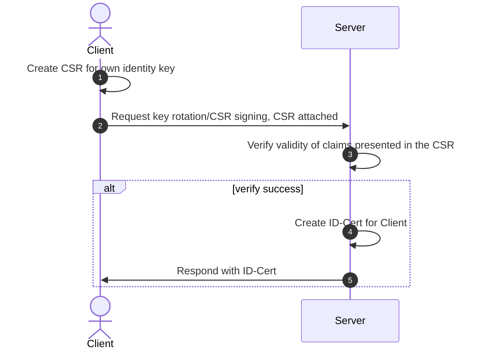
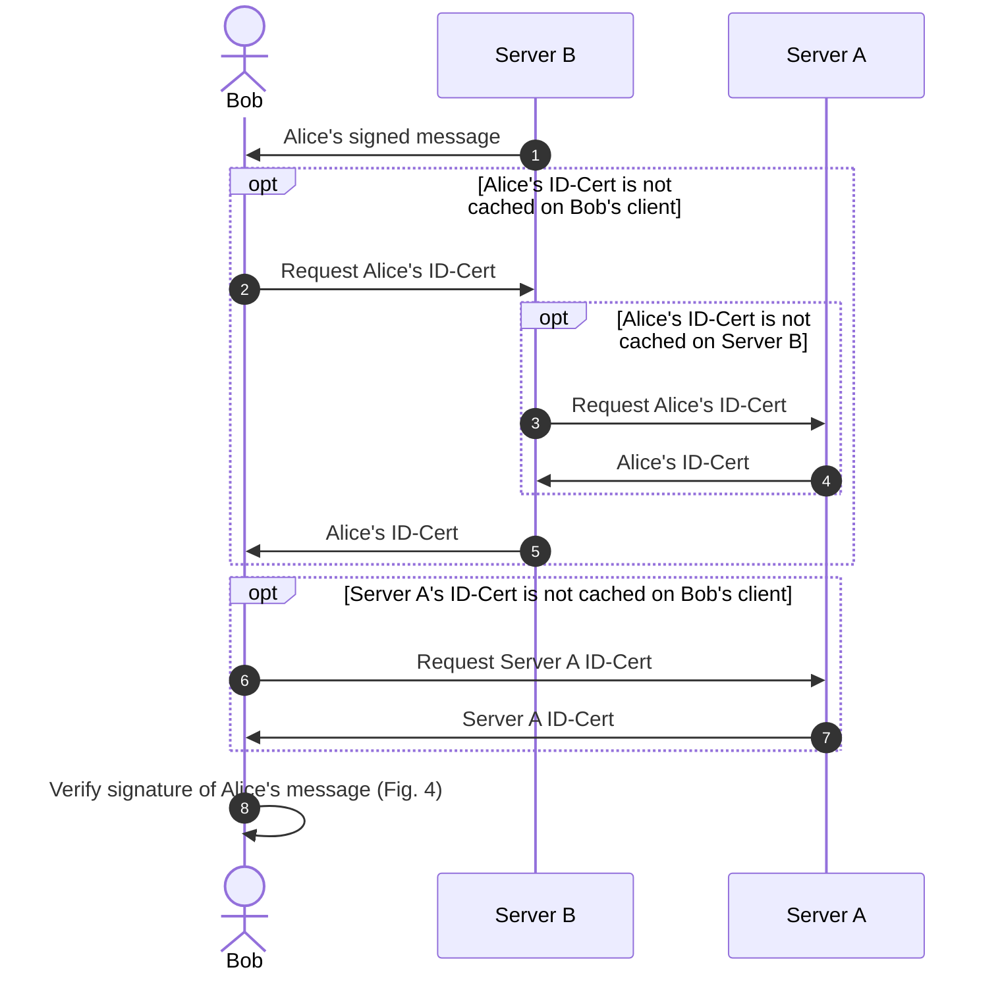
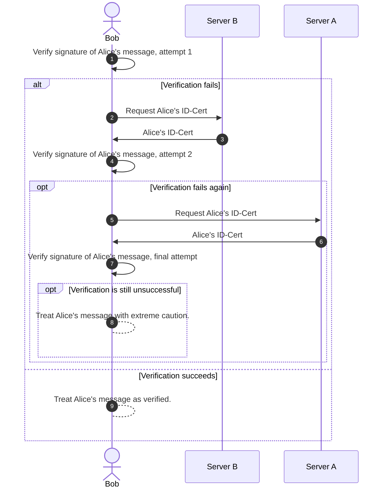
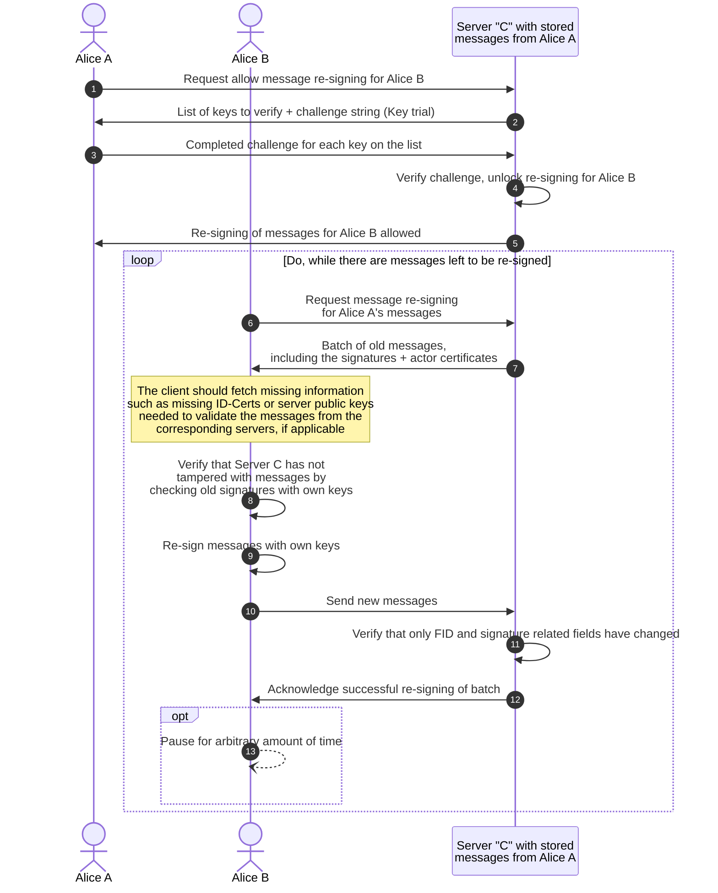
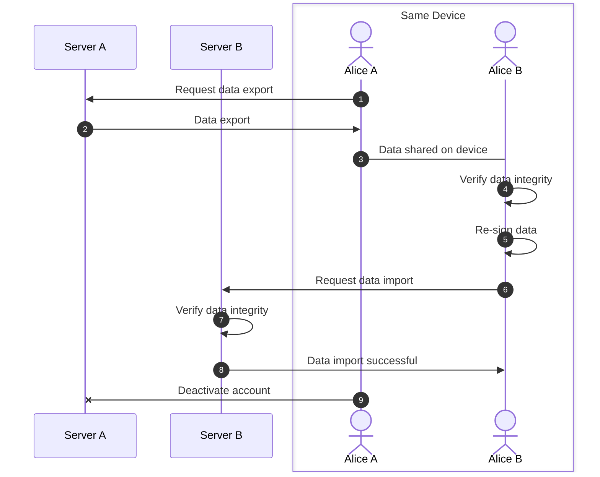

# polyproto Specification

**v0.1.0-alpha.1** - Treat this as an unfinished draft.

[Semantic versioning v2.0.0](https://semver.org/spec/v2.0.0.html) is used to version this specification.
The version number specified here also applies to the API documentation.

- [polyproto Specification](#polyproto-specification)
  - [1. Terminology used in this document](#1-terminology-used-in-this-document)
  - [2. Trust model](#2-trust-model)
  - [3. APIs and communication protocols](#3-apis-and-communication-protocols)
    - [3.3 WebSockets](#33-websockets)
      - [3.3.1 Events over REST](#331-events-over-rest)
  - [4. Federated identity](#4-federated-identity)
    - [4.1 Authentication](#41-authentication)
      - [4.1.1 Authenticating on a foreign server](#411-authenticating-on-a-foreign-server)
      - [4.1.2 Sensitive actions](#412-sensitive-actions)
    - [4.2 Challenge strings](#42-challenge-strings)
    - [4.3 Protection against misuse by malicious home servers](#43-protection-against-misuse-by-malicious-home-servers)
  - [5. Federation IDs (FIDs)](#5-federation-ids-fids)
  - [6. Cryptography and ID-Certs](#6-cryptography-and-id-certs)
    - [6.1 Home server signed certificates for public client identity keys (ID-Cert)](#61-home-server-signed-certificates-for-public-client-identity-keys-id-cert)
      - [6.1.1 Structure of an ID-Cert](#611-structure-of-an-id-cert)
        - [6.1.1.1 Identity Descriptors (IDDs)](#6111-identity-descriptors-idds)
        - [6.1.1.2 Extensions and constraints](#6112-extensions-and-constraints)
        - [6.1.1.3 Session IDs](#6113-session-ids)
      - [6.1.2 Necessity of ID-Certs](#612-necessity-of-id-certs)
      - [6.1.3 Key rotation](#613-key-rotation)
      - [6.1.4 Early revocation of ID-Certs](#614-early-revocation-of-id-certs)
    - [6.2 Actor identity keys and message signing](#62-actor-identity-keys-and-message-signing)
      - [6.2.1 Message verification](#621-message-verification)
      - [6.2.2 Handling of external messages](#622-handling-of-external-messages)
    - [6.3 Private key loss prevention and private key recovery](#63-private-key-loss-prevention-and-private-key-recovery)
    - [6.4 Cryptographic recommendations](#64-cryptographic-recommendations)
    - [6.5 Best practices](#65-best-practices)
      - [6.5.1 Signing keys and ID-Certs](#651-signing-keys-and-id-certs)
      - [6.5.2 Home server operation and design](#652-home-server-operation-and-design)
      - [6.5.3 Private key loss prevention and private key recovery](#653-private-key-loss-prevention-and-private-key-recovery)
  - [7. Migrations](#7-migrations)
    - [7.1 Identity migration](#71-identity-migration)
      - [7.1.1 Redirects](#711-redirects)
    - [7.2 Re-signing messages](#72-re-signing-messages)
      - [7.2.1 Message batches](#721-message-batches)
      - [7.2.2 Server imposed limits](#722-server-imposed-limits)
        - [7.2.2.1 Body size](#7221-body-size)
        - [7.2.2.2 Interval between re-signing batches](#7222-interval-between-re-signing-batches)
    - [7.3 Moving data](#73-moving-data)
      - [7.3.1 Content Addressing with relative roots](#731-content-addressing-with-relative-roots)
    - [7.4 Challenges and trust](#74-challenges-and-trust)
  - [8. Protocol extensions (P2 extensions)](#8-protocol-extensions-p2-extensions)
    - [8.1 Extension design](#81-extension-design)
    - [8.2 Namespaces](#82-namespaces)
    - [8.3 Officially endorsed extensions](#83-officially-endorsed-extensions)
    - [8.4 Versioning and yanking](#84-versioning-and-yanking)
      - [8.4.1 Yanking](#841-yanking)
    - [8.5 Dependencies](#85-dependencies)
    - [8.6 Routes](#86-routes)
  - [9. Services](#9-services)
  - [9.1 Discoverability](#91-discoverability)
    - [9.1.1 Changing a primary service provider](#911-changing-a-primary-service-provider)

The polyproto protocol is a home-server-based identity federation protocol specification intended
for use in applications where actor identity is needed. polyproto focuses on federated identity,
and does not specify any further application-specific features. It can be used standalone, as a
method of authenticating across many applications and services, or as a base for federated protocol
extensions and application implementations. The use of cryptography - namely digital
signatures and X.509 certificates - make polyproto identities verifiable and portable. polyproto
empowers actors, as the home server can be changed at any time, without losing data or connections
to other actors.

This document is intended to be used as a starting point for developers wanting to develop software,
which can operate with other polyproto implementations.

## 1. Terminology used in this document

The following terminology is used throughout this document:

--8<-- "snippets/glossary.md"

## 2. Trust model

polyproto operates under the following trust assumptions:

1. Users entrust their home server and its admins with data security and discretion on actions
   appearing as actor-performed as, as with most home server based systems, it is
   possible for a home server to impersonate an actor in unencrypted communications.
2. Impersonation *can* be detected by users, as home servers never have access to private keys of
   actors. To sign messages as an actor, a home server would have to use a different key pair.
3. Users only trust information, which can be verified by cryptographic means. This includes
   verifying the identity of other actors and verifying the integrity of messages.
4. In a federated context, users trust foreign servers with all unencrypted data they send
   to them.
5. Foreign servers cannot impersonate users without immediate detection. Outsiders, meaning foreign
   servers and other actors, are unable to produce signatures that have a cryptographic connection
   to the actors' home server. This is assuming correct implementation of cryptographic
   standards, secure home server operation and non-compromised client devices, all of which are
   mostly out of the scope of this specification.
6. Users rely on their home server for identity key certification, without the home server
   possessing the identity.

## 3. APIs and communication protocols

The polyproto specification defines a set of [APIs](/APIs).
In addition to these REST APIs, polyproto employs WebSockets for real-time communication between
clients and servers.

The APIs are divided into two categories:

- **Routes: No registration needed**: These routes are available to all clients, regardless of
  whether this server is the client's home server.
- **Routes: Registration needed**: These routes are only available to clients where the server is
  the client's home server.

All software aiming to federate with other polyproto implementations must implement the APIs defined
in this specification. Implementations can choose to extend the APIs with additional routes, but must
not remove or change the behavior of the routes defined in this specification.

### 3.3 WebSockets

WebSockets enable real-time communication between actor clients and servers.

WebSocket connections to polyproto servers consist of the following cycle:


*Fig. 1: Sequence diagram of a WebSocket connection to a polyproto server.*

!!! info

    To learn more about polyproto WebSockets and WebSocket Events, consult the [WebSockets documentation](/docs/APIs/Core/WebSockets/index.md).

#### 3.3.1 Events over REST

For some implementation contexts, a constant WebSocket connection might not be wanted. A client can
instead opt to query an API endpoint to receive events, which would normally be sent through the WebSocket
connection. Concrete polyproto-implementations and extensions can decide whether this alternative
behavior is supported.

!!! example

    An example of an implementation context where having a constant WebSocket might not be wanted would
    be Urban IoT devices, or devices with a limited or only periodically available internet
    connection. 

Querying [this endpoint](/APIs/Core/Routes%3A No registration needed/#get-events) yields a JSON-Array
containing all events the session has missed since last querying the endpoint, or since last being
connected to the WebSocket.

Depending on how many events the session has
missed, the earliest events might be excluded from the response to limit the response bodies size. This
behavior should be explicitly documented in implementations or extensions of polyproto.

Due to the
intended use cases for retrieving events through REST rather than WebSockets, this endpoint is not
a long-polling endpoint.

There are three intended, main modes for retrieving events in polyproto

1. Keep a constant WebSocket connection whenever possible
2. Keep a semi-constant WebSocket connection, perhaps connecting every x minutes for a set period of
   time
3. Do not use WebSockets and only query the REST API

Polling a REST endpoint is inherently inefficient and therefore should only be done with a high interval,
ranging from a few minutes to a few days. If a client requires information more often than that,
then a WebSocket connection should be considered.

## 4. Federated identity

The federation of actor identities allows users to engage with foreign servers as if they were their
home servers. For example, in polyproto-chat, an actor can send direct messages to users from a
different server or join the Guilds of other servers.

Identity certificates defined in sections [#6. Cryptography and ID-Certs](#6-cryptography-and-id-certs)
and [#6.1 Home server signed certificates for public client identity keys (ID-Cert)](#61-home-server-signed-certificates-for-public-client-identity-keys-id-cert)
are employed to sign messages that the actor sends to other servers.

!!! note "Using one identity for several polyproto implementations"

    An actor can choose to use the same identity for multiple polyproto implementations. Read
    [section #9](#9-services) for more information.

!!! info

    You can read more about Identity Certificates in [section #6.](#6-cryptography-and-id-certs)

### 4.1 Authentication

The core polyproto specification does not contain a strict definition of authentication procedures
and endpoints. This allows for a wide range of authentication methods to be used. However, if
implementations want to closely interoperate with each other, they should highly consider
implementing the [polyproto-auth](./auth.md) standard for authenticating on home servers and
foreign servers alike.

!!! warning

    Close interoperation is only possible if all involved polyproto implementations have an
    overlapping set of supported authentication methods. Therefore, it is highly recommended to implement
    and use the polyproto-auth standard, unless your use case requires strictly requires a different
    authentication method. Of course, other authentication methods can be implemented in addition to
    polyproto-auth.

When successfully authenticated, a client receives a session token, which can then be used to
access authenticated routes on the REST API and to establish a WebSocket connection. Each ID-Cert
can only have one active session token at a time.

!!! info "About session tokens"

    Session tokens are used to authenticate a user over a longer period of time, instead of, for
    example, requiring the user to solve a challenge string every time they want to access a
    protected route.

#### 4.1.1 Authenticating on a foreign server

Regardless of the authentication method used, the foreign server must verify the actor's identity
before allowing them to perform any actions. This verification must be done by proving the cryptographic
connection between an actors' home servers' public identity key and the actors' ID-Cert. Challenge
strings, as described in [Section 4.2](#42-challenge-strings) and in [polyproto-auth](./auth.md)
are used for this purpose within this specification.

Servers must also check with the actors' home server to ensure that the ID-Cert has not been revoked.
APIs for this purpose are defined in the [API documentation](/APIs).

#### 4.1.2 Sensitive actions

!!! warning

    Sensitive actions should require a second factor of authentication, apart from the actors'
    private key. This second factor can be anything from a password to TOTP or hardware keys, depending
    on the authentication method or standard used.

    If this is not done, a malicious user who gained access to an actors' private key can lock that
    actor out of their account entirely, as the malicious user could [revoke the actors' other ID-Certs](#714-early-revocation-of-id-certs),
    and thus prevent the actor from logging in again.

Sensitive actions include, but are not limited to:

- Generating a new ID-Cert
- Revoking an ID-Cert
- Changing the actors' federation ID
- Changing the actors' other factors of authentication
- Server administration actions

Clients should be prepared to gracefully handle the case where a sensitive action fails due to
a lack of a second factor of authentication, and should prompt the user to provide the second
factor of authentication.

### 4.2 Challenge strings

Servers are alphanumeric challenge strings to verify an actor's private identity key
possession, without revealing the private key itself. These strings, ranging from 32 to 256 characters,
have a UNIX timestamp lifetime. If the current timestamp surpasses this lifetime, the challenge fails.
The actor signs the string, sending the signature and their ID-Cert to the server, which then verifies
the signature's authenticity.

!!! tip

    For public-facing polyproto implementations, it is recommended to use a challenge string length
    of at least 64 characters, including at least one character from each of the alphanumeric
    character classes (`[a-zA-Z0-9]`). Server implementations should ensure that challenge strings
    are unique per actor. If this is not the case, actors could potentially be the target of replay attacks.

Challenge strings can counteract replay attacks. Their uniqueness ensures that even identical requests
have different signatures, preventing malicious servers from successfully replaying requests.

### 4.3 Protection against misuse by malicious home servers

To protect users from misuse by malicious home servers, a mechanism is needed to prevent home
servers from generating federation tokens for users without their consent and knowledge.

!!! example "Potential misuse scenario"

    A malicious home server can potentially request a federation token on behalf of one of its
    users, and use it to generate a session token on the actor's behalf. The malicious server can
    then impersonate the actor on another server, as well as read unencrypted data (such as messages,
    in the context of a chat application) sent on the other server.

!!! abstract

    The above scenario is not unique to polyproto, and rather a problem other federated
    services/protocols, like ActivityPub, have as well. There is no real solution to this problem,
    but it can be mitigated a bit by making it more difficult for malicious home servers to do
    something like this without the actor noticing.

Polyproto servers need to inform users of new sessions. This visibility hampers malicious home
servers, but does not solve the issue of them being able to create federation tokens for servers the
actor does not connect to. This is because, naturally, users cannot receive notifications without a
connection. Clients re-establishing server connections must be updated on any new sessions
generated during their absence. The `NEW_SESSION` gateway event must be dispatched to all sessions,
excluding the new session. The `NEW_SESSION` event's stored data can be accessed in the
[Gateway Events documentation](/docs/APIs/Core/WebSockets/gateway_events.md#new_session).

!!! note

    With proper safety precautions and strong encryption, it is extremely unlikely for a malicious
    server to be able to listen in on encrypted conversations, without all users in that 
    conversation noticing. When implementing the polyproto-mls P2 extension, MLS's forward secrecy
    guarantees ensure that, in theory, a malicious session cannot decrypt any messages sent before
    its' join epoch. If secrecy or confidentiality are of concern, users should host their own home
    server and use end-to-end encryption, such as polyproto-mls.

## 5. Federation IDs (FIDs)

Every client requires an associated actor identity. Actors are distinguished by a unique federation
ID (FID). FIDs consist of their identifier, which is unique per instance, and the instance's root domain.
This combination ensures global uniqueness.

FIDs used in public contexts are formatted as `actor@optionalsubdomain.domain.tld`, and are case-insensitive.

The following regular expression can be used to validate actor IDs: `\b([a-z0-9._%+-]+)@([a-z0-9-]+(\.[a-z0-9-]+)*)`.

!!! info

    The above regular expression is flavored for the Rust Programming Language, but can be easily
    adapted to other languages.

!!! note

    Validating a federation ID with the above regex does not guarantee that the ID is valid. It only
    indicates that the federation ID is formatted correctly.

For all intents and purposes, a federation ID is a display of identity. However, verifying identity
claims is crucial. See [Section #6.1](#61-home-server-signed-certificates-for-public-client-identity-keys-id-cert)
and [Section #6.2.2](#621-message-verification) for more information.

## 6. Cryptography and ID-Certs

### 6.1 Home server signed certificates for public client identity keys (ID-Cert)

The ID-Cert, a [X.509](https://en.wikipedia.org/wiki/X.509) certificate, validates a public actor
identity key. It is an actor-generated CSR ([Certificate Signing Request](https://en.wikipedia.org/wiki/Certificate_signing_request)),
signed by a home server, encompassing actor identity information and the client's public identity key.
Clients can get an ID-Cert in return for a valid and well-formed CSR. Generating a new ID-Cert is
considered a [sensitive action](#412-sensitive-actions) and therefore should require a second factor
of authentication.

A CSR in the context of polyproto will be referred to as an ID-CSR. ID-CSRs are DER- or PEM-encoded
[PKCS #10](https://datatracker.ietf.org/doc/html/rfc2986) CSRs, with a few additional requirements.

All ID-Certs are valid X.509 v3 certificates. However, not all X.509 v3 certificates are valid ID-Certs.

ID-Certs form the basis of message signing and verification in polyproto.
They are used to verify the identity of a client, and to verify the integrity of messages sent by a
client.

An ID-CSR includes the following information, according to the X.509 standard:

- The public identity key of the client.
- An identity descriptor (IDD), describing the actor the certificate is issued to. The IDD must be
  formatted according to [Section 6.1.1.1](#6111-identity-descriptors-idds).
- The signature algorithm used to sign the certificate.
- The signature of the certificate, generated by using the entities' private identity key.

When signing an ID-CSR, the home server must verify the correctness of all claims presented in the CSR.

!!! warning "Important"

    All entities receiving an ID-Cert MUST inspect the certificate for correctness and validity. 
    This includes checking whether the signature matches the certificates' contents and checking the
    certificate's validity period.

Actors must use a separate ID-Cert for each client or session they use. Separating ID-Certs
limits the potential damage a compromised ID-Cert can cause.

For two implementations of polyproto to be interoperable, they must support an overlapping set of
digital signature algorithms. See [Section 6.4](#64-cryptographic-recommendations) for more
information on cryptographic recommendations.

#### 6.1.1 Structure of an ID-Cert

The ID-Cert is a valid X.509 certificate, and as such, it has a specific structure. The structure of
an X.509 certificate is defined in [RFC5280](https://tools.ietf.org/html/rfc5280).
ID-Certs encompass a subset of the structure of an X.509 certificate.

ID-Certs have the following structure:

| Field Description                                                                            | Special requirements, if any                                                                    | X.509 equivalent                                         |
| -------------------------------------------------------------------------------------------- | ----------------------------------------------------------------------------------------------- | -------------------------------------------------------- |
| Correctly formatted Name attribute, according to [#6.1.1.1](#6111-identity-descriptors-idds) | [Identity descriptor](#6111-identity-descriptors-idds)                                          | Issuer Name                                              |
| A unique identifier for the certificate, used by the CA to identify this certificate.        | Must be unique across all certificates issued by a home server.                                 | Serial Number                                            |
| The algorithm used to sign the certificate.                                                  |                                                                                                 | Certificate Signature Algorithm & Signature Algorithm ID |
| The signature of the certificate, generated by using the home servers' private identity key. |                                                                                                 | Certificate Signature                                    |
| The expiry date of the certificate.                                                          | Time must not be after expiry date of the home server's root certificate                        | Validity period: Not After                               |
| Certificate validity period starting date                                                    | Time must not be before the home server's root certificate was generated                        | Validity period: Not Before                              |
| X.509 Version Number (v3)                                                                    | polyproto only uses Version 3 X.509 certificates.                                               | Version Number                                           |
| The public identity key of the client.                                                       |                                                                                                 | Subject Public Key Info: Subject Public Key              |
| The public key algorithm used to generate the client's public identity key.                  |                                                                                                 | Subject Public Key Info: Public Key Algorithm            |
| The session ID of the client.                                                                | No two valid certificates for one session ID can exist. Session IDs have to be unique per user. | Subject Unique Identifier                                |
| Extensions                                                                                   | [Extensions and Constraints](#6112-extensions-and-constraints)                                  | Extensions                                               |

##### 6.1.1.1 Identity Descriptors (IDDs)

polyproto Identity Descriptors are a subset of the X.509 certificate's distinguished name. [Distinguished
Names (`DNs`)](https://ldap.com/ldap-dns-and-rdns/), according to the LDAP Data Interchange Format (LDIF).
The `DN` is a sequence of [relative distinguished names (`RDNs`)](https://ldap.com/ldap-dns-and-rdns/).

The identity descriptor must be unique for each certificate issued by a home server. The `DN` of an ID-Cert
must meet all of the following requirements:

- Identity descriptor (IDD) must have "common name" attribute. If the ID-Cert is for an actor, the
  common name must be the local name of the actor. In the case of an actor with an FID of
  `xenia@example.com`, the "common name" would be `xenia`. If the ID-Cert is a self-signed home server
  certificate, the "common name" attribute must not be present.
- Must have at least one domain component, specifying the home servers' FQDN
  (fully qualified domain name).
- If the ID-Cert or ID-CSR is for an actor, the IDD must include the `UID` (OID 0.9.2342.19200300.100.1.1)
  **and** `uniqueIdentifier` (OID 0.9.2342.19200300.100.1.44) fields.
    - `UID` is the federation ID of the actor, e.g. `actor@fqdn-of-home server.example.com`.
    - `uniqueIdentifier` is a Session ID.
- Can have other attributes, if the additional attributes do not conflict with the above
  requirements. Additional attributes might be ignored by other home servers and other clients, unless
  specified otherwise in a polyproto extension. Additional attributes, which are not part of a polyproto
  extension must be non-critical X.509 extensions.

If the home server does not have a subdomain or top level domain, the `dc` fields for these
components should be omitted.

##### 6.1.1.2 Extensions and constraints

The following constraints must be met by ID-Certs:

- If the ID-Cert is a root certificate
    - It must have the `CA` flag set to `true`. The path length constraint must be present and set
      to `0`.
    - It must have the `keyCertSign` key usage flag set to `true`.
- If the ID-Cert is an actor certificate
    - It must have the `CA` flag set to `false` or omitted.
    - It must have the `keyCertSign` key usage flag set to `false` or omitted.
    - It must have the `digitalSignature` key usage flag OR `contentCommitment` flags set to `true`.

[Key Usage Flags](https://cryptography.io/en/latest/x509/reference/#cryptography.x509.KeyUsage) and
[Basic Constraints](https://cryptography.io/en/latest/x509/reference/#cryptography.x509.BasicConstraints)
are critical extensions. Therefore, if any of these X.509 extensions are present, they must be marked
as "critical". ID-Certs not adhering to this standard must be treated as malformed.

##### 6.1.1.3 Session IDs

The session ID is an [`ASN.1`](https://en.wikipedia.org/wiki/ASN.1) [`Ia5String`](https://en.wikipedia.org/wiki/IA5STRING)
chosen by the actor requesting the ID-Cert. It is used to uniquely identify a session. The session
ID must be unique for each certificate issued to that actor. A session ID can be re-used if the
session belonging to that session ID has become invalid. Session ID re-use in this case also applies,
when a different ID-Cert wants to use the same session ID, provided that the session ID is not currently
in use. If the session ID is currently in use, the actor requesting the ID-Cert must select a different
session ID, as session IDs must not be overridden silently.

Session IDs are 1 - 32 characters long and. They can contain any character permitted by the `ASN.1`
`IA5String` type.

Session IDs can be used to identify a session across devices, or to detect if a new, perhaps
malicious session has been created.

#### 6.1.2 Necessity of ID-Certs

The addition of a certificate is necessary to prevent a malicious foreign server from abusing public
identity key caching to impersonate an actor. Consider the following example, which employs foreign
server public identity key caching, but no home server issued identity key certificates:

!!! example "Potential misuse scenario"

    A malicious foreign server B can fake a message from Alice
    (Home server: Server A) to Bob (Home Server: Server B), by generating a new identity key pair
    and using it to sign the malicious message. The foreign server then sends that message to Bob,
    who will then request Alice's public identity key from Server B, who will then send Bob the
    malicious public identity key. Bob will succeed in verifying the signature of the message, and
    not notice that the message has been crafted by a malicious server.

The above scenario is not possible with home server issued identity key certificates, as the
malicious server cannot generate an identity key pair for Alice, which is signed by Server A.

#### 6.1.3 Key rotation

A session can choose to rotate their ID-Cert at any time. This is done by generating a new identity
key pair, using the new private key to generate a new CSR, and sending the new Certificate Signing
Request to the home server, along with at least one new KeyPackage and a corresponding 'last resort'
KeyPackage, if encryption is offered. The home server will then generate the new ID-Cert, given that
the CSR is valid and that the server accepts the creation of new ID-Certs at this time.

Rotating keys is done by using an API route, which requires authorization.

!!! note

    Sessions can request a new ID-Cert for any session of the same actor. Most other, currently existing
    services also allow for this, as it is a common use case for user to want to, perhaps, log out of
    devices they no longer use. Depending on your use case, this might be a security concern. Whether
    and how this risk is mitigated is up to concrete implementations.

Home servers must keep track of the ID-Certs of all users (and their clients) registered on them,
and must offer a clients' ID-Cert for a given timestamp on request. This is to ensure messages
sent by users, even ones sent a long time ago, can be verified by other servers and their users.
This is because the public key of an actor likely changes over time and users must sign all messages
they send to servers. Likewise, a client should also keep all of its own ID-Certs stored
perpetually, to potentially verify its identity in case of a migration.

Users must hold on to all of their past key pairs, as they might need them to
[migrate their account in the future](#7-migrations). How this is done is specified in
[section 6.3: Private key loss prevention and private key recovery](#63-private-key-loss-prevention-and-private-key-recovery).

The lifetime of an actor ID-Cert should be limited to a maximum of 60 days. This is to ensure that even
in a worst-case scenario, a compromised ID-Cert can only be used for a limited amount of time. The
renewal of an ID-Cert is considered a [sensitive action](#412-sensitive-actions) and should require
a second factor of authentication. A client that has this second factor of authentication stored
should renew the ID-Cert of the authenticated actor without further interaction.

Server ID-Certs should be rotated way less often (every 1-3 years). Only rotate a server ID-Cert
if it is suspected to be compromised, is lost, or has expired.



*Fig. 2: Sequence diagram depicting the process of a client that uses a CSR to request a new ID-Cert
from their home server.*

A server identity key's lifetime might come to an early or unexpected end, perhaps due to some sort
of leak of the corresponding private key. When this happens, the server should generate a new
identity key pair and broadcast the
[`SERVER_KEY_CHANGE`](/docs/APIs/Core/WebSockets/gateway_events.md#server_key_change) gateway event
to all clients. Clients must request new ID-Certs through a CSR. Should a client be offline at the time
of the key change, it must be informed of the change upon reconnection.

#### 6.1.4 Early revocation of ID-Certs

!!! abstract "A note about CRLs"

    It is common for systems relying on X.509 certificates for user authentication to use Certificate
    Revocation Lists (CRLs) to keep track of which certificates are no longer valid. This is done to
    prevent a user from using a certificate that has been revoked.

    CRLs are difficult to implement well, often requiring many resources to keep up to date, and
    are also not always reliable. OCSP (Online Certificate Status Protocol) is a more modern, reliable
    and easier to implement alternative. Still, it potentially requires many resources to
    keep up with demand, while introducing potential privacy concerns.

    polyproto inherently mitigates some of the possible misuse of a revoked certificate, as the validity
    of a certificate is usually checked by many parties. Especially, if the revocation process is
    initiated by the actor themselves, the actor already lets all servers they are connected to know
    that the certificate in question is no longer valid. 

    polyproto does not require the use of CRLs or OCSP.

An ID-Cert can be revoked by the home server or the actor at any time. This can be done for various
reasons, such as a suspected leak of the private identity key. When an ID-Cert is revoked, the server
must revoke the session associated with the revoked ID-Cert. Revoking an ID-Cert is considered a
[sensitive action](#412-sensitive-actions) and therefore should require a second factor of authentication.

!!! info

    The above paragraph is true for both foreign and home servers. The API routes associated with
    revoking an ID-Cert are the same regardless of the server type.

### 6.2 Actor identity keys and message signing

As briefly mentioned section [#4](#4-federated-identity), users must hold on to an identity key pair
at all times. This key pair is used to represent an actor's identity and to verify
message integrity, by having an actor sign all messages they send with their
private identity key. The key pair is generated by the actor. An actor-generated identity key
certificate signing request (CSR) is sent to the actor's home server when first connecting to the
server with a new session, or when rotating keys. The key is stored in the client's local storage.
Upon receiving a new identity key CSR, a home server will sign this CSR and send the resulting ID-Cert
to the client. This certificate is proof that the home server attests to the clients key. Read
[section 6.1](#61-home-server-signed-certificates-for-public-client-identity-keys-id-cert) for more
information about the certificate.

#### 6.2.1 Message verification

To ensure message integrity through signing, clients and servers must verify
message signatures. This involves cross-checking the message signature against the sender's
ID-Cert and the senders' home server's ID-Cert, while also confirming the validity of the
ID-Cert attached to the message and ensuring its public key matches the sender's.

!!! info

    Signature verification must always be "strict", meaning that signature schemes producing malleable
    signatures and [weak public keys](https://en.wikipedia.org/wiki/Weak_key) must be rejected.

**Example:** Say we have two actors. Alice, who is registered on Server A, and Bob, who is registered
on Server B. Alice and Bob are having a conversation on Server B. Given a signed message from Alice,
such as Bob would receive from Server B, the process of verifying the signature would look like this:



*Fig. 3: Sequence diagram of a successful message signature verification.*

Bob's client and Server B should now cache Server A's and Alice's ID-Certs, to avoid having to
request them again.

The TTL (time to live) of these cached items should be relatively short. Recommended values
are between one (1) and twelve (12) hours. Cached ID-Certs must be evicted from
the cache, after the TTL has expired. Expired cached ID-Certs must not be used for signature
verification of new messages, even if the client cannot renew its cache.

??? question "Why not select longer lived TTLs for cached ID-Certs?"

    Suppose that an actors' private identity key is compromised. The actor notices this, and revokes
    their ID-Cert. If the TTL of cached ID-Certs is too long, the compromised ID-Cert might still be
    used for signature verification for a long amount of time, even after the ID-Cert has been revoked.
    This is a problem in the following hypothetical scenario with malicious actor "Eve" and victim
    "Alice":

    1. Alice's private identity key is compromised.
    2. Malicious actor Eve logs onto Server X, which Alice has never connected to before.
    3. Alice notices the breach, requesting the revocation of her ID-Cert on all servers she is
       connected to.
    4. Server X does not get this revocation message, as Alice does not know about her connection to
       Server X.
    5. Eve can now impersonate Alice on Server X, for as long as the TTL of the cached ID-Cert on
       Server X has not expired.

If the verification fails, Bob's client should try to re-request the key from Server B first.
Should the verification fail again, Bob's client can try to request Alice's public identity key
and ID-Cert from Server A (Alice's home server). The signature verification process should then be
re-tried. Should the verification still not succeed, the message should be treated with extreme
caution.



*Fig. 4: Sequence diagram showing how message verification should be handled if the first attempt
to verify the signature fails.*

??? question "Why should Bob's client request Alice's public identity key from his own server first?"

    Bob's client could request Alice's public identity key from Server A, instead of Server B.
    However, this is discouraged, as it

    - Generates unnecessary load on Server A; Doing it this way distributes the load of public
      identity key requests more fairly, as the server that the message was sent on is the one that
      has to process the bulk of public identity key requests.
    - Would expose unnecessary metadata to Server A; Server A does not need to know who exactly
      Alice is talking to, and when. Only Server B, Alice and Bob need to know this information.
      Always requesting the public identity key from Server A might expose this information to
      Server A.

    Clients should only use Server A as a fallback for public identity key verification, if Server B
    does not respond to the request for Alice's public identity key, or if the verification fails
    with the public identity key from Server B.

!!! info

    A failed signature verification does not always mean that the message is invalid. It may be that
    the actor's identity key has changed, and that Server B has not yet received the new public
    identity key for some reason. However, if the signature cannot be verified at a certain time,
    this information must be communicated to the actor performing the verification.

#### 6.2.2 Handling of external messages

In the context of federation with other federation protocols, such as ActivityPub, it is possible
for actors to receive messages, which do not have a signature attached to them. If a P2 extension
explicitly allows for this, it is possible for a polyproto server to forward such messages to
clients. If a P2 extension does not explicitly allow for this, both servers and clients must
reject such messages. Clients receiving unexpected external messages should inform the actor about
the fact that a server has tried to send them an invalid, possibly malicious message.

Before a polyproto server forwards such a message to clients, it must add an "external" property to
the message object. If possible in the data format used, this property should be set to a boolean
value of `true`. If the data format does not support boolean values, the property should be set to
a string value of `true` in all lowercase characters. This property must be passed along to the
client or clients receiving the message.

If the actor receiving this external message is human, the client must inform the actor that the
message is external, and that the message has not been signed by the sender. External messages
should be distinguishable from signed messages at first glance.

### 6.3 Private key loss prevention and private key recovery

As described in previous sections, actors must hold on to their past identity key pairs, should they
want or need to migrate their account.

Home servers must offer a way for actors to upload and recover their private identity keys while not
having access to the private keys themselves. Private identity keys must be encrypted with
strong passphrases and encryption schemes such as AES, before being uploaded to the server.
Authenticated actors can download their encrypted private identity keys from the server at any time.
All encryption and decryption operations must be done client-side.

If any uncertainty about the availability of the home server exists, clients should regularly
download their encrypted private identity keys from the server and store them in a secure location.
Ideally, each client should immediately download their encrypted private identity keys from the
server after connecting. Clients should never store key backups in an unencrypted manner.

Whether an actor uploads their encrypted private identity keys to the server is their own choice.
It is also recommended backing up the encrypted private identity keys in some other secure location.

The APIs for managing encrypted private identity keys are documented in the API documentation.

- [Upload encrypted private key material](/APIs/Core/Routes%3A Registration needed/#post-upload-encrypted-private-key-material)
- [Get encrypted private key material](/APIs/Core/Routes%3A Registration needed/#get-get-encrypted-private-key-material)
- [Delete encrypted private key material](/APIs/Core/Routes%3A Registration needed/#delete-delete-encrypted-private-key-material)
- [Get encrypted private key material upload size limit](/APIs/Core/Routes%3A Registration needed/#options-get-encrypted-private-key-material-upload-size-limit)

### 6.4 Cryptographic recommendations

For two implementations of polyproto to be interoperable, they must support an overlapping set of
digital signature algorithms.

If technically practical, all implementations of polyproto must support use of the Ed25519 digital
signature algorithm for signing messages and generating ID-Certs. The use of the RSA algorithm for
digital signatures [is heavily discouraged](https://blog.trailofbits.com/2019/07/08/fuck-rsa/).

### 6.5 Best practices

The following subsections are dedicated to documenting best practices to consider when
implementing polyproto.

#### 6.5.1 Signing keys and ID-Certs

- When a server is asked to generate a new ID-Cert for an actor, it must make sure that the CSR is
  valid and, if set, has an expiry date less than or equal to the expiry date of the server's own ID-Cert.
- Due to the fact that a `SERVER_KEY_CHANGE` gateway event is bound to generate a large amount of
  traffic, servers should only manually generate a new identity key pair when absolutely necessary
  and instead select a fitting expiry date interval for their ID-Certs. It might
  also be a good idea to stagger the sending of `SERVER_KEY_CHANGE` gateway events, to prevent a
  server from initiating a DDoS attack on itself. <!--TODO: What does this mean??-->
- When a client or server receives the information that an actor's client identity key has been
  changed, the client/server in question should update their cached ID-Cert for the actor in
  question, taking into account the session ID of the new identity key pair.

#### 6.5.2 Home server operation and design

- Use a caching layer for your home server to handle the potentially large amount of requests for
  ID-Certs without putting unnecessary strain on the database.

#### 6.5.3 Private key loss prevention and private key recovery

- It is a good idea for home servers to limit the upload size and available upload slots for encrypted
  private identity keys.

## 7. Migrations

polyproto empowers the end-user by defining straightforward mechanisms to change their home server
while preserving their identity, moving messages to another server, or both.

Identity migration allows actors to transparently re-assign ownership of their identity and messages
to a new identity. This allows actors to switch home servers while not losing ownership of messages
sent by them.

Message migration allows actors to move messages from one service-provider to another in a
tamper-resistant way. This makes it possible for actors to switch service providers, taking some
or all of their messages with them. Which messages can be moved is up to P2 extensions to define,
as it might not always be possible to move all messages. Some messages might be tied to a
specific context, which is unavailable on the new server.

!!! example "Example: Information tied to a specific context"

    In a chat application, there might exist a group chat with a lot of people in it. Moving your
    messages from this group chat to another server might be impossible, depending on the architecture
    of the chat application. Typically, the messages in a group chat are stored on the server
    hosting the group. Moving the messages of one individual from one server to another is not
    possible in these cases.

!!! example "Example: Information not necessarily tied to a specific context"

    Continuing the chat application example, it might very well be possible to move messages
    written in a private chat between two actors from one server to another. An examplary
    architecture where this is possible, is where all private messages are stored on the server of
    the actor who sent the message. Here, an actor can move their messages to another server without
    any issues.

Migrating an actor always involves reassigning the ownership of all actor-associated data in the
distributed network to the new actor. Should the old actor want to additionally move all data from
the old home server to another home server, more steps are needed. Account migration is not considered
a sensitive action.

### 7.1 Identity migration

Transferring message ownership from an old to a new account, known as
identity migration, necessitates coordination between the two involved accounts.

Identity migration is a process, which can be broken down into the following steps:

- [Setting up a redirect](#711-redirects)
- [Re-signing data](#72-re-signing-messages)

As shown by the API routes offered in the API documentation, both of these steps can be initiated
through one API call.

It is not required that the new account is located on another home server as the old account.

#### 7.1.1 Redirects

Setting up a redirect is an optional step in the identity migration process, helping
make the transition from the old account to the new account smoother.

A redirect has to be confirmed by both the redirection source and the redirection target. The redirect
is only valid for one specific redirection target. Redirection targets must be valid actors and their
home servers must be reachable when the redirect is being set up.

!!! info

    "Optional" does not mean that home servers can choose to not implement this feature. Instead,
    it means that actors can choose to not use this feature.


*Fig. 5: Sequence diagram depicting the setting up of a redirect.*

Until a redirection source actor deletes their account, the home server of that actor should respond
with `307 Temporary Redirect` to requests for information about the redirection source. After
the redirection source deletes their account, Server A can select to either respond with
`308 Permanent Redirect`, or to remove the redirect entirely.

### 7.2 Re-signing messages

Re-signing messages is the process of transparently changing the signature of messages while leaving
the content of the messages unchanged. "Transparently" refers to the fact that an outsider can
verify the following facts:

- Both involved actors have agreed to the re-signing of the messages
- The "old" actor has proven ownership of the signature keys used to produce the "old" signatures
  of the messages
- The message content has not changed during the re-signing process

The intended use cases for re-signing messages are:

- Changing ownership of messages from one actor to another. This enables seamless transitions
  between accounts, while preserving the integrity of the messages.
- Reducing the amount of keys that need to be remembered by an actor, done if the actor deems it to
  be convenient.
- "Rotate keys of past messages" - This is useful when an actor's private identity key has been
  compromised, and the actor wants to ensure that all messages sent by them are still owned by them
  and not at risk of being tampered with.

Actors must not be able to re-sign messages, to which they cannot prove signature-key ownership of.

Additionally, servers must verify the following things about re-signed messages:

- The new signature matches the messages' contents, and is valid
- The ID-Cert corresponding to the new signature is a valid ID-Cert, issued by the correct home
  server
- The contents of the message have not been changed during the re-signing process

The amount of keys that can be used to re-sign messages must not exceed the amount of keys sent in
the servers' key trial, but can be less.

Below is a sequence diagram depicting a typical re-signing process, which transfers ownership of
messages from Alice A to Alice B.



To allow for a singular set of behaviors, which fit the three intended use cases mentioned prior,
not all messages stored by the server of an actor need to be re-signed.
Besides querying for all non-re-signed messages, actors can also query or all non-resigned
messages, whose signatures correspond to a specific ID-Cert or set of ID-Certs. The API routes
for re-signing messages are documented in the API documentation.

#### 7.2.1 Message batches

Messages, which have not yet been re-signed are being delivered to an actor in batches. A batch is
a JSON object, representing messages sent, using the same ID-Cert. An
exemplary array of message batches, as returned by the server, might look as follows:

```json
[
  {
    id_cert: "QLASDiohs79034sjkldfny8eppqxncp7n4g9vozeyuiwofxb...",
    messages: [
      {
        signature: "ASDiohs79034sjkldfny8eppqxncp7n4g9vozeyuiwofxb...",
        content: {
          message: "Hello!"
        }
      },
      {
        signature: "ASDiohs7902347sjkldfny8eafhjhjafdlk4g121ghjkz...",
        content: {
          message: "Hello again!"
        }
      }
    ]
  },
  {
    id_cert: "QLAxiohs79034sjkldfny8eppqxncp7n4g9vozeyuiwofxn...",
    messages: [
      {
        ...
      }
    ]
  }
]
```

The concrete values held by a message batch are up to the concrete implementation. The prior JSON
array depicting an array of message batches is only an example. However, it is mandatory that a
message batch holds the following information:

- The ID-Cert used to sign the messages in the batch
- An array of messages, which must at least contain the following information:
    - The signature of the message
    - The full content of the message

Returning re-signed messages to the server is done in the same format as the server sends them to
the client.

#### 7.2.2 Server imposed limits

##### 7.2.2.1 Body size

Servers can limit the size of an HTTP request body containing re-signed messages.
If a body size limit is imposed, the server must communicate
this to clients in their response to a query for messages, which have not yet been re-signed.
Communicating the body size limit is done by adding a `X-P2-Return-Body-Size-Limit` header to the
response. If this header is not present or has a value of `-1`, clients should assume that there is
no body-size limit.

##### 7.2.2.2 Interval between re-signing batches

Servers can define an interval, which a client must wait for before sending a new batch of re-signed
messages to the server.

The server communicates this interval to the client as a response to receiving a batch of re-signed
messages from the client. The interval is communicated by adding a
`X-P2-Wait-Until` header to the response. The value of this header is a 64-bit integer. The integer
represents a UNIX timestamp, which in turn represents the time, at which the client is allowed to
send the next batch of re-signed messages.

Clients should expect that the duration of the interval changes between batches. The server can
dynamically adjust the duration, which a client must wait before being allowed to send the next
batch of re-signed messages. The server can also select to not impose an interval between re-signing
batches. Clients should also expect that the server suddenly decides to impose an interval between
re-signing batches, even if it has not done so before.

If this header is not present or has a value of `-1`, clients should assume that there is no interval
between re-signing batches.

*Fig. 7: Sequence diagram depicting the re-signing procedure.*

### 7.3 Moving data

In cases of an imminent server shutdown or distrust in the old server, moving data from the old server
is necessary to prevent data loss. This process extends upon the reassigning ownership process, and
usually involves the following steps:

1. Using the old account, the client requests a data export from your old home server.
2. The old home server sends a data export to the client. The client will check the signatures on
   the exported data, to ensure it was not tampered with.
3. The new account re-signs the data with its own keys and imports it into the new home server.
4. The new home server verifies the data and signals that the import was successful.
5. The old client requests the deactivation or deletion of the old account on the old home server.



*Fig. 8: Sequence diagram depicting the data moving process.*

How this process is implemented is up to P2 extensions to define. The above steps are only a
guideline. The API routes for data export and import are documented in the API documentation.

#### 7.3.1 Content Addressing with relative roots

Moving data from one server to another might break references to this data. To prevent this as much
as possible, content addressing with relative roots is recommended for data behind an additional
layer of indirection.

!!! example

    In a chat service, a user might have posted a message containing a picture. In this example, the
    picture is stored on the user's home server, which is not necessarily the same server as the
    chat service. If the user moves their account to another server, the picture might not be
    accessible anymore.

Content addressing with relative roots aids in preventing this issue. Instead of referring to
the absolute URL of the content, the server processing the content generates a unique identifier.
This identifier can be used to retrieve the content from the server. Most importantly, this
identifier does not change when the content is moved to another server. If the base domain of the
new server is known, the identifier can be used to retrieve the content from the new server.
The "relative root" is the base domain of the server, which is used to retrieve the content.

The uniqueness constraint of the identifier is important. If a collision occurs when trying to
move the content to another server, the content cannot be migrated in a way that preserves the
references to it. One way to ensure the uniqueness of the identifier is to use a hash function on the
content itself. Combining this has with a cryptographically strong nonce, then hashing the result of
concatenating the nonce and the hash of the content should yield a unique identifier.

The API route for content addressing with relative roots is formatted as follows:

`<server_url>/.p2/core/content/<content_id>`

The API route for content addressing with relative roots is documented more thoroughly in the API
documentation.

Servers with no need for content addressing with relative roots can select to not implement this
feature. Servers not implementing this feature should return a `404 Not Found` status code when
the API route is accessed. Clients should expect finding servers not implementing this feature.

### 7.4 Challenges and trust

Changing the publicly visible ownership of actor data requires the chain of trust to be maintained.
If an "old" account wants to change the publicly visible ownership of its data, the "old"
account must prove that it possesses the private keys that were used to
sign the messages. This is done by signing a challenge string with the private
keys. If the server verifies the challenge, it authorizes the new account to re-sign the old
account's messages signed with the verified key. Instead of overwriting the message, a new message variant
with the new signature is created, preserving the old message.

All challenge strings and their responses created in the context of account migration must be made
public to ensure that a chain of trust can be maintained. A third party should be able to verify that
the challenge string, which authorized the ownership change of an accounts' data was signed by the
correct private key. The API routes needed to verify challenges as an outsider are documented in the
API documentation.

Implementations and protocol extensions should carefully consider the extent of messages that can be
re-signed.

!!! example

    In the case of a social media platform with quote-posting functionality, it is reasonable to
    assume that re-signing a quoted post is allowed. However, this would likely change the
    signature of the quoted post, which would be undesirable. Edge cases like these are up to
    implementations to handle, and should be well documented.

## 8. Protocol extensions (P2 extensions)

polyproto leaves room for extensions, outsourcing concepts such as concrete
message types to protocol extensions. This allows for a more flexible
core protocol, which can be adapted to a wide variety of use cases. The following sections
define:

- protocol extensions, also called P2 extensions
- how protocol extensions interact with the core protocol
- requirements, which must be fulfilled by protocol extensions to become officially endorsed

### 8.1 Extension design

P2 extensions *should* be either of the following:

- a **major** technological addition, which can be taken advantage of
by other extensions. Examples of this are:
  - a unified WebSocket Gateway connection scheme
  - Message Layer Encryption (MLS)
  - Compatibility with other protocols (e.g. Matrix, ActivityPub)
- a definition of a [service](#9-services). Examples of this are:
  - A federated chat application
  - A federated social media platform

A good P2 extension should never be both at the same time. If a P2 extension is both a
major technological addition and a document describing a particular application use case, it should
likely be split into two separate extensions.

Designing P2 extensions, which only specify a single route or a small set of behavior changes is
discouraged. Instead, these should be implemented as part of a larger extension, which offers a
more comprehensive set of features.

!!! note

    If you are, say, developing a polyproto server implementation with a feature that is not part of
    the default polyproto specification, you do not have to create a P2 extension for this feature.
    P2 extensions are useful for defining interoperable services, which can be implemented by a variety
    of servers and clients.

### 8.2 Namespaces

A namespace is a string used to identify a specific P2 extension. Used as a prefix in URLs, they
prevent route name collisions between different extensions. Namespaces should be unique
and descriptive. They must only contain lowercase letters, numbers, hyphens, and underscores.
Namespaces must be at least 2 characters long and at most 64 characters long.

Officially endorsed P2 extensions have priority over selecting namespaces. If a namespace is already
taken by an officially endorsed extension, a different namespace must be chosen. If a namespace
collision exists between an officially endorsed extension and a regular P2 extension, the officially
endorsed extension has priority.

### 8.3 Officially endorsed extensions

Officially endorsed extensions are extensions that either:

- have undergone review and approval by the polyproto maintainers
- have been developed by the maintainers themselves
- have been developed by a third party and are now maintained by the polyproto maintainers

Contact the polyphony-chat maintainers under [info@polyphony.chat](mailto:info@polyphony.chat)
if you want to have your extension officially endorsed.

Officially endorsed extensions must fulfill all the requirements listed in
[section 8](#8-protocol-extensions-p2-extensions).

Each version of an extension developed by outside parties must undergo the review process before
being officially endorsed.

### 8.4 Versioning and yanking

Semantic Versioning v2.0.0 is used for versioning P2 extensions. The version number of an extension
is defined in the extension's documentation. The version number must be updated whenever a change is
made to the extension. The only exception to this rule is when marking an extension as deprecated
(yanking).

#### 8.4.1 Yanking

Yanking an extension means that the extension is no longer supported, and that it **should not** be used.
A later version of the extension should be used instead. Yanked extension versions should prominently
display the "yanked" status next to the version number in the extension's documentation.

Versions of officially endorsed P2 extensions can normally not be removed, only marked as yanked.

### 8.5 Dependencies

P2 extensions can depend on other P2 extensions. If an extension depends on another extension, the
name of the dependency must be listed in the extension's documentation, along with a link to the
dependencies' specification document.

The following syntax is used for indicating the version number of a dependency:

| Syntax  | Meaning                                                                                                                              |
| ------- | ------------------------------------------------------------------------------------------------------------------------------------ |
| `1.0.0` | Any version of the dependency with the major version `1`, a minor version of `0`, and a patch version of `0` or greater is required. |
| `1.0`   | Any version of the dependency with the major version `1` and the minor version `0` is required. The patch version is unimportant.    |
| `1`     | Any version of the dependency with the major version `1` is required. The minor and patch versions are unimportant.                  |

When selecting a version number for a dependency, the highest possible version number that fulfills
the requirements should be selected.

The name of the dependency along with the version number is to be listed right beneath the extension's
version declaration in the extension's documentation. Ideally, a link to the dependencies' specification
document should be included.

To grow the ecosystem of interoperable [services](#9-services), it is encouraged to first develop
a generic version of that service, which acts as a shared base for all implementations. This shared
base can then be extended with the exact, non-service-critical features that are needed for a
specific implementation.

For example, a generic, federated chat service extension might offer routes for adding
reactions to chat messages. However, a route for adding reactions with full-screen animation effects
would be better suited as an implementation-specific detail.

If possible for the given use case, P2 extensions should depend on and extend already existing,
officially endorsed P2 extensions.

!!! example

    Say, you are developing a social chat platform using polyproto. In this example, you would like
    your chat platform to have a feature, which is not part of the officially endorsed
    `polyproto-chat` extension. Instead of developing a new extension from scratch, your chat
    extension should likely depend on `polyproto-chat`, and define only this new feature as part of
    your own extension.

Doing this ensures a high level of interoperability across all different implementations of a specific
application group.

### 8.6 Routes

Polyproto extensions must never change, add or remove routes defined by the extension they depend on.
Instead, routes with alternating or new behavior must be added under a newly defined namespace, which
must differ from the original namespace. Changing the behavior of existing routes breaks compatibility
with other implementations of the same extension.

Route paths must always start with `.p2/`, followed by the extensions' namespace. Namespaces are
explained in [section 8.2](#82-namespaces).

## 9. Services

!!! info

    A "service" is any application-specific implementation of polyproto, defined by a P2 extension.
    All services are P2 extensions, but not all P2 extensions are services.

Actors can use their identity to register with any server hosting polyproto services, such as polyproto-chat.
These servers can be the actors' home server, but can also be foreign servers. There is no limitation
to how many services any given actor can register with, and what these services are.

Application specific implementations of polyproto should consider that users of their service might
also want to register for services offered by other servers, using the same identity.

## 9.1 Discoverability

The discoverability feature allows users who are registered with the same service but on different
servers to communicate with each other. The actor initiating the communication only needs to know the
federation ID of the actor they want to communicate with. Consider the following example:

!!! example "Example: Discovering services"

    !!! info

        The example below is simplified for the sake of clarity. In a real-world scenario, Alice
        and the Chat server would perform the foreign server authentication procedure described in
        [section 4.1.1](#411-authenticating-on-a-foreign-server) before Alice can send a
        chat message to Bob. The example also uses a simplified example of how polyproto-chat works.

    Alice and Bob want to communicate with each other. Both Alice and Bob are registered on servers
    which host the polyproto-chat service. However, Alice and Bob are not registered on the same
    server, and they do not share any chat rooms. Alice types in Bob's federation ID into her
    chat client. The client then queries Bob's home server to find out, which server Bob is using
    for the polyproto-chat service. Alice's client can then send the chat message to Bob's server,
    which will forward the chat message to Bob.

    ```mermaid
    sequenceDiagram
    autonumber

    participant sb as Bob's Home Server
    actor aa as Alice
    participant sc as Chat server Bob is registered on
    actor ab as Bob

    aa->>sb: Query: Which server is Bob using for polyproto-chat?
    sb->>aa: Response: URL of Chat server Bob is registered on
    aa->>sc: Message to Bob
    sc->>ab: Forward message from Alice to Bob
    ```

    *Fig. 9: Sequence diagram depicting how Alice's client discovers which server Bob is using for
    the examplary polyproto-chat service.*

    The example demonstrates how Alice can communicate with Bob, even though they do not share any
    servers.

To be discoverable, an actor must add a key-value pair to their home server's database. The
key is the name of the service, and the value is the base URL of the server hosting the service.

The API routes for managing discoverability are documented in the API documentation.

### 9.1.1 Changing a primary service provider

Keys are unique in the actor-scoped service->service-provider table. Actors wanting
to register for two or more different implementations of the same service must select, which
service provider to use as a so-called "primary service provider" for that service.

If the actor is human, clients must not override the existing
key-value pair silently. Instead, clients must either ask the actor to confirm the change, or
not change the key-value pair. Automated actors may override values as they see fit.

Changing a primary service provider entry is considered a sensitive action and should
require a second factor of authentication.

Messages do not get moved or re-signed when changing the primary
service provider for a given service. If an actor wants to move their messages to the new primary
service provider, they must request a [migration](#7-migrations).
