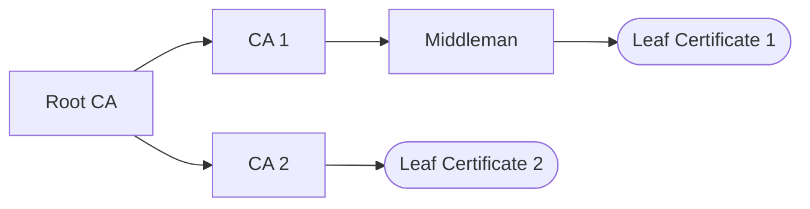

# Certificates, please: X.509 in polyproto

This blog post covers a bit about how and why X.509 is used in polyproto, and how we try to make
the process of implementing your own server and incorporating it into an existing network a little
easier.

<!-- more -->

!!! quote "Authors' note"

    Before knowing and reading about the X.500- and PKCS-series of RFCs, I legitimately thought,
    that implementing an own certificate standard for polyproto would be a good idea! Looking back,
    this is **incredibly** naive. But learning new things and improving myself is one of the
    biggest joys I experience when writing software, so this humbling experience was totally worth
    it for me, personally.

polyproto is a federation protocol that uses X.509 Public Key Infrastructure (PKI) to prove and
federate your identity across a whole network of decentralized services.

## X.509

Specifically, polyproto leverages the already well-documented and widely used X.509 standard at its
core. X.509 was chosen over `OpenPGP` because of its comparative simplicity. The Web of Trust from
`OpenPGP` often requires active user input to assign trust levels to users and their keys, which is
not inline with our ideas and goals for user experience in a decentralized system.
Ideally, decentralization and federation is as seamless as possible for the end-user,
and X.509 with its Certificate Authority (CA for short) model is the better fit for such a goal. 
In fact, X.509 can be *so* seamless to the end-user, that you have probably forgotten that you are
already using it right now!

HTTPS (SSL/TLS) certificates are likely the most popular form of digital certificate out there,
and they’re implemented in a way, where the only time us humans ever have to think about them,
is when our browser tells us that a certificate from a website we’re trying to visit, is not
valid anymore.

This popularity is great news for polyproto, because it means that mature tooling for all sorts
of programming languages exists *today*, along with tutorials and documentation, teaching potential
implementers how everything works.

## How polyproto uses X.509, briefly

In polyproto, home servers act as Certificate Authorities, while each client you connect from has
its own end-user Certificate, issued by your home server. With certificates, you can prove your
identity to any person or server at any time. Certificates are also used to verify the integrity
of data sent across the polyproto network.

If servers and clients have well-implemented cryptography, it should be *extremely* unlikely - if
not impossible - for non-quantum-based, non-supercomputer-cluster home servers to alter
the contents of a message before passing them on to the recipient.

!!! quote "Authors note"

    :nerd: Technically, polyproto and X.509 absolutely support Post-Quantum Hybrid Digital
    Signatures. If these Hybrid Digital Signatures use well-made Post-Quantum Signature schemes
    and are implemented well, polyproto also offers post-quantum-computing resilience. There
    seems to be very little, easy to understand reading material on hybrid schemes out there.
    The best/most easy to understand definition or explanation of hybrid schemes I could find is
    [this one, in the document "A Hybrid Signature Method with Strong Non-Separability"](https://www.ietf.org/archive/id/draft-nir-lamps-altcompsigs-00.html#name-non-separability).

In short, clients generate a [PKCS #10](https://datatracker.ietf.org/doc/html/rfc2986) Certificate
Signing Request (CSR). This CSR includes some information about the client. In polyprotos case, this
information is:

- session ID
- federation ID
- algorithm used to generate the public key attached to the CSR
- the public key attached to the CSR
- a signature which is verifiable using the attached public key, validating all of the
  aforementioned information

This CSR is sent to your home server, which verifies this information and in turn responds with a
polyproto X.509 Certificate (ID-Cert).

Home servers get their root certificate by self-signing a CSR. Unlike actor/client certificates, the
home server root certificate features [X.509 extensions such as the "Basic Constraints" attribute](https://en.wikipedia.org/wiki/X.509#Extensions_informing_a_specific_usage_of_a_certificate),
marking its certificate as a CA certificate, allowing the home server to sign CSRs
using this certificate.

## But it’s not all perfect.

Root Certificates in the context of HTTPS and the modern, SSL/TLS protected web are a big source
of centralization. This centralization might be necessary to a degree, but it inevitably means less
plurality, and way more hoops to jump through, should you also want to be a CA. 

To give context for those who might need it, essentially, every certificate for every website out
there has to be able to be traced back to one of the root certificates installed on your
internet-capable device's operating system or web browser. This creates an incredible amount of
centralization, because one Root Certificate Authority is directly responsible for hundreds of
thousands, if not millions of websites. This dependency on a few privileged Root CAs
has been monetized, which is why getting an SSL/TLS certificate for your website
used to cost you money (and depending on who you are, it might still be that way). Nowadays though,
[Let's Encrypt](https://letsencrypt.org) exists, offering free SSL/TLS certificates, with the caveat
that these certificates are only valid for three months at a time.

## What can we do about this?

To try and keep open polyproto networks to *stay* open for everyone, polyproto should make
centralization to the degree of modern-day SSL/TLS at infeasible.

An approach we are taking is limiting the length of the certification path.

In X.509, to validate and trust a certificate, you must also trust all the other certificates leading up to the Root Certificate of the Certificate Tree.

!!! example

    To trust `Leaf Certificate 1`, one would have to also trust the certificates held by the
    `Middleman CA`, `CA 1` and the `Root CA`.

This path from the certificate you are actually trying to validate to the Root Certificate is
referred to as the certification path. By arbitrarily limiting the length of this path, it becomes
harder for one certificate authority to issue and manage a great (1.000.000+) number of
certificates, due to the increasing amount of processing power required to handle web requests and
to verify and sign CSRs.

In polyproto, the maximum length of this certification path is 1, meaning a Root Certificate may
only issue leaf certificates. Cutting out middlemen makes it hard to scale to monstrous levels
of centralization, as the control one CA can have over the entire network is limited.

All of these factors combined should always make developing or hosting your own home server a
viable option.

!!! quote "Authors note"

    To clarify, this does not mean that polyproto servers will only be able to handle a small amount
    of users, or that polyproto is designed for small-userbase scenarios. A well-implemented
    and fast home server implementation should, with the given resources, be able to handle a great
    number of registered users. This shallow-depth trust model should aid in stopping trust
    hierarchies with great amounts of influence over the network from forming.

    However, real-life power distribution scenarios can be be unpredictable, which
    means that the efficacy of limiting the certificate path length as a measure to prevent
    centralization can only be proven when polyproto is being deployed in the real world.
    
---

If you have any questions or feedback, feel free to reach out to me via email, where you can
reach me under `flori@polyphony.chat`. OpenPGP is supported, and my public key can be found on
[keys.openpgp.org (click to download pubkey)](https://keys.openpgp.org/vks/v1/by-fingerprint/1AFF5E2D2145C795AB117C2ADCAE4B6877C6FC4E)
